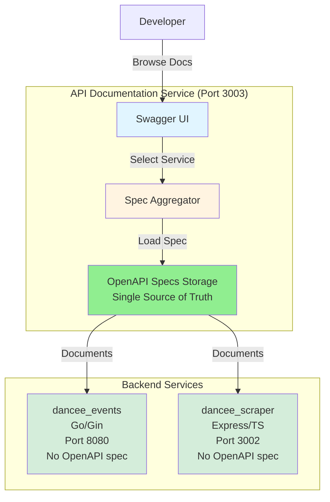
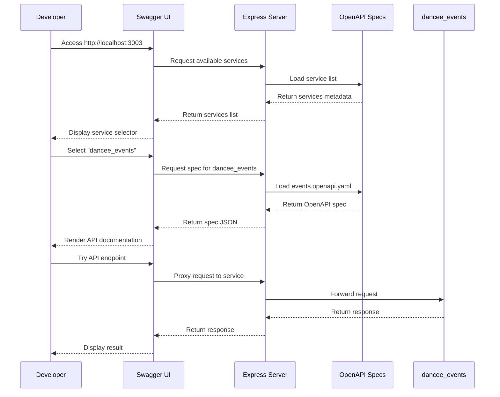

# Design Document: Centralized API Documentation Service

## Overview

The Centralized API Documentation Service is a standalone Node.js/TypeScript service that serves as the **Single Source of Truth** for all API documentation in the Dancee project. It provides a unified Swagger UI interface where developers can explore and test APIs from multiple services (dancee_events on port 8080 and dancee_scraper on port 3002) through a single entry point. The service will run on port 3003 and serve as the central documentation hub for all Dancee backend APIs.

**Key Principle**: All OpenAPI specifications are stored ONLY in `backend/dancee_api/specs/`. Individual backend services (dancee_events, dancee_scraper) do NOT contain their own OpenAPI specs - they are documented exclusively through this centralized service.

## Architecture



### Service Flow



## Components and Interfaces

### Component 1: Express Server

**Purpose**: Main HTTP server that serves Swagger UI and OpenAPI specifications

**Interface**:
```typescript
interface ServerConfig {
  port: number;
  host: string;
  corsOrigins: string[];
}

interface Server {
  start(): Promise<void>;
  stop(): Promise<void>;
  getHealth(): HealthStatus;
}
```

**Responsibilities**:
- Serve Swagger UI static files
- Provide REST endpoints for spec retrieval
- Handle CORS for API testing
- Proxy requests to backend services (optional)

### Component 2: Spec Aggregator

**Purpose**: Manages and serves OpenAPI specifications for all backend services

**Interface**:
```typescript
interface SpecAggregator {
  loadSpecs(): Promise<void>;
  getServiceList(): ServiceInfo[];
  getSpec(serviceId: string): OpenAPISpec | null;
  validateSpec(spec: OpenAPISpec): ValidationResult;
}

interface ServiceInfo {
  id: string;
  name: string;
  version: string;
  description: string;
  baseUrl: string;
  specPath: string;
}
```

**Responsibilities**:
- Load OpenAPI specs from file system
- Validate spec format and structure
- Provide service metadata
- Cache specs in memory

### Component 3: OpenAPI Spec Generator

**Purpose**: Utilities to generate OpenAPI 3.0 specifications from existing API documentation

**Interface**:
```typescript
interface SpecGenerator {
  generateFromMarkdown(markdown: string, metadata: ServiceMetadata): OpenAPISpec;
  generateFromCode(servicePath: string): OpenAPISpec;
  saveSpec(spec: OpenAPISpec, outputPath: string): Promise<void>;
}

interface ServiceMetadata {
  title: string;
  version: string;
  description: string;
  baseUrl: string;
}
```

**Responsibilities**:
- Parse existing API documentation
- Generate OpenAPI 3.0 compliant specs
- Save specs to YAML/JSON format

## Data Models

### OpenAPISpec

```typescript
interface OpenAPISpec {
  openapi: string; // "3.0.0"
  info: {
    title: string;
    version: string;
    description: string;
    contact?: {
      name: string;
      email: string;
    };
  };
  servers: Server[];
  paths: Record<string, PathItem>;
  components?: {
    schemas?: Record<string, Schema>;
    responses?: Record<string, Response>;
    parameters?: Record<string, Parameter>;
  };
}

interface Server {
  url: string;
  description: string;
}

interface PathItem {
  get?: Operation;
  post?: Operation;
  put?: Operation;
  delete?: Operation;
  patch?: Operation;
}

interface Operation {
  summary: string;
  description?: string;
  operationId?: string;
  tags?: string[];
  parameters?: Parameter[];
  requestBody?: RequestBody;
  responses: Record<string, Response>;
}

interface Parameter {
  name: string;
  in: 'query' | 'path' | 'header' | 'cookie';
  description?: string;
  required?: boolean;
  schema: Schema;
  example?: any;
}

interface RequestBody {
  description?: string;
  required?: boolean;
  content: Record<string, MediaType>;
}

interface Response {
  description: string;
  content?: Record<string, MediaType>;
}

interface MediaType {
  schema: Schema;
  example?: any;
}

interface Schema {
  type?: string;
  format?: string;
  properties?: Record<string, Schema>;
  items?: Schema;
  required?: string[];
  example?: any;
  description?: string;
  enum?: any[];
}
```

### ServiceConfig

```typescript
interface ServiceConfig {
  services: ServiceDefinition[];
  ui: UIConfig;
}

interface ServiceDefinition {
  id: string;
  name: string;
  version: string;
  description: string;
  baseUrl: string;
  specFile: string;
  enabled: boolean;
}

interface UIConfig {
  title: string;
  description: string;
  defaultService: string;
  theme: 'light' | 'dark' | 'auto';
}
```

**Validation Rules**:
- Service ID must be unique and kebab-case
- Base URL must be valid HTTP/HTTPS URL
- Spec file must exist and be valid OpenAPI 3.0
- At least one service must be enabled

## API Endpoints

### GET /api/services

Get list of all available backend services.

**Response**: `200 OK`
```json
[
  {
    "id": "dancee-events",
    "name": "Dancee Events API",
    "version": "1.0.0",
    "description": "Event management and favorites API",
    "baseUrl": "http://localhost:8080",
    "specPath": "/api/spec/dancee-events"
  },
  {
    "id": "dancee-scraper",
    "name": "Dancee Scraper API",
    "version": "1.0.0",
    "description": "Facebook event scraping API",
    "baseUrl": "http://localhost:3002",
    "specPath": "/api/spec/dancee-scraper"
  }
]
```

### GET /api/spec/:serviceId

Get OpenAPI specification for a specific service.

**Parameters**:
- `serviceId` (path) - Service identifier (e.g., "dancee-events")

**Response**: `200 OK`
```json
{
  "openapi": "3.0.0",
  "info": {
    "title": "Dancee Events API",
    "version": "1.0.0",
    "description": "REST API for managing dance events and user favorites"
  },
  "servers": [
    {
      "url": "http://localhost:8080",
      "description": "Development server"
    },
    {
      "url": "https://dancee-events.fly.dev",
      "description": "Production server"
    }
  ],
  "paths": { ... }
}
```

**Error Response**: `404 Not Found`
```json
{
  "error": "Service not found",
  "serviceId": "invalid-service"
}
```

### GET /

Serve Swagger UI interface.

**Response**: `200 OK` (HTML)

### GET /health

Health check endpoint.

**Response**: `200 OK`
```json
{
  "status": "ok",
  "services": {
    "dancee-events": "loaded",
    "dancee-scraper": "loaded"
  }
}
```

## Directory Structure

```
backend/dancee_api/
├── src/
│   ├── index.ts                 # Application entry point
│   ├── server.ts                # Express server setup
│   ├── config/
│   │   ├── services.config.ts   # Service definitions
│   │   └── app.config.ts        # App configuration
│   ├── aggregator/
│   │   ├── spec-aggregator.ts   # Spec loading and management
│   │   └── spec-validator.ts    # OpenAPI validation
│   ├── routes/
│   │   ├── services.routes.ts   # Service list endpoints
│   │   └── spec.routes.ts       # Spec retrieval endpoints
│   └── middleware/
│       ├── cors.middleware.ts   # CORS configuration
│       └── error.middleware.ts  # Error handling
├── specs/
│   ├── events.openapi.yaml      # dancee_events OpenAPI spec
│   └── scraper.openapi.yaml     # dancee_scraper OpenAPI spec
├── docs/
│   ├── SETUP.md                 # Setup instructions
│   ├── USAGE.md                 # Usage guide
│   └── CONTRIBUTING.md          # Contribution guidelines
├── .env.example                 # Environment variables template
├── .gitignore
├── package.json
├── tsconfig.json
├── taskfile.yaml                # Task automation
└── README.md                    # Project overview
```

## Error Handling

### Error Scenario 1: Invalid Service ID

**Condition**: User requests spec for non-existent service
**Response**: Return 404 with descriptive error message
**Recovery**: Display available services in error response

### Error Scenario 2: Malformed OpenAPI Spec

**Condition**: Spec file is invalid or corrupted
**Response**: Log error, return 500 with generic message
**Recovery**: Serve cached version if available, otherwise exclude service from list

### Error Scenario 3: Service Unavailable

**Condition**: Backend service is not running
**Response**: Spec still loads (documentation available offline)
**Recovery**: Display warning in UI that service may be unavailable for testing

### Error Scenario 4: CORS Issues

**Condition**: Browser blocks API requests due to CORS
**Response**: Ensure proper CORS headers are set
**Recovery**: Provide proxy endpoint for testing if needed

## Testing Strategy

### Unit Testing Approach

**Test Coverage Goals**: 80%+ coverage for core logic

**Key Test Cases**:
- Spec loading and validation
- Service list generation
- Error handling for missing specs
- Configuration parsing
- Route handlers

**Testing Framework**: Jest with TypeScript support

### Integration Testing Approach

**Test Scenarios**:
- Full server startup and shutdown
- Spec retrieval through HTTP endpoints
- Swagger UI rendering
- Service list API
- Health check endpoint

**Tools**: Supertest for HTTP testing

### Manual Testing Checklist

- [ ] Swagger UI loads correctly
- [ ] Service selector displays all services
- [ ] Switching between services works
- [ ] API endpoints are documented correctly
- [ ] Try It Out feature works for each service
- [ ] CORS allows requests from frontend
- [ ] Health check returns correct status

## Performance Considerations

**Spec Caching**: Load all specs into memory on startup to avoid file I/O on each request

**Lazy Loading**: Consider lazy loading specs only when requested if memory is constrained

**Response Time**: Target < 100ms for spec retrieval endpoints

**Concurrent Requests**: Support multiple simultaneous spec requests

**Static Asset Serving**: Use efficient static file serving for Swagger UI assets

## Security Considerations

**No Authentication Required**: Documentation service is for development use only

**CORS Configuration**: Allow all origins in development, restrict in production

**Input Validation**: Validate service IDs to prevent path traversal attacks

**Rate Limiting**: Consider adding rate limiting if exposed publicly

**Sensitive Data**: Ensure no API keys or secrets are included in OpenAPI specs

## Dependencies

### Runtime Dependencies

- **express** (^4.18.0) - Web server framework
- **swagger-ui-express** (^5.0.0) - Swagger UI middleware
- **js-yaml** (^4.1.0) - YAML parsing for OpenAPI specs
- **cors** (^2.8.5) - CORS middleware
- **dotenv** (^16.0.0) - Environment variable management

### Development Dependencies

- **typescript** (^5.0.0) - TypeScript compiler
- **@types/express** (^4.17.0) - Express type definitions
- **@types/swagger-ui-express** (^4.1.0) - Swagger UI types
- **@types/node** (^20.0.0) - Node.js type definitions
- **ts-node** (^10.9.0) - TypeScript execution
- **nodemon** (^3.0.0) - Development auto-reload
- **jest** (^29.0.0) - Testing framework
- **@types/jest** (^29.0.0) - Jest type definitions
- **supertest** (^6.3.0) - HTTP testing
- **eslint** (^8.0.0) - Code linting
- **prettier** (^3.0.0) - Code formatting

### External Services

- **dancee_events** 
  - Development: `http://localhost:8080`
  - Production: `https://dancee-events.fly.dev`
  - Event management and favorites API
  
- **dancee_scraper**
  - Development: `http://localhost:3002`
  - Production: `https://dancee-scraper.fly.dev`
  - Facebook event scraping API

## Implementation Notes

### OpenAPI Spec Generation

**IMPORTANT**: OpenAPI specifications are created and maintained ONLY in `backend/dancee_api/specs/`. Individual services do NOT have their own OpenAPI specs.

For **dancee_events** (Go/Gin):
- Parse existing `backend/dancee_events/docs/API.md` markdown documentation
- Extract endpoints, parameters, request/response schemas
- Generate OpenAPI 3.0 YAML specification in `backend/dancee_api/specs/events.openapi.yaml`
- Include all data models from documentation
- Keep this as the single source of truth for dancee_events API documentation

For **dancee_scraper** (Express/TypeScript):
- Parse existing code and `backend/dancee_scraper/README.md`
- Extract route definitions and handlers
- Generate OpenAPI 3.0 YAML specification in `backend/dancee_api/specs/scraper.openapi.yaml`
- Document query parameters and responses
- Keep this as the single source of truth for dancee_scraper API documentation

**Maintenance**: When APIs change in backend services, update the corresponding OpenAPI spec in `backend/dancee_api/specs/` - do NOT create specs in individual service directories.

### Swagger UI Configuration

```typescript
const swaggerOptions = {
  explorer: true,
  swaggerOptions: {
    urls: [
      {
        url: '/api/spec/dancee-events',
        name: 'Dancee Events API'
      },
      {
        url: '/api/spec/dancee-scraper',
        name: 'Dancee Scraper API'
      }
    ]
  }
};
```

### Environment Variables

```bash
# Server Configuration
PORT=3003
HOST=localhost
NODE_ENV=development

# Service URLs (Development)
EVENTS_SERVICE_URL=http://localhost:8080
SCRAPER_SERVICE_URL=http://localhost:3002

# Service URLs (Production)
# EVENTS_SERVICE_URL=https://dancee-events.fly.dev
# SCRAPER_SERVICE_URL=https://dancee-scraper.fly.dev

# UI Configuration
UI_TITLE="Dancee API Documentation"
DEFAULT_SERVICE=dancee-events
```

## Correctness Properties

*A property is a characteristic or behavior that should hold true across all valid executions of a system—essentially, a formal statement about what the system should do. Properties serve as the bridge between human-readable specifications and machine-verifiable correctness guarantees.*

### Property 1: Spec Loading and Validation

*For any* set of OpenAPI specification files in Spec_Storage, when the API_Documentation_Service starts, all files that comply with OpenAPI 3.0 schema should be loaded into memory and available via the service list, while non-compliant files should be excluded and logged as errors.

**Validates: Requirements 1.1, 1.2, 1.3, 12.1**

### Property 2: Service List Completeness

*For any* set of successfully loaded services, when a GET request is made to `/api/services`, the response should contain all enabled services, and each service entry should include all required fields (id, name, version, description, baseUrl, specPath).

**Validates: Requirements 2.1, 2.2**

### Property 3: Spec Retrieval from Cache

*For any* valid Service_ID that has been loaded, when a GET request is made to `/api/spec/:serviceId`, the system should return the corresponding OpenAPI specification from memory cache without accessing the file system.

**Validates: Requirements 3.1, 3.4, 10.1**

### Property 4: Invalid Service ID Handling

*For any* Service_ID that is not in the loaded services list, when a GET request is made to `/api/spec/:serviceId`, the system should return HTTP status 404 with an error message containing the invalid Service_ID.

**Validates: Requirements 3.2, 7.1**

### Property 5: Multi-Environment Server URLs

*For any* OpenAPI specification served by the system, the spec should include server definitions for both development (localhost) and production (fly.dev) environments.

**Validates: Requirements 3.3, 9.2**

### Property 6: Health Status Completeness

*For any* system state, when a GET request is made to `/health`, the response should include overall service status and individual loading status for each configured Backend_Service.

**Validates: Requirements 5.2**

### Property 7: CORS Header Presence

*For any* HTTP response from the API_Documentation_Service, the response should include appropriate CORS headers (Access-Control-Allow-Origin, Access-Control-Allow-Methods, Access-Control-Allow-Headers).

**Validates: Requirements 6.1**

### Property 8: Missing Spec Resilience

*For any* set of spec files where some files are missing or unreadable, the system should log errors for the missing files and successfully load all other valid specifications.

**Validates: Requirements 7.3**

### Property 9: Path Traversal Prevention

*For any* Service_ID parameter containing path traversal sequences (e.g., "../", "./", "..\\"), the system should reject the request and not access files outside the Spec_Storage directory.

**Validates: Requirements 7.4**

### Property 10: Multi-Format Spec Support

*For any* OpenAPI specification stored in either YAML or JSON format, the system should successfully load and serve the specification.

**Validates: Requirements 8.2**

### Property 11: Environment-Based Configuration

*For any* valid set of environment variables (PORT, HOST, service URLs, CORS origins), when the API_Documentation_Service starts, it should use those values for its configuration.

**Validates: Requirements 9.1, 9.5**

### Property 12: OpenAPI Spec Documentation Completeness

*For any* API endpoint documented in an OpenAPI specification, the endpoint should include operation summary, description, parameters (with name, location, type, required flag), request body schema (if applicable), and response schemas (with status code, description, content schema).

**Validates: Requirements 12.2, 12.3, 12.4**

### Property 13: Spec Examples Presence

*For any* OpenAPI specification with request or response payloads, the spec should include example values to demonstrate expected data formats.

**Validates: Requirements 12.5**

## Future Enhancements

- Auto-discovery of backend services
- Real-time spec updates when services change
- API versioning support
- Authentication for production deployment
- Request/response logging and analytics
- Export functionality (Postman collections, etc.)
- Dark mode theme support
- Custom branding and styling
- Spec validation CI/CD pipeline to ensure specs stay in sync with actual APIs
- Automated spec generation from service code annotations

## Design Principles

### Single Source of Truth

All OpenAPI specifications live exclusively in `backend/dancee_api/specs/`. This ensures:

1. **Centralized Maintenance**: Update API docs in one place
2. **Consistency**: All services documented with same standards
3. **Version Control**: Single repository for all API documentation
4. **No Duplication**: Avoid sync issues between service-level and central docs
5. **Easy Discovery**: Developers know exactly where to find API documentation

### Separation of Concerns

- **Backend Services**: Focus on business logic and API implementation
- **dancee_api**: Focus on API documentation and developer experience
- Services don't need to maintain their own OpenAPI specs or Swagger UI
