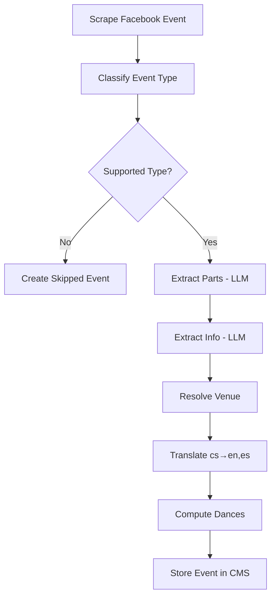
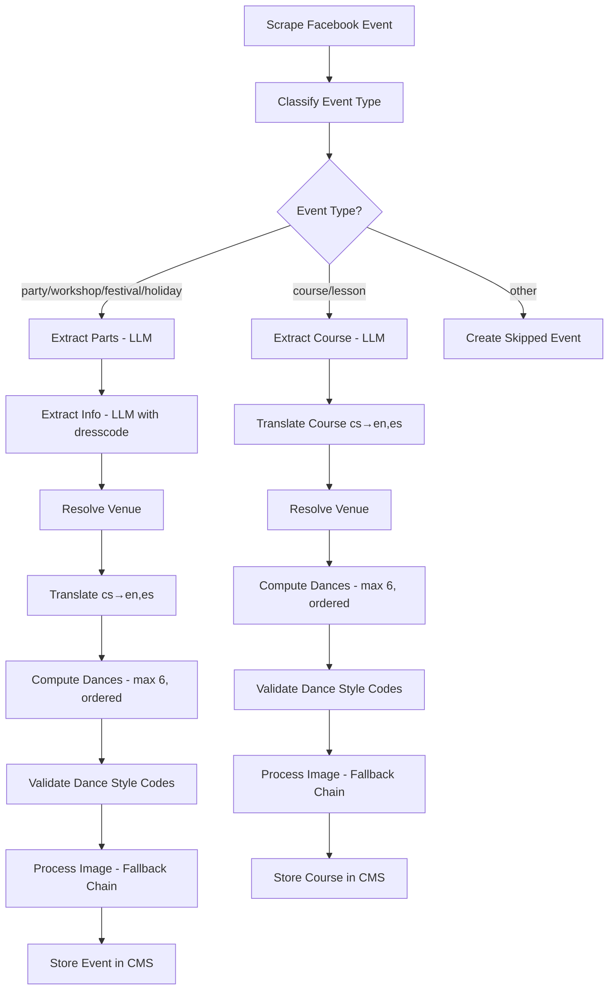
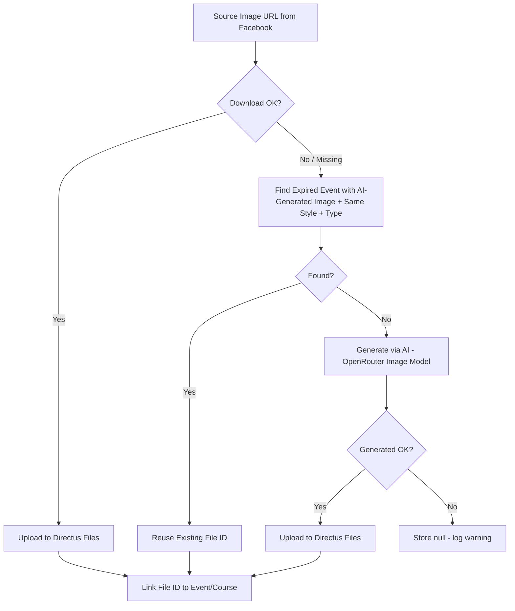

# Design Document: CMS Data Completeness

## Overview

This design extends the dancee_cms (Directus) schema and dancee_workflow (TypeScript/Restate) processing pipeline to support all data required by the dancee_app2 Flutter frontend. The changes fall into four categories:

1. **CMS Schema Extensions** — New collections (courses, dance_styles, favorites) and new fields on existing collections (event image, event_type, dresscode info type)
2. **Workflow Pipeline Extensions** — Image download/upload pipeline, event type routing (events vs courses), course extraction with dedicated LLM prompt, dance style validation, dresscode extraction
3. **Setup Script Updates** — Idempotent creation of all new collections, fields, relations, and seed data
4. **Data Model Updates** — New Zod schemas, updated existing schemas, new Directus client functions

The design preserves all existing patterns: fetch-based Directus client (no SDK), Zod validation, retry-on-JSON-error for LLM calls, idempotent setup script, and Restate durable workflow steps.

## Architecture

### Current Pipeline (Events Only)



### Extended Pipeline (Events + Courses + Images)



### Image Fallback Chain



## Components and Interfaces

### Modified Components

#### 1. `src/core/schemas.ts` — Schema Updates

- **EventInfoSchema**: Add `"dresscode"` to the type enum → `z.enum(["url", "price", "dresscode"])`
- **FacebookEventSchema**: Add optional `imageUrl` field (string, nullable) to `FacebookEventObjectSchema`
- **DirectusEventSchema**: Add `image` (nullable number/string for file ID) and `event_type` (string) fields
- **SUPPORTED_EVENT_TYPES**: Add `"course"` and `"lesson"` to the array
- **computeDances**: Update to preserve first-seen order from parts and cap at 6 entries
- **New schemas**: `DirectusCourseSchema`, `DirectusCourseTranslationSchema`, `DirectusDanceStyleSchema`, `DirectusFavoriteSchema`, `CourseExtractionSchema`

#### 2. `src/core/prompts.ts` — Prompt Updates

- **getEventInfoExtractionPrompt**: Add `"dresscode"` to the list of extractable info types
- **getEventPartsExtractionPrompt**: Add instruction to order dances by relevance; accept a `danceStyleCodes: string[]` parameter and inject the codes dynamically into the prompt (fetched from dance_styles collection, cached per batch run)
- **New**: `getCourseExtractionPrompt(outputLanguage, eventStartTime, eventEndTime, danceStyleCodes)` — dedicated prompt for course data extraction; includes dynamic dance style codes list
- **New**: `getImageGenerationPrompt(title, primaryDance, eventType)` — prompt for AI image generation

#### 3. `src/services/event-parser.ts` — Parser Updates

- **New**: `extractCourseData(description, eventStartTime, eventEndTime)` — calls LLM with course extraction prompt, validates against `CourseExtractionSchema`, uses `retryOnJsonError`

#### 4. `src/services/workflow.ts` — Workflow Routing

- **Updated**: `runWorkflow` — after classification, route `course`/`lesson` types to a new `runCourseWorkflow` branch
- **New**: `runCourseWorkflow` — extracts course data, translates, resolves venue, processes image, stores in courses collection
- **Updated**: Event branch — adds image processing step, stores `event_type`, validates dance codes

#### 5. `src/clients/directus-client.ts` — New Client Functions

- **New**: `uploadFile(buffer, filename, mimeType)` — uploads binary to Directus Files API (`/files`) using multipart/form-data, returns file ID
- **New**: `createCourse(course)` — creates a course record
- **New**: `findCourseByOriginalUrl(url)` — duplicate check for courses
- **New**: `getDanceStyleCodes()` — fetches all dance_style codes from `/items/dance_styles?fields=code`; result is cached in-memory per batch run (module-level cache with manual invalidation at batch start) to avoid repeated API calls during a single batch processing cycle
- **New**: `findExpiredEventWithImage(primaryDance, eventType)` — finds most recently expired event with matching dance/type that has an AI-generated image (image_source = "ai_generated"); Facebook-sourced images are excluded from reuse
- **New**: `createFavorite(favorite)` / `deleteFavorite(userId, itemType, itemId)` — favorites CRUD
- **Updated**: `createEvent` — now includes `image` and `event_type` fields

#### 6. `src/services/image-processor.ts` — New Component

- **New service** handling the image fallback chain:
  - `processEventImage(imageUrl, primaryDance, eventType, title)` — orchestrates the fallback chain
  - `downloadImage(url)` — downloads image from URL, returns Buffer + mime type
  - `uploadToDirectus(buffer, filename, mimeType)` — delegates to directus-client `uploadFile`
  - `generateAiImage(title, primaryDance, eventType)` — calls OpenRouter image generation API (e.g. FLUX or Gemini image model)
  - `findReusableImage(primaryDance, eventType)` — queries expired events for reusable file ID, filtering only AI-generated images (image_source = "ai_generated")

#### 7. `scripts/setup-directus.ts` — Setup Script Updates

- **New**: `setupCoursesCollection()` — creates courses collection with all fields
- **New**: `setupCoursesTranslationsCollection()` — creates courses_translations with translation fields
- **New**: `setupCoursesTranslationsRelation()` — configures translations relation
- **New**: `setupCoursesVenueRelation()` — M2O from courses to venues
- **New**: `setupDanceStylesCollection()` — creates dance_styles with `code` as PK, parent_code self-reference
- **New**: `setupDanceStylesTranslationsCollection()` — creates dance_styles_translations
- **New**: `setupDanceStylesTranslationsRelation()` — configures translations relation
- **New**: `setupFavoritesCollection()` — creates favorites with unique constraint
- **New**: `seedDanceStyles()` — seeds hierarchical dance style data
- **Updated**: `setupEventsCollection()` — adds `image` and `event_type` fields
- **Updated**: `main()` — calls all new setup functions in correct order

### Configuration Updates

#### `.env` / `.env.example`

No new environment variables required. Image generation uses the existing `OPENROUTER_API_KEY` — OpenRouter supports image generation models (e.g. FLUX, Gemini image models) through the same OpenAI-compatible API used for text LLM calls.

#### `src/core/config.ts`

- Add `imageGenerationModel` config option (default: a suitable OpenRouter image model, e.g. a FLUX model)
- Image generation uses the existing `openrouterApiKey` and OpenRouter base URL — no separate API key needed

## Data Models

### New Collections

#### `courses`

| Field | Type | Nullable | Notes |
|---|---|---|---|
| id | integer (auto PK) | No | Auto-generated |
| title | string(512) | Yes | Czech title from LLM |
| description | text | Yes | Czech description from LLM |
| instructor_name | string(255) | Yes | Extracted or fallback to organizer |
| instructor_bio | text | Yes | |
| instructor_avatar_url | string(2048) | Yes | |
| venue | integer (M2O → venues) | Yes | Same venue resolution as events |
| start_date | date | Yes | Course start date |
| end_date | date | Yes | Course end date |
| schedule_day | string(50) | Yes | e.g. "Tuesday" |
| schedule_time | string(50) | Yes | e.g. "19:00 - 20:30" |
| lesson_count | integer | Yes | |
| lesson_duration_minutes | integer | Yes | |
| max_participants | integer | Yes | |
| current_participants | integer | No | Default 0 |
| price | string(255) | Yes | |
| price_note | string(512) | Yes | |
| level | string(50) | Yes | beginner/intermediate/advanced/all_levels |
| dances | JSON | Yes | Array of dance style code strings, max 6, ordered by relevance |
| image | integer (M2O → directus_files) | Yes | Cover image |
| image_source | string(50) | Yes | "facebook" or "ai_generated" — tracks image origin for reuse eligibility |
| original_url | string(2048) | Yes | Facebook source URL |
| original_description | text | Yes | Raw Facebook description |
| status | string(50) | No | published/draft/archived, default "published" |
| translation_status | string(50) | Yes | complete/partial/missing |
| translations | alias (O2M) | — | Relation to courses_translations |

#### `courses_translations`

| Field | Type | Nullable | Notes |
|---|---|---|---|
| id | integer (auto PK) | No | Auto-generated |
| courses_id | integer (M2O → courses) | Yes | |
| languages_code | string(10) (M2O → languages) | Yes | |
| title | string(512) | Yes | |
| description | text | Yes | |
| learning_items | JSON | Yes | Array of strings |

#### `dance_styles`

| Field | Type | Nullable | Notes |
|---|---|---|---|
| code | string(50) (PK) | No | e.g. "salsa", "bachata-sensual" |
| name | string(100) | No | English display name |
| parent_code | string(50) (M2O → dance_styles) | Yes | Self-referencing for hierarchy |
| sort_order | integer | No | Display ordering |
| translations | alias (O2M) | — | Relation to dance_styles_translations |

#### `dance_styles_translations`

| Field | Type | Nullable | Notes |
|---|---|---|---|
| id | integer (auto PK) | No | Auto-generated |
| dance_styles_code | string(50) (M2O → dance_styles) | Yes | |
| languages_code | string(10) (M2O → languages) | Yes | |
| name | string(100) | Yes | Translated display name |

#### `favorites`

| Field | Type | Nullable | Notes |
|---|---|---|---|
| id | integer (auto PK) | No | Auto-generated |
| user_id | string(255) | No | Indexed |
| item_type | string(50) | No | "event" or "course" |
| item_id | integer | No | References event or course ID |
| created_at | datetime | No | Auto-set on creation |

Unique constraint: `(user_id, item_type, item_id)`

### Modified Collections

#### `events` — New Fields

| Field | Type | Nullable | Notes |
|---|---|---|---|
| image | integer (M2O → directus_files) | Yes | Cover image file ID |
| image_source | string(50) | Yes | "facebook" or "ai_generated" — tracks image origin for reuse eligibility |
| event_type | string(50) | Yes | party/workshop/festival/holiday/other |

### Updated Schemas (Zod)

#### `EventInfoSchema` — Updated

```typescript
export const EventInfoSchema = z.object({
  type: z.enum(["url", "price", "dresscode"]),
  key: z.string().min(1),
  value: z.string().min(1),
});
```

#### `FacebookEventObjectSchema` — Updated

Add to existing schema:
```typescript
imageUrl: z.string().nullable().optional(),
```

#### `CourseExtractionSchema` — New

```typescript
export const CourseExtractionSchema = z.object({
  title: z.string(),
  description: z.string(),
  instructor_name: z.string().nullable(),
  level: z.enum(["beginner", "intermediate", "advanced", "all_levels"]).default("all_levels"),
  schedule_day: z.string().nullable(),
  schedule_time: z.string().nullable(),
  lesson_count: z.number().int().positive().nullable(),
  lesson_duration_minutes: z.number().int().positive().nullable(),
  max_participants: z.number().int().positive().nullable(),
  price: z.string().nullable(),
  price_note: z.string().nullable(),
  learning_items: z.array(z.string()),
  dances: z.array(z.string()),
});
```

#### `DirectusCourseSchema` — New

```typescript
export const DirectusCourseSchema = z.object({
  id: z.union([z.number(), z.string()]).optional(),
  title: z.string().optional(),
  description: z.string().optional(),
  instructor_name: z.string().nullable().optional(),
  instructor_bio: z.string().nullable().optional(),
  instructor_avatar_url: z.string().nullable().optional(),
  venue: z.union([z.number(), z.string(), DirectusVenueSchema]).nullable().optional(),
  start_date: z.string().nullable().optional(),
  end_date: z.string().nullable().optional(),
  schedule_day: z.string().nullable().optional(),
  schedule_time: z.string().nullable().optional(),
  lesson_count: z.number().nullable().optional(),
  lesson_duration_minutes: z.number().nullable().optional(),
  max_participants: z.number().nullable().optional(),
  current_participants: z.number().optional(),
  price: z.string().nullable().optional(),
  price_note: z.string().nullable().optional(),
  level: z.string().nullable().optional(),
  dances: z.array(z.string()).optional(),
  image: z.union([z.number(), z.string()]).nullable().optional(),
  original_url: z.string().nullable().optional(),
  original_description: z.string().nullable().optional(),
  status: z.enum(["published", "draft", "archived"]).optional(),
  translation_status: z.enum(["complete", "partial", "missing"]).optional(),
  translations: z.array(z.union([z.any(), z.number(), z.string()])).optional(),
});
```

#### `DirectusDanceStyleSchema` — New

```typescript
export const DirectusDanceStyleSchema = z.object({
  code: z.string(),
  name: z.string(),
  parent_code: z.string().nullable().optional(),
  sort_order: z.number().optional(),
});
```

#### `DirectusFavoriteSchema` — New

```typescript
export const DirectusFavoriteSchema = z.object({
  id: z.union([z.number(), z.string()]).optional(),
  user_id: z.string(),
  item_type: z.enum(["event", "course"]),
  item_id: z.number(),
  created_at: z.string().optional(),
});
```

### Dance Styles Seed Data

Hierarchical structure seeded by setup script:

| Code | Name | Parent | Sort |
|---|---|---|---|
| salsa | Salsa | null | 1 |
| salsa-on1 | Salsa On1 | salsa | 2 |
| salsa-on2 | Salsa On2 | salsa | 3 |
| salsa-cubana | Salsa Cubana | salsa | 4 |
| bachata | Bachata | null | 10 |
| bachata-sensual | Bachata Sensual | bachata | 11 |
| bachata-dominicana | Bachata Dominicana | bachata | 12 |
| kizomba | Kizomba | null | 20 |
| urban-kiz | Urban Kiz | kizomba | 21 |
| semba | Semba | kizomba | 22 |
| zouk | Zouk | null | 30 |
| lambada | Lambada | zouk | 31 |
| tango | Tango | null | 40 |
| swing | Swing | null | 50 |
| lindy-hop | Lindy Hop | swing | 51 |
| west-coast-swing | West Coast Swing | swing | 52 |
| boogie-woogie | Boogie Woogie | swing | 53 |
| charleston | Charleston | swing | 54 |
| reggaeton | Reggaeton | null | 60 |
| afro | Afro | null | 70 |
| forro | Forró | null | 80 |
| ballroom | Standard | null | 90 |
| waltz | Waltz | ballroom | 91 |
| viennese-waltz | Viennese Waltz | ballroom | 92 |
| quickstep | Quickstep | ballroom | 93 |
| slowfox | Slowfox | ballroom | 94 |
| latin | Latin | null | 100 |
| cha-cha | Cha-Cha | latin | 101 |
| rumba | Rumba | latin | 102 |
| samba | Samba | latin | 103 |
| paso-doble | Paso Doble | latin | 104 |
| jive | Jive | latin | 105 |
| dancehall | Dancehall | null | 110 |
| hip-hop | Hip-Hop | null | 120 |
| contemporary | Contemporary | null | 130 |
| ecstatic-dance | Ecstatic Dance | null | 140 |


## Correctness Properties

*A property is a characteristic or behavior that should hold true across all valid executions of a system — essentially, a formal statement about what the system should do. Properties serve as the bridge between human-readable specifications and machine-verifiable correctness guarantees.*

### Property 1: parseEventType maps all valid types and defaults invalid to "other"

*For any* string that matches one of the valid event types ("party", "workshop", "lesson", "course", "festival", "holiday", "other") regardless of casing or surrounding whitespace, `parseEventType` should return that type in lowercase. *For any* string that does not match a valid event type, `parseEventType` should return `"other"`.

**Validates: Requirements 2.2**

### Property 2: EventInfoSchema validates type, key, and value constraints

*For any* info item object with `type` in `["url", "price", "dresscode"]` and non-empty `key` and non-empty `value`, the `EventInfoSchema` should successfully validate. *For any* info item with a type not in that set, or with an empty/missing key or value, the schema should reject it.

**Validates: Requirements 3.1, 3.6**

### Property 3: Translation info_translations length matches info array length

*For any* event content with N info items, the translated output must contain exactly N `info_translations` entries. If the LLM returns a different count, the translator should throw a validation error.

**Validates: Requirements 3.7**

### Property 4: computeDances preserves first-seen order and caps at 6

*For any* list of event parts where each part has an array of dance style strings, `computeDances` should return a deduplicated array where: (a) the order matches the first-seen order across parts (iterating parts then dances within each part), (b) the length is at most 6, and (c) if fewer than 6 unique dances exist, all are included without padding.

**Validates: Requirements 4.1, 4.2, 4.4, 4.5**

### Property 5: Event type routing correctness

*For any* classified event type, the workflow routing decision should be: types in `["party", "workshop", "festival", "holiday"]` route to the events collection, types in `["course", "lesson"]` route to the courses collection, and type `"other"` creates a skipped_events record.

**Validates: Requirements 6.2, 11.1, 11.2, 11.3**

### Property 6: CourseExtractionSchema validates course data structure

*For any* object with valid course fields (title as string, description as string, level in `["beginner", "intermediate", "advanced", "all_levels"]`, dances as string array, learning_items as string array, and nullable numeric fields for lesson_count/lesson_duration_minutes/max_participants), the `CourseExtractionSchema` should successfully validate. *For any* object missing required fields or with invalid level values, the schema should reject it.

**Validates: Requirements 7.2**

### Property 7: Dance style tag validation discards unrecognized codes

*For any* list of dance style tag strings and a set of valid dance_styles codes, the validation function should return only the tags that exist in the valid codes set, preserving the original order of the retained tags.

**Validates: Requirements 8.7**

### Property 8: Parent dance style filtering includes child codes

*For any* parent dance style code and a hierarchical dance_styles dataset, filtering events/courses by the parent code should match items tagged with the parent code itself OR any of its direct child codes.

**Validates: Requirements 8.5**

### Property 9: FacebookEventSchema accepts optional imageUrl

*For any* valid Facebook event object (with required fields id, name, startTimestamp, url), the schema should parse successfully regardless of whether `imageUrl` is present, null, or absent. When present as a non-null string, the parsed result should contain that string as `imageUrl`.

**Validates: Requirements 12.2**

## Error Handling

| Step | Error | Handling | Severity |
|---|---|---|---|
| Image download | HTTP error / timeout | Proceed to fallback: reuse expired event image | Warning |
| Image reuse lookup | No matching expired event | Proceed to fallback: AI image generation | Warning |
| AI image generation | API error / timeout | Store null for image, log warning, continue | Warning |
| Directus file upload | Upload fails | Store null for image, log warning, continue | Warning |
| Course extraction (LLM) | Invalid JSON after 3 retries | Throw TerminalError, create error record | Terminal |
| Course extraction (LLM) | Missing course-specific fields | Use defaults (organizer as instructor, "all_levels") | Warning |
| Dance style validation | Tag not in dance_styles codes | Discard unrecognized tag silently | Info |
| Dance style validation | All tags unrecognized | Store empty dances array | Warning |
| Event type routing | Unknown type | Create skipped_events record | Info |
| Translation (course) | Translation fails for one language | Continue with remaining languages, mark partial | Warning |
| Setup script | Collection/field already exists | Skip creation, log message | Info |
| Setup script | Seed data already exists | Skip insertion, log message | Info |
| Favorites unique constraint | Duplicate (user_id, item_type, item_id) | Directus returns 400, client surfaces error | Error |

### Key Design Decisions

1. **Image failures never block event/course creation** — the image field is nullable, and every step in the fallback chain gracefully degrades to the next option or null.
2. **Course extraction failures are terminal** — unlike event parts/info extraction which can fall back to empty arrays, a course without extracted data has no meaningful content to store.
3. **Dance style validation is lenient** — unrecognized tags are silently discarded rather than failing the workflow, because the LLM may produce valid dance names that don't match our code system.

## Testing Strategy

### Property-Based Testing

Library: **fast-check** (TypeScript property-based testing library, already compatible with the Vitest test runner used in dancee_workflow)

Configuration:
- Minimum 100 iterations per property test
- Each test tagged with: `Feature: cms-data-completeness, Property {number}: {property_text}`

Property tests to implement:

1. **parseEventType mapping** — Generate random strings (valid types with random casing/whitespace, and random invalid strings). Assert correct mapping.
2. **EventInfoSchema validation** — Generate random info items with valid/invalid type/key/value combinations. Assert accept/reject behavior.
3. **Translation length preservation** — Generate random event content with N info items, mock translator to return matching/mismatching lengths. Assert validation behavior.
4. **computeDances order and cap** — Generate random lists of EventPart objects with random dance arrays. Assert first-seen order, max 6, and no-padding behavior.
5. **Event type routing** — Generate random event type strings. Assert correct routing decision for each category.
6. **CourseExtractionSchema validation** — Generate random course extraction objects with valid/invalid fields. Assert accept/reject behavior.
7. **Dance style tag validation** — Generate random tag lists and valid code sets. Assert only valid tags retained in order.
8. **Parent dance style filtering** — Generate random hierarchical dance style datasets and event tag sets. Assert parent filter includes children.
9. **FacebookEventSchema imageUrl** — Generate random Facebook event objects with/without imageUrl. Assert parsing succeeds and value is preserved.

### Unit Tests

Unit tests complement property tests for specific examples and edge cases:

- **Prompt content checks**: Verify `getEventInfoExtractionPrompt()` mentions "dresscode", `getEventPartsExtractionPrompt()` mentions relevance ordering and dance style codes, `getCourseExtractionPrompt()` is in English and mentions Czech output
- **SUPPORTED_EVENT_TYPES**: Verify the constant includes "course" and "lesson"
- **retryOnJsonError**: Verify it throws TerminalError after 3 failed attempts with SyntaxError
- **computeDances edge cases**: Empty parts array → empty result; single part with 10 dances → first 6 returned; duplicate dances across parts → deduplicated
- **filterEventInfo with dresscode**: Verify dresscode items pass through, items with empty values are filtered out
- **Dance styles seed data**: Verify seed data structure has expected parent-child relationships

### Integration Tests (Manual / CI)

- Setup script idempotency: Run script twice against a test Directus instance, verify no errors or duplicates
- Image upload pipeline: Mock HTTP responses, verify fallback chain progression
- Course workflow end-to-end: Mock scraper + LLM, verify course record created with correct fields
