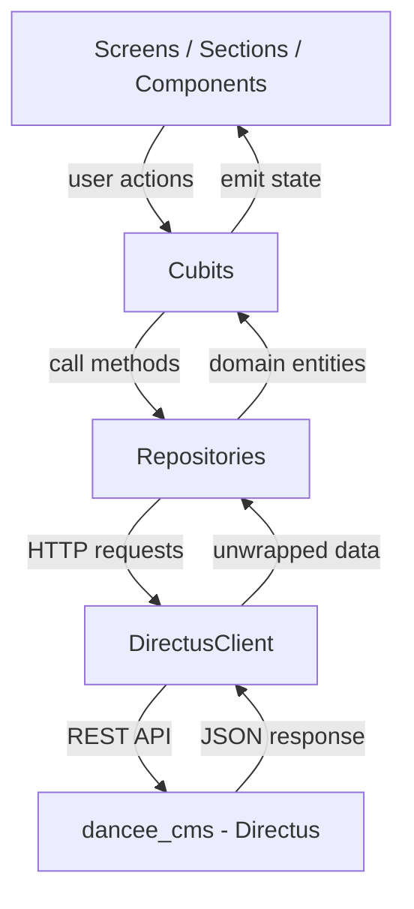
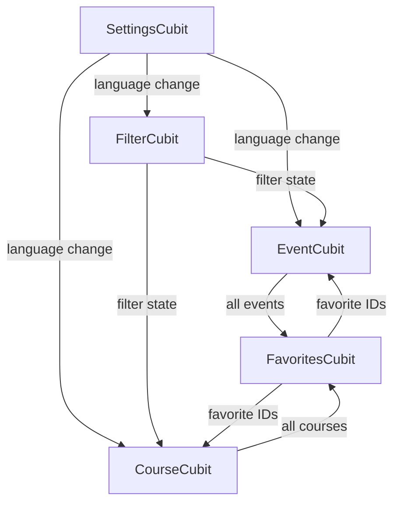
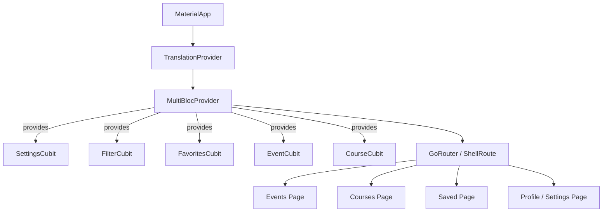

# Design Document: CMS Flutter Integration

## Overview

This design replaces all hardcoded mock data in dancee_app2 with live data from dancee_cms (Directus). The app currently uses static repository classes (`EventRepository`, `CourseRepository`, `CityRepository`) that return hardcoded `const` objects. This feature introduces:

1. A Dart `DirectusClient` (Dio-based HTTP client) reused from dancee_app's proven pattern
2. Domain entity classes (`Event`, `Course`, `Venue`, `DanceStyle`, `Favorite`) with `fromDirectus()` factories that parse CMS JSON
3. Repository classes that call the Directus REST API and return domain entities
4. Cubits (`EventCubit`, `CourseCubit`, `FilterCubit`, `FavoritesCubit`, `SettingsCubit`) managing state with freezed
5. Client-side filtering by dance style (with parent/child hierarchy) and location (region), shared across events and courses
6. Favorites synced to CMS via a `favorites` collection, with optimistic updates
7. Language-aware data fetching using Directus `deep` translation filters, triggered by settings changes
8. Configuration via the existing `config.dart` / `config.example.dart` / `core/config.dart` pattern

The design preserves dancee_app2's existing screen/section/component UI structure and routing. No backend changes are needed — the app talks directly to the existing Directus REST API.

## Architecture

### Data Flow



### Cubit Dependency Graph



### Widget Tree (BlocProvider placement)



All cubits are provided above the router so they are shared across all pages. `FilterCubit` is a single instance shared between events and courses pages. `FavoritesCubit` resolves favorite items against the loaded events and courses from `EventCubit` and `CourseCubit`.

## Components and Interfaces

### New Files

| Layer | File | Purpose |
|-------|------|---------|
| Core | `lib/core/clients.dart` | `DirectusClient` — Dio-based HTTP client for Directus REST API |
| Core | `lib/core/config.dart` | `AppConfig` — re-exports sensitive config + public constants |
| Core | `lib/core/exceptions.dart` | `ApiException` — typed exception for API errors |
| Core | `lib/core/service_locator.dart` | get_it DI setup for all clients, repos, cubits |
| Data/Entities | `lib/data/entities/event.dart` | `Event` entity with `fromDirectus()` factory |
| Data/Entities | `lib/data/entities/course.dart` | `Course` entity with `fromDirectus()` factory |
| Data/Entities | `lib/data/entities/venue.dart` | `Venue` entity with `fromDirectus()` factory |
| Data/Entities | `lib/data/entities/dance_style.dart` | `DanceStyle` entity with `fromDirectus()` factory |
| Data/Entities | `lib/data/entities/favorite.dart` | `Favorite` entity with `fromDirectus()` factory |
| Data/Entities | `lib/data/entities/event_info.dart` | `EventInfo` and `EventInfoType` |
| Data/Entities | `lib/data/entities/event_part.dart` | `EventPart` entity with `fromDirectus()` factory |
| Logic/States | `lib/logic/states/filter_state.dart` | `FilterState` immutable data object |
| Data/Repos | `lib/data/repositories/event_repository.dart` | Fetches events from CMS, replaces mock data |
| Data/Repos | `lib/data/repositories/course_repository.dart` | Fetches courses from CMS, replaces mock data |
| Data/Repos | `lib/data/repositories/favorites_repository.dart` | CRUD favorites via CMS |
| Data/Repos | `lib/data/repositories/dance_style_repository.dart` | Fetches dance styles with translations |
| Logic/States | `lib/logic/states/event_state.dart` | `EventState` (freezed) |
| Logic/States | `lib/logic/states/course_state.dart` | `CourseState` (freezed) |
| Logic/States | `lib/logic/states/favorites_state.dart` | `FavoritesState` (freezed) |
| Logic/States | `lib/logic/states/settings_state.dart` | `SettingsState` (freezed) |
| Logic/Cubits | `lib/logic/cubits/event_cubit.dart` | `EventCubit` — imports `../states/event_state.dart` |
| Logic/Cubits | `lib/logic/cubits/course_cubit.dart` | `CourseCubit` — imports `../states/course_state.dart` |
| Logic/Cubits | `lib/logic/cubits/filter_cubit.dart` | `FilterCubit` — imports `../states/filter_state.dart` |
| Logic/Cubits | `lib/logic/cubits/favorites_cubit.dart` | `FavoritesCubit` — imports `../states/favorites_state.dart` |
| Logic/Cubits | `lib/logic/cubits/settings_cubit.dart` | `SettingsCubit` — imports `../states/settings_state.dart` |
| Config | `lib/config.dart` | Sensitive: `directusBaseUrl`, `directusAccessToken` (gitignored) |
| Config | `lib/config.example.dart` | Template with placeholder values (committed) |

### DirectusClient Interface

Reuses the proven pattern from dancee_app. Key methods:

```dart
class DirectusClient {
  DirectusClient({required String baseUrl, required String accessToken, Dio? dio});

  /// GET with Directus envelope unwrapping. Returns the `data` field.
  Future<dynamic> get(String path, {Map<String, dynamic>? queryParameters});

  /// POST with envelope unwrapping.
  Future<dynamic> post(String path, {dynamic data});

  /// DELETE request.
  Future<void> delete(String path, {Map<String, dynamic>? queryParameters});
}
```

### Repository Interfaces

All repositories live under `lib/data/repositories/`.

```dart
// lib/data/repositories/event_repository.dart
class EventRepository {
  /// Fetches all published events with venue and translations for [languageCode].
  Future<List<Event>> getEvents(String languageCode);
}

class CourseRepository {
  /// Fetches all published courses with venue and translations for [languageCode].
  Future<List<Course>> getCourses(String languageCode);
}

class FavoritesRepository {
  /// Lists all favorites for [userId].
  Future<List<Favorite>> getFavorites(String userId);
  /// Creates a favorite. Returns the created record.
  Future<Favorite> addFavorite({required String userId, required String itemType, required int itemId});
  /// Deletes a favorite by matching userId + itemType + itemId.
  Future<void> removeFavorite({required String userId, required String itemType, required int itemId});
}

class DanceStyleRepository {
  /// Fetches all dance styles with translations for [languageCode].
  Future<List<DanceStyle>> getDanceStyles(String languageCode);
}
```

### Cubit Interfaces

Each cubit's freezed state class lives in a separate file under `lib/logic/states/`, and the cubit class lives under `lib/logic/cubits/`. For example, `EventState` lives in `logic/states/event_state.dart` and `EventCubit` lives in `logic/cubits/event_cubit.dart` (which imports `../states/event_state.dart`). All state classes, including `FilterState`, live under `lib/logic/states/`.

```dart
// lib/logic/states/event_state.dart — EventState (freezed)
@freezed
class EventState with _$EventState {
  const factory EventState.initial() = _Initial;
  const factory EventState.loading() = _Loading;
  const factory EventState.loaded({required List<Event> allEvents, required List<Event> filteredEvents, required List<Event> featuredEvents}) = _Loaded;
  const factory EventState.error({required String message}) = _Error;
}

// lib/logic/cubits/event_cubit.dart — EventCubit (imports ../states/event_state.dart)
import '../states/event_state.dart';

class EventCubit extends Cubit<EventState> {
  Future<void> loadEvents(String languageCode);
  void applyFilters(FilterState filters);
  void updateFavoriteStatus(String eventId, bool isFavorited);
}

// lib/logic/states/course_state.dart — CourseState (freezed)
@freezed
class CourseState with _$CourseState {
  const factory CourseState.initial() = _Initial;
  const factory CourseState.loading() = _Loading;
  const factory CourseState.loaded({required List<Course> allCourses, required List<Course> filteredCourses}) = _Loaded;
  const factory CourseState.error({required String message}) = _Error;
}

// lib/logic/cubits/course_cubit.dart — CourseCubit (imports ../states/course_state.dart)
import '../states/course_state.dart';

class CourseCubit extends Cubit<CourseState> {
  Future<void> loadCourses(String languageCode);
  void applyFilters(FilterState filters);
  void updateFavoriteStatus(String courseId, bool isFavorited);
}

// lib/logic/cubits/filter_cubit.dart — FilterCubit (imports ../states/filter_state.dart)
import '../states/filter_state.dart';

class FilterCubit extends Cubit<FilterState> {
  void setDanceStyles(Set<String> codes);
  void setLocations(Set<String> regions);
  void clearAll();
}

// lib/logic/states/favorites_state.dart — FavoritesState (freezed)
@freezed
class FavoritesState with _$FavoritesState {
  const factory FavoritesState.initial() = _Initial;
  const factory FavoritesState.loading() = _Loading;
  const factory FavoritesState.loaded({required Set<int> eventIds, required Set<int> courseIds}) = _Loaded;
  const factory FavoritesState.error({required String message}) = _Error;
}

// lib/logic/cubits/favorites_cubit.dart — FavoritesCubit (imports ../states/favorites_state.dart)
import '../states/favorites_state.dart';

class FavoritesCubit extends Cubit<FavoritesState> {
  Future<void> loadFavorites();
  Future<void> toggleFavorite({required String itemType, required int itemId});
  bool isFavorited(String itemType, int itemId);
}

// lib/logic/states/settings_state.dart — SettingsState (freezed)
@freezed
class SettingsState with _$SettingsState {
  const factory SettingsState({required String languageCode}) = _SettingsState;
}

// lib/logic/cubits/settings_cubit.dart — SettingsCubit (imports ../states/settings_state.dart)
import '../states/settings_state.dart';

class SettingsCubit extends Cubit<SettingsState> {
  Future<void> init();
  Future<void> setLanguage(String languageCode);
  String get currentLanguageCode;
}
```

## Data Models

### CMS Collections (existing in Directus)

The following collections already exist in dancee_cms (created by `setup-directus.ts`):

- `events` — with fields: id, title, original_description, organizer, venue (M2O → venues), start_time, end_time, timezone, original_url, parts (JSON), info (JSON), dances (JSON), status, image (M2O → directus_files), event_type, registration_url
- `events_translations` — fields: events_id, languages_code, title, description, parts_translations (JSON), info_translations (JSON)
- `courses` — fields: id, title, description, instructor_name, instructor_bio, instructor_avatar_url, venue (M2O → venues), start_date, end_date, schedule_day, schedule_time, lesson_count, lesson_duration_minutes, max_participants, current_participants, price, price_note, level, dances (JSON), image, original_url, registration_url, status
- `courses_translations` — fields: courses_id, languages_code, title, description, learning_items (JSON)
- `venues` — fields: id, name, street, number, town, country, postal_code, region, latitude, longitude
- `dance_styles` — fields: code (PK), name, parent_code (self-ref), sort_order
- `dance_styles_translations` — fields: dance_styles_code, languages_code, name
- `favorites` — fields: id, user_id, item_type ("event"|"course"), item_id, created_at
- `languages` — fields: code (PK), name

### Dart Entity Classes

Each entity lives in its own file under `lib/data/entities/`. They use Equatable for value equality and provide `fromDirectus()` factories. Each cubit's freezed state class lives under `lib/logic/states/` and the cubit class lives under `lib/logic/cubits/` (e.g. `EventState` in `logic/states/event_state.dart`, `EventCubit` in `logic/cubits/event_cubit.dart`).

#### Venue (`lib/data/entities/venue.dart`)

```dart
class Venue extends Equatable {
  final int id;
  final String name;
  final String street;
  final String number;
  final String town;
  final String country;
  final String postalCode;
  final String region;
  final double latitude;
  final double longitude;

  String get fullAddress {
    final streetPart = number.isNotEmpty ? '$street $number' : street;
    return '$streetPart, $postalCode $town, $country';
  }

  factory Venue.fromDirectus(Map<String, dynamic> json);
}
```

#### Event (`lib/data/entities/event.dart`)

```dart
class Event extends Equatable {
  final int id;
  final String? imageUrl;        // Constructed: {baseUrl}/assets/{fileId}
  final String title;
  final String description;       // Translated, joined paragraphs
  final DateTime startTime;
  final DateTime? endTime;
  final String? timezone;
  final String organizer;
  final Venue? venue;
  final List<String> dances;      // Dance style codes
  final String eventType;         // "party", "workshop", "festival", etc.
  final List<EventInfo> info;     // Typed info items (url, price, dresscode)
  final List<EventPart> parts;    // Program data with translated fields
  final String? originalUrl;
  final bool isFavorited;

  factory Event.fromDirectus(Map<String, dynamic> json, {
    required String languageCode,
    required String directusBaseUrl,
    Set<int> favoriteEventIds = const {},
  });
}
```

Translation extraction logic in `fromDirectus`:
1. Look for translation matching `languageCode` in the `translations` array
2. If not found, fall back to `en`
3. If still not found, use the first available translation
4. Extract `title`, `description`, `parts_translations`, `info_translations`

#### Course (`lib/data/entities/course.dart`)

```dart
class Course extends Equatable {
  final int id;
  final String? imageUrl;
  final String title;
  final String description;
  final String? instructorName;
  final String? instructorBio;
  final String? instructorAvatarUrl;
  final Venue? venue;
  final String? startDate;
  final String? endDate;
  final String? scheduleDay;
  final String? scheduleTime;
  final int? lessonCount;
  final int? lessonDurationMinutes;
  final int? maxParticipants;
  final int? currentParticipants;
  final String? price;
  final String? priceNote;
  final String? level;
  final List<String> dances;
  final List<String> learningItems;  // Translated
  final String? originalUrl;
  final bool isFavorited;

  factory Course.fromDirectus(Map<String, dynamic> json, {
    required String languageCode,
    required String directusBaseUrl,
    Set<int> favoriteCourseIds = const {},
  });
}
```

#### DanceStyle (`lib/data/entities/dance_style.dart`)

```dart
class DanceStyle extends Equatable {
  final String code;
  final String name;           // Translated name
  final String? parentCode;
  final int sortOrder;

  factory DanceStyle.fromDirectus(Map<String, dynamic> json, {required String languageCode});
}
```

#### Favorite (`lib/data/entities/favorite.dart`)

```dart
class Favorite extends Equatable {
  final int id;
  final String userId;
  final String itemType;       // "event" or "course"
  final int itemId;
  final String? createdAt;

  factory Favorite.fromDirectus(Map<String, dynamic> json);
}
```

#### EventInfo & EventPart (`lib/data/entities/event_info.dart`, `lib/data/entities/event_part.dart`)

```dart
enum EventInfoType { url, price, dresscode }

class EventInfo extends Equatable {
  final EventInfoType type;
  final String key;            // Translated key
  final String value;

  factory EventInfo.fromDirectus(Map<String, dynamic> json, {Map<String, dynamic>? translation});
}

class EventPart extends Equatable {
  final String name;           // Translated
  final String? description;   // Translated
  final String type;           // "party", "workshop", "openLesson"
  final DateTime? startTime;
  final DateTime? endTime;
  final List<String> lectors;
  final List<String> djs;

  factory EventPart.fromDirectus(Map<String, dynamic> json, {Map<String, dynamic>? translation});
}
```

### FilterState (`lib/logic/states/filter_state.dart`)

```dart
class FilterState extends Equatable {
  final Set<String> selectedDanceStyles;  // Dance style codes
  final Set<String> selectedRegions;      // Venue region strings

  bool get hasActiveFilters => selectedDanceStyles.isNotEmpty || selectedRegions.isNotEmpty;
}
```

### Directus API Query Patterns

Events fetch:
```
GET /items/events?fields=*,venue.*,translations.*&filter[status][_eq]=published&sort=start_time&limit=-1&deep[translations][_filter][languages_code][_eq]={lang}
```

Courses fetch:
```
GET /items/courses?fields=*,venue.*,translations.*&filter[status][_eq]=published&sort=start_date&limit=-1&deep[translations][_filter][languages_code][_eq]={lang}
```

Dance styles fetch:
```
GET /items/dance_styles?fields=*,translations.*&sort=sort_order&limit=-1&deep[translations][_filter][languages_code][_eq]={lang}
```

Favorites fetch:
```
GET /items/favorites?filter[user_id][_eq]={userId}&sort[]=-created_at
```

### Filtering Logic

All filtering is client-side using AND logic:

```dart
List<Event> filterEvents(List<Event> events, FilterState filters, List<DanceStyle> allStyles) {
  return events.where((event) {
    // Dance style filter — expand parent codes to include children
    if (filters.selectedDanceStyles.isNotEmpty) {
      final expandedCodes = <String>{};
      for (final code in filters.selectedDanceStyles) {
        expandedCodes.add(code);
        expandedCodes.addAll(
          allStyles.where((s) => s.parentCode == code).map((s) => s.code),
        );
      }
      if (!event.dances.any((d) => expandedCodes.contains(d))) return false;
    }
    // Location filter
    if (filters.selectedRegions.isNotEmpty) {
      if (event.venue == null || !filters.selectedRegions.contains(event.venue!.region)) return false;
    }
    return true;
  }).toList();
}
```

The same logic applies to courses. The `filterCourses` function is identical in structure.

### Language Mapping

| slang locale | Directus languages_code |
|-------------|------------------------|
| `en` | `en` |
| `cs` | `cs` |
| `es` | `es` |

Direct 1:1 mapping — no conversion needed.

### Image URL Construction

```dart
String? buildImageUrl(dynamic fileId, String directusBaseUrl) {
  if (fileId == null) return null;
  return '$directusBaseUrl/assets/$fileId';
}
```

## Correctness Properties

*A property is a characteristic or behavior that should hold true across all valid executions of a system — essentially, a formal statement about what the system should do. Properties serve as the bridge between human-readable specifications and machine-verifiable correctness guarantees.*

### Property 1: Deep language filter in API queries

*For any* valid language code (en, cs, es), when a repository method fetches events, courses, or dance styles, the query parameters sent to the Directus API SHALL include `deep[translations][_filter][languages_code][_eq]` set to that language code.

**Validates: Requirements 1.5, 15.1, 15.2**

### Property 2: HTTP error to ApiException mapping

*For any* HTTP error status code (4xx, 5xx) or network failure returned by the Directus API, the DirectusClient SHALL throw an `ApiException` with a non-empty descriptive message string.

**Validates: Requirements 1.7**

### Property 3: Translation extraction from CMS JSON

*For any* valid CMS event or course JSON containing a translations array with an entry matching the requested language code, parsing via `fromDirectus()` SHALL produce an entity whose `title` and `description` fields equal the values from that translation entry.

**Validates: Requirements 2.3, 3.2**

### Property 4: Image URL construction

*For any* non-null file ID and any Directus base URL string, the constructed image URL SHALL equal `{directusBaseUrl}/assets/{fileId}`. When the file ID is null, the image URL SHALL be null.

**Validates: Requirements 2.4, 3.3**

### Property 5: Translation fallback chain

*For any* translations array that does NOT contain an entry for the requested language code, the parser SHALL use the English (`en`) translation if present. If English is also missing, it SHALL use the first available translation. If the array is empty, title and description SHALL fall back to empty strings or the raw untranslated fields.

**Validates: Requirements 2.5, 3.4**

### Property 6: Featured events are filtered festivals

*For any* list of events and any filter state, the "featured events" subset SHALL contain exactly those events where `eventType == "festival"` AND the event matches all active filter criteria (dance styles and locations). When this subset is empty, the featured section is hidden.

**Validates: Requirements 4.2, 5.1, 5.2**

### Property 7: Combined AND filtering

*For any* list of events (or courses), any set of selected dance style codes, and any set of selected regions, the filtered result SHALL contain only items that satisfy ALL active filter criteria simultaneously: (a) if dance styles are selected, the item's dances list contains at least one of the expanded codes, AND (b) if regions are selected, the item's venue region matches one of the selected regions. Empty filter criteria impose no restriction.

**Validates: Requirements 8.3, 8.4, 9.3, 9.4, 10.1, 10.2**

### Property 8: Parent/child dance style expansion

*For any* parent dance style code and any list of dance styles with parent/child relationships, selecting the parent code SHALL expand the filter to include the parent code itself plus all codes where `parentCode` equals the selected parent. An item tagged with any of these expanded codes SHALL pass the dance style filter.

**Validates: Requirements 8.5**

### Property 9: Region extraction from loaded data

*For any* list of events and courses with venue data, the set of available regions for the location filter SHALL equal the union of all non-empty `venue.region` values from both events and courses, with no duplicates.

**Validates: Requirements 9.1**

### Property 10: Favorite resolution against loaded data

*For any* set of favorite records and any loaded events and courses lists, resolving favorites SHALL produce a list where each resolved item's `id` matches the `itemId` of the corresponding favorite, and the `itemType` correctly identifies whether it's an event or course.

**Validates: Requirements 11.2**

### Property 11: Favorites sorted by creation date

*For any* list of resolved favorites, the displayed order SHALL be sorted by `createdAt` in descending order (newest first).

**Validates: Requirements 11.3**

### Property 12: Favorites unaffected by filters

*For any* filter state (including non-empty dance style and region selections), the saved items page SHALL display ALL favorited items regardless of whether they match the active filters.

**Validates: Requirements 11.4**

### Property 13: Favorite toggle round-trip

*For any* item (event or course), toggling the favorite status twice (add then remove, or remove then add) SHALL return the favorite state to its original value.

**Validates: Requirements 12.3**

### Property 14: Optimistic favorite update

*For any* favorite toggle action, the cubit state SHALL reflect the new favorite status immediately after the toggle method is called, before the CMS API request completes.

**Validates: Requirements 12.4**

### Property 15: Optimistic update revert on failure

*For any* favorite toggle action where the CMS API request fails, the cubit state SHALL revert to the pre-toggle favorite status.

**Validates: Requirements 12.5**

### Property 16: Language persistence round-trip

*For any* valid language code (en, cs, es), persisting the language to SharedPreferences and then reading it back SHALL produce the same language code. On app restart, the SettingsCubit SHALL restore the persisted language.

**Validates: Requirements 16.3, 16.4**

## Error Handling

### API Errors

| Error Type | Handling |
|-----------|----------|
| Network timeout / connection error | `ApiException` with user-friendly message. Cubits emit error state with retry option. |
| HTTP 401/403 (auth failure) | `ApiException`. Since we use a static token, this indicates misconfiguration. Show error with suggestion to check config. |
| HTTP 404 (not found) | `ApiException`. For item lookups, treat as "item not found". |
| HTTP 5xx (server error) | `ApiException`. Show generic server error with retry. |
| JSON parse error | `ApiException`. Log the raw response for debugging. Show generic error. |
| Empty translations array | Not an error — use fallback chain (Property 5). |
| Null venue on event/course | Not an error — venue fields default to empty/zero values. |

### Favorite Errors

| Scenario | Handling |
|----------|----------|
| Add favorite fails | Revert optimistic update (remove from local set). Show error snackbar. |
| Remove favorite fails | Revert optimistic update (re-add to local set). Show error snackbar. |
| Duplicate favorite (409) | Treat as success — the favorite already exists. |

### Data Loading Errors

Each cubit (EventCubit, CourseCubit, FavoritesCubit) follows the same pattern:
1. Emit `loading` state
2. On success: emit `loaded` state with data
3. On failure: emit `error` state with translated message and retry callback
4. Non-fatal errors (e.g., favorite toggle failure while list is loaded) use an error stream/snackbar without destroying the loaded state

## Testing Strategy

### Property-Based Testing

Library: `fast_check` (Dart) — or if unavailable in the Dart ecosystem, use `test` with custom generators via helper functions that produce randomized inputs.

Since Dart's property-based testing ecosystem is limited, the recommended approach is:
- Use the standard `test` package with custom generator functions
- Each property test runs a loop of 100+ iterations with randomized inputs
- Generators produce random events, courses, filter states, dance style hierarchies, and translation arrays

Each property test MUST:
- Run minimum 100 iterations
- Reference its design property with a comment tag
- Tag format: `// Feature: cms-flutter-integration, Property {N}: {title}`

### Property Tests

| Property | Test Description |
|----------|-----------------|
| P1: Deep language filter | Generate random language codes, verify query params contain correct deep filter |
| P2: Error mapping | Generate random HTTP status codes, verify ApiException is thrown with non-empty message |
| P3: Translation extraction | Generate random CMS JSON with translations, verify parsed entity has correct translated fields |
| P4: Image URL construction | Generate random file IDs and base URLs, verify URL pattern |
| P5: Translation fallback | Generate translation arrays with missing languages, verify fallback chain |
| P6: Featured = filtered festivals | Generate random event lists with mixed types + random filters, verify featured subset |
| P7: AND filtering | Generate random items + random filter states, verify AND logic |
| P8: Parent/child expansion | Generate random dance style trees, verify expansion includes parent + children |
| P9: Region extraction | Generate random events/courses with venues, verify region set |
| P10: Favorite resolution | Generate random favorites + items, verify resolution correctness |
| P11: Favorites sort order | Generate random favorites with dates, verify descending sort |
| P12: Favorites ignore filters | Generate random favorites + active filters, verify all favorites shown |
| P13: Toggle round-trip | Generate random items, toggle twice, verify original state |
| P14: Optimistic update | Mock slow API, toggle, verify immediate state change |
| P15: Revert on failure | Mock failing API, toggle, verify state reverts |
| P16: Language round-trip | Generate random language codes, persist + read, verify equality |

### Unit Tests

Unit tests complement property tests for specific examples and edge cases:

- Parsing a specific known CMS event JSON produces expected Event entity
- Parsing a course with no translations falls back correctly
- Image URL is null when file ID is null
- Empty event list produces empty featured and upcoming sections
- Filter with no selections returns all items
- Favorite toggle on non-existent item is handled gracefully
- Settings cubit initializes with English when no persisted language exists
- DirectusClient correctly unwraps the Directus `{ "data": ... }` envelope
- ApiException contains status code for HTTP errors

### Test File Structure

```
test/
├── data/
│   ├── entities/
│   │   ├── event_test.dart              # Event parsing, translation extraction
│   │   ├── course_test.dart             # Course parsing, translation extraction
│   │   ├── venue_test.dart              # Venue parsing
│   │   ├── dance_style_test.dart        # DanceStyle parsing
│   │   ├── favorite_test.dart           # Favorite parsing
│   │   ├── event_info_test.dart         # EventInfo parsing
│   │   ├── event_part_test.dart         # EventPart parsing
│   │   └── event_part_test.dart         # EventPart parsing
│   └── repositories/
│       ├── event_repository_test.dart   # API calls with mocked DirectusClient
│       ├── course_repository_test.dart
│       ├── favorites_repository_test.dart
│       └── dance_style_repository_test.dart
├── logic/
│   ├── states/
│   │   ├── event_state_test.dart        # EventState freezed variants
│   │   ├── course_state_test.dart       # CourseState freezed variants
│   │   ├── favorites_state_test.dart    # FavoritesState freezed variants
│   │   ├── settings_state_test.dart     # SettingsState freezed variants
│   │   └── filter_state_test.dart      # FilterState equality, hasActiveFilters
│   └── cubits/
│       ├── event_cubit_test.dart        # Loading, filtering, featured logic
│       ├── course_cubit_test.dart
│       ├── filter_cubit_test.dart       # Shared state, AND logic, expansion
│       ├── favorites_cubit_test.dart    # Optimistic updates, revert, resolution
│       └── settings_cubit_test.dart     # Language persistence round-trip
├── core/
│   └── clients_test.dart                # DirectusClient envelope unwrapping, error mapping
└── helpers/
    └── generators.dart                  # Random data generators for property tests
```
