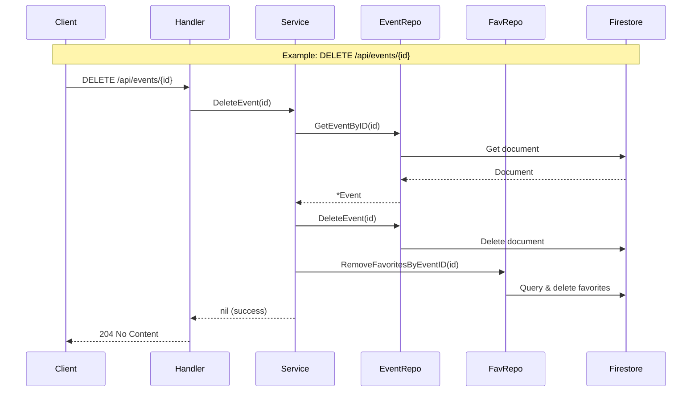

# Design Document: Event CRUD Endpoints

## Overview

This design document describes the implementation of full CRUD (Create, Read, Update, Delete) operations for dance events in the `dancee_events` Go backend service. The implementation follows the existing architectural patterns established in the codebase, using Gin for HTTP routing, Firestore for persistence, and a layered architecture (handlers → services → repositories).

The feature adds four new endpoints:
- `GET /api/events/{id}` - Retrieve a single event
- `POST /api/events` - Create a new event
- `PUT /api/events/{id}` - Update an existing event
- `DELETE /api/events/{id}` - Delete an event

Additionally, the existing `POST /api/events/seed` endpoint and its associated logic will be removed.

## Architecture

The implementation follows the existing three-layer architecture:

```
┌─────────────────────────────────────────────────────────────┐
│                      HTTP Layer (Gin)                        │
│  GET /api/events/{id}  POST /api/events  PUT  DELETE        │
└─────────────────────────────────────────────────────────────┘
                              │
                              ▼
┌─────────────────────────────────────────────────────────────┐
│                   Handler Layer                              │
│  event_handler.go: GetEvent, CreateEvent, UpdateEvent,      │
│                    DeleteEvent                               │
└─────────────────────────────────────────────────────────────┘
                              │
                              ▼
┌─────────────────────────────────────────────────────────────┐
│                   Service Layer                              │
│  event_service.go: GetEventByID, CreateEvent, UpdateEvent,  │
│                    DeleteEvent                               │
└─────────────────────────────────────────────────────────────┘
                              │
                              ▼
┌─────────────────────────────────────────────────────────────┐
│                  Repository Layer                            │
│  event_repository.go: GetEventByID, CreateEvent,            │
│                       UpdateEvent, DeleteEvent               │
│  favorites_repository.go: RemoveFavoritesByEventID          │
└─────────────────────────────────────────────────────────────┘
                              │
                              ▼
┌─────────────────────────────────────────────────────────────┐
│                     Firestore                                │
│  Collection: events                                          │
│  Collection: favorites/{userId}/events                       │
└─────────────────────────────────────────────────────────────┘
```

### Request Flow



## Components and Interfaces

### Handler Layer (`internal/handlers/event_handler.go`)

New methods added to the existing `EventHandler` struct:

```go
// GetEvent handles GET /api/events/:id
// Query params: userId (optional) - to include isFavorite field
func (h *EventHandler) GetEvent(c *gin.Context)

// CreateEvent handles POST /api/events
// Request body: Event JSON (without id)
func (h *EventHandler) CreateEvent(c *gin.Context)

// UpdateEvent handles PUT /api/events/:id
// Request body: Event JSON (without id)
func (h *EventHandler) UpdateEvent(c *gin.Context)

// DeleteEvent handles DELETE /api/events/:id
func (h *EventHandler) DeleteEvent(c *gin.Context)
```

Removed methods:
- `SeedEvents` - removed entirely

### Service Layer (`internal/services/event_service.go`)

New methods added to the existing `EventService` struct:

```go
// GetEventByID retrieves a single event, optionally marking favorite status
func (s *EventService) GetEventByID(eventID, userID string) (*models.Event, error)

// CreateEvent validates and creates a new event
func (s *EventService) CreateEvent(event *models.Event) (*models.Event, error)

// UpdateEvent validates and updates an existing event
func (s *EventService) UpdateEvent(eventID string, event *models.Event) (*models.Event, error)

// DeleteEvent deletes an event and its associated favorites
func (s *EventService) DeleteEvent(eventID string) error
```

Removed methods:
- `SeedEvents` - removed entirely

### Repository Layer

#### `internal/repositories/event_repository.go`

New methods added to the existing `EventRepository` struct:

```go
// CreateEvent creates a new event with a Firestore auto-generated ID
func (r *EventRepository) CreateEvent(event *models.Event) (string, error)

// UpdateEvent overwrites an existing event document
func (r *EventRepository) UpdateEvent(eventID string, event *models.Event) error

// DeleteEvent deletes an event document by ID
func (r *EventRepository) DeleteEvent(eventID string) error
```

Removed methods/logic:
- `initializeSampleData` - removed entirely (was called in `NewEventRepository`)

#### `internal/repositories/favorites_repository.go`

New method:

```go
// RemoveFavoritesByEventID removes a specific event from all users' favorites.
// Queries all user documents in the favorites collection and deletes the
// matching event sub-document.
func (r *FavoritesRepository) RemoveFavoritesByEventID(eventID string) error
```

### Validation

A new `CreateEventRequest` struct will be introduced in the models package to handle request binding with validation tags:

```go
// CreateEventRequest represents the request body for creating/updating an event.
// Uses Gin's binding tags for required field validation.
type CreateEventRequest struct {
    Title       string            `json:"title" binding:"required"`
    Description *string           `json:"description,omitempty"`
    Organizer   string            `json:"organizer" binding:"required"`
    Venue       Venue             `json:"venue" binding:"required"`
    StartTime   string            `json:"startTime" binding:"required"`
    EndTime     *string           `json:"endTime,omitempty"`
    Duration    *int64            `json:"duration,omitempty"`
    Dances      []string          `json:"dances" binding:"required,min=1"`
    Info        []EventInfo       `json:"info,omitempty"`
    Parts       []EventPart       `json:"parts,omitempty"`
}
```

This struct is used for both create and update operations. Gin's `ShouldBindJSON` validates required fields and returns a 400 error with details if validation fails.

### Route Registration (`main.go`)

Updated route registration:

```go
events := group.Group("/events")
{
    events.GET("/list", eventHandler.ListEvents)
    events.GET("/:id", eventHandler.GetEvent)          // NEW
    events.POST("", eventHandler.CreateEvent)           // NEW
    events.PUT("/:id", eventHandler.UpdateEvent)        // NEW
    events.DELETE("/:id", eventHandler.DeleteEvent)     // NEW
    events.GET("/favorites", eventHandler.ListFavorites)
    events.POST("/favorites", eventHandler.AddFavorite)
    events.DELETE("/favorites/:eventId", eventHandler.RemoveFavorite)
    // events.POST("/seed", ...) REMOVED
}
```

**Route ordering note:** Named routes like `/list` and `/favorites` must be registered before the parameterized `/:id` route to avoid Gin treating "list" or "favorites" as an ID parameter.

### CORS Update

The CORS middleware in `main.go` must be updated to include `PUT` in the allowed methods:

```go
c.Writer.Header().Set("Access-Control-Allow-Methods", "GET, POST, PUT, DELETE, OPTIONS")
```

## Data Models

### Existing Models (No Changes)

The existing `Event`, `Venue`, `Address`, `EventInfo`, and `EventPart` structs in `internal/models/event.go` remain unchanged. The `Event` struct already has the correct Firestore and JSON tags.

### New Model: `CreateEventRequest`

Added to `internal/models/event.go`:

```go
type CreateEventRequest struct {
    Title       string      `json:"title" binding:"required"`
    Description *string     `json:"description,omitempty"`
    Organizer   string      `json:"organizer" binding:"required"`
    Venue       Venue       `json:"venue" binding:"required"`
    StartTime   string      `json:"startTime" binding:"required"`
    EndTime     *string     `json:"endTime,omitempty"`
    Duration    *int64      `json:"duration,omitempty"`
    Dances      []string    `json:"dances" binding:"required,min=1"`
    Info        []EventInfo `json:"info,omitempty"`
    Parts       []EventPart `json:"parts,omitempty"`
}

// ToEvent converts a CreateEventRequest to an Event model.
func (r *CreateEventRequest) ToEvent() *Event {
    return &Event{
        Title:       r.Title,
        Description: r.Description,
        Organizer:   r.Organizer,
        Venue:       r.Venue,
        StartTime:   r.StartTime,
        EndTime:     r.EndTime,
        Duration:    r.Duration,
        Dances:      r.Dances,
        Info:        r.Info,
        Parts:       r.Parts,
    }
}
```

### Firestore Data Layout

No changes to the Firestore data layout. Events are stored in the `events` collection with the document ID as the event ID. Favorites are stored in `favorites/{userId}/events/{eventId}`.

### Cascade Delete Strategy

When an event is deleted, all favorite references must also be removed. The `RemoveFavoritesByEventID` method will:

1. List all documents in the `favorites` collection (each document represents a user)
2. For each user document, attempt to delete the sub-document at `favorites/{userId}/events/{eventId}`
3. Ignore "not found" errors (the user may not have favorited that event)

This approach is acceptable for the current scale. If the number of users grows significantly, a Firestore collection group query on the `events` sub-collection would be more efficient.

### OpenAPI Specification Updates

The `backend/dancee_api/specs/events.openapi.yaml` file will be updated to:

1. **Add** `GET /api/events/{id}` path with 200 and 404 responses
2. **Add** `POST /api/events` path with `CreateEventRequest` schema, 201 and 400 responses
3. **Add** `PUT /api/events/{id}` path with `CreateEventRequest` schema, 200, 400, and 404 responses
4. **Add** `DELETE /api/events/{id}` path with 204 and 404 responses
5. **Add** `CreateEventRequest` component schema documenting required/optional fields
6. **Remove** `POST /api/events/seed` path definition
7. **Remove** `SeedEventsResponse` component schema

## Correctness Properties

*A property is a characteristic or behavior that should hold true across all valid executions of a system — essentially, a formal statement about what the system should do. Properties serve as the bridge between human-readable specifications and machine-verifiable correctness guarantees.*

### Property 1: GET event returns correct data with correct isFavorite

*For any* event stored in Firestore and any optional userId, a GET request to `/api/events/{id}` should return that event's data with HTTP 200, and the `isFavorite` field should be `true` if and only if the event exists in that user's favorites collection (or be absent/false when no userId is provided).

**Validates: Requirements 1.1, 1.2**

### Property 2: isPast is correctly computed

*For any* event, the `isPast` field returned by the API should be `true` if the event's endTime (or startTime when endTime is absent) is before the current time, and `false` otherwise.

**Validates: Requirements 1.4**

### Property 3: Non-existent ID returns 404

*For any* event ID that does not exist in Firestore, GET, PUT, and DELETE requests to `/api/events/{id}` should all return HTTP 404 with a JSON body `{"error": "Event not found"}`.

**Validates: Requirements 1.3, 3.2, 4.2**

### Property 4: Create event round-trip

*For any* valid event input (with all required fields: title, organizer, venue, startTime, dances), creating the event via POST `/api/events` and then retrieving it via GET `/api/events/{id}` using the returned ID should yield an event whose fields match the original input.

**Validates: Requirements 2.1**

### Property 5: Missing required fields returns 400

*For any* event input that is missing at least one required field (title, organizer, venue, startTime, or dances), both POST `/api/events` and PUT `/api/events/{id}` should return HTTP 400 with a JSON body describing the validation error.

**Validates: Requirements 2.2, 3.3**

### Property 6: Created event IDs are unique

*For any* sequence of valid create requests to POST `/api/events`, all returned event IDs should be distinct.

**Validates: Requirements 2.3**

### Property 7: Update event round-trip

*For any* existing event and any valid update payload, a PUT request to `/api/events/{id}` followed by a GET request to the same ID should return an event whose fields match the update payload.

**Validates: Requirements 3.1**

### Property 8: Delete removes event

*For any* existing event, a DELETE request to `/api/events/{id}` should return HTTP 204, and a subsequent GET request to the same ID should return HTTP 404.

**Validates: Requirements 4.1**

### Property 9: Delete cascades to favorites

*For any* event that has been favorited by one or more users, deleting that event should also remove it from all users' favorites collections. After deletion, no user's favorites list should contain the deleted event ID.

**Validates: Requirements 4.3**

## Error Handling

All error responses follow the existing pattern using `gin.H{"error": message}`:

| Scenario | HTTP Status | Response Body |
|---|---|---|
| Event not found (GET/PUT/DELETE) | 404 | `{"error": "Event not found"}` |
| Missing required fields (POST/PUT) | 400 | `{"error": "<binding error details>"}` |
| Invalid JSON body (POST/PUT) | 400 | `{"error": "<parse error details>"}` |
| Firestore read/write failure | 500 | `{"error": "<error message>"}` |
| Cascade delete partial failure | 500 | `{"error": "failed to clean up favorites: <details>"}` |

### Error Flow

- **Handler layer**: Parses request, delegates to service, maps service errors to HTTP status codes
- **Service layer**: Validates business rules, returns typed errors (e.g., "event not found")
- **Repository layer**: Wraps Firestore errors, returns Go errors

The handler checks for known error messages (e.g., `"event not found"`) to determine the appropriate HTTP status code, consistent with the existing pattern in `AddFavorite` and `RemoveFavorite`.

## Testing Strategy

### Property-Based Testing

Property-based tests will use the [`rapid`](https://github.com/flyingmutant/rapid) library for Go, which provides property-based testing with automatic shrinking.

Each correctness property from the design will be implemented as a single property-based test with a minimum of 100 iterations. Tests will operate against the service layer (with a mock/in-memory repository) to keep them fast and deterministic.

**Test tag format:** `Feature: event-crud-endpoints, Property {number}: {property_text}`

Property tests to implement:
1. GET event returns correct data with correct isFavorite (Property 1)
2. isPast is correctly computed (Property 2)
3. Non-existent ID returns 404 (Property 3)
4. Create event round-trip (Property 4)
5. Missing required fields returns 400 (Property 5)
6. Created event IDs are unique (Property 6)
7. Update event round-trip (Property 7)
8. Delete removes event (Property 8)
9. Delete cascades to favorites (Property 9)

### Unit Testing

Unit tests complement property tests by covering specific examples and edge cases:

- Specific example: POST `/api/events/seed` returns 404 after removal (Requirement 5.1)
- Edge case: Creating an event with empty `dances` array (should fail validation)
- Edge case: Updating an event with the same data (idempotent)
- Edge case: Deleting an event with no favorites (no cascade needed)
- Edge case: GET with empty string as ID
- Integration: Verify route registration order (named routes before parameterized)

### Test File Location

```
backend/dancee_events/
├── internal/
│   ├── services/
│   │   └── event_service_test.go    # Property + unit tests for service layer
│   ├── handlers/
│   │   └── event_handler_test.go    # HTTP handler tests
│   └── repositories/
│       └── event_repository_test.go # Repository tests with mock Firestore
```

### Test Configuration

- Property tests: minimum 100 iterations per property
- Use `rapid` library for Go property-based testing
- Mock Firestore client for repository tests
- Use `httptest` for handler-level HTTP tests
