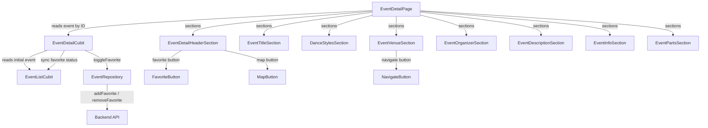

# Design Document: Event Detail Page

## Overview

The Event Detail Page is a read-heavy Flutter screen that displays comprehensive information about a single dance event. It is accessed from the event list or favorites list by tapping an event card, receiving the event ID via route parameter (`/events/:id`). The page retrieves the event from the already-loaded `EventListCubit` state — no additional API calls are needed for display.

The page introduces a new `EventDetailCubit` to manage local state concerns: specifically, toggling the favorite status and launching external map navigation. The cubit reads the event from `EventListCubit`, delegates favorite toggling to `EventRepository`, and synchronizes the updated favorite status back to `EventListCubit`.

The existing page structure (route, sections, components) is already scaffolded. This design covers completing the missing functionality: favorite toggle with optimistic UI, map/navigation launch via `url_launcher`, and wiring the new cubit into the existing widget tree.

## Architecture



### Data Flow

1. User taps an event card → navigates to `/events/:id`
2. `EventDetailPage` creates/accesses `EventDetailCubit` with the event ID
3. `EventDetailCubit.loadEvent()` finds the event in `EventListCubit.state.allEvents`
4. Page renders all sections from the cubit's state
5. User taps Favorite → `EventDetailCubit.toggleFavorite()`:
   - Optimistically flips `isFavorite` in local state
   - Calls `EventRepository.toggleFavorite()`
   - On success: syncs back to `EventListCubit` by calling `loadEvents()`
   - On failure: reverts local state, shows snackbar error
6. User taps Map/Navigate → `EventDetailCubit` or direct handler launches `url_launcher` with coordinates or address

### Key Design Decisions

- **Dedicated EventDetailCubit**: Rather than reusing `EventListCubit` directly for favorite toggling (which would couple the detail page to the list's state transitions), a dedicated cubit isolates the detail page's concerns. This allows optimistic UI updates and error recovery without affecting the list state mid-toggle.
- **Optimistic favorite toggle**: The UI flips the heart icon immediately, then calls the API. On failure, it reverts. This provides instant feedback.
- **No new API calls for display**: The event data is already loaded in `EventListCubit`. The detail cubit simply reads from it.
- **url_launcher for map navigation**: Uses the `url_launcher` package to open external map apps. Coordinates are preferred when available; falls back to address string.

## Components and Interfaces

### EventDetailCubit

New cubit managing the event detail page state.

```dart
// File: lib/features/events/logic/event_detail.dart

@freezed
class EventDetailState with _$EventDetailState {
  const factory EventDetailState.initial() = EventDetailInitial;
  const factory EventDetailState.loaded({
    required Event event,
    @Default(false) bool isTogglingFavorite,
  }) = EventDetailLoaded;
  const factory EventDetailState.error(String message) = EventDetailError;
}

class EventDetailCubit extends Cubit<EventDetailState> {
  final EventRepository _repository;
  final EventListCubit _eventListCubit;
  final String eventId;

  EventDetailCubit({
    required EventRepository repository,
    required EventListCubit eventListCubit,
    required this.eventId,
  });

  void loadEvent();           // Find event from EventListCubit state
  Future<void> toggleFavorite(); // Optimistic toggle + API call + sync
  Future<void> openMap();     // Launch external map with coordinates or address
}
```

### Updated EventDetailPage

The page will use `BlocProvider` to create an `EventDetailCubit` scoped to the page lifecycle, instead of directly reading from `EventListCubit`.

```dart
// Simplified structure
class EventDetailPage extends StatelessWidget {
  final String eventId;

  Widget build(BuildContext context) {
    return BlocProvider(
      create: (_) => EventDetailCubit(
        repository: getIt<EventRepository>(),
        eventListCubit: getIt<EventListCubit>(),
        eventId: eventId,
      )..loadEvent(),
      child: BlocBuilder<EventDetailCubit, EventDetailState>(
        builder: (context, state) => state.when(
          initial: () => loading,
          loaded: (event, isToggling) => scrollableContent(event),
          error: (msg) => errorView,
        ),
      ),
    );
  }
}
```

### Updated Sections

- **EventDetailHeaderSection**: Receives `event` and callbacks `onFavoritePressed`, `onMapPressed`, `onBackPressed`. The favorite button shows filled/outlined heart based on `event.isFavorite`.
- **EventVenueSection**: The navigate button receives an `onNavigatePressed` callback.
- **EventInfoSection**: URL-type info items become tappable, launching `url_launcher`.

### Map Navigation Utility

A helper function to build the map URL:

```dart
// In the cubit or a utility
Future<void> launchMapNavigation(Venue venue) async {
  final Uri uri;
  if (venue.latitude != null && venue.longitude != null) {
    uri = Uri.parse(
      'https://www.google.com/maps/dir/?api=1&destination=${venue.latitude},${venue.longitude}'
    );
  } else {
    uri = Uri.parse(
      'https://www.google.com/maps/dir/?api=1&destination=${Uri.encodeComponent(venue.address.fullAddress)}'
    );
  }
  await launchUrl(uri, mode: LaunchMode.externalApplication);
}
```

### DI Registration

```dart
// In service_locator.dart — register as factory (new instance per detail page)
getIt.registerFactoryParam<EventDetailCubit, String, void>(
  (eventId, _) => EventDetailCubit(
    repository: getIt<EventRepository>(),
    eventListCubit: getIt<EventListCubit>(),
    eventId: eventId,
  ),
);
```

### Translation Keys

New keys needed for the favorite toggle feedback:

| Key | EN | CS | ES |
|---|---|---|---|
| `eventDetail.addedToFavorites` | Added to favorites | Přidáno do oblíbených | Añadido a favoritos |
| `eventDetail.removedFromFavorites` | Removed from favorites | Odebráno z oblíbených | Eliminado de favoritos |
| `eventDetail.favoriteError` | Failed to update favorite | Nepodařilo se aktualizovat oblíbené | Error al actualizar favorito |
| `eventDetail.remove` | Remove | Odebrat | Eliminar |

Existing keys (`eventDetail.favorite`, `eventDetail.map`, `eventDetail.navigateToVenue`, etc.) are already defined and sufficient.

## Data Models

No new entities are needed. The existing `Event`, `Venue`, `Address`, `EventInfo`, `EventPart` entities already contain all fields required by the design:

- `Event.isFavorite` — drives the favorite button state
- `Event.badge` — drives the status badge display
- `Event.dances` — drives the dance styles section
- `Event.info` — drives the additional info section
- `Event.parts` — drives the event parts section
- `Venue.latitude`, `Venue.longitude` — used for map navigation with coordinates
- `Venue.address.fullAddress` — fallback for map navigation
- `EventInfo.type` — determines icon and tap behavior (URL opens browser)
- `EventPart.type` — determines localized label (Workshop, Party, Open Lesson)
- `EventPart.lectors`, `EventPart.djs` — displayed on part cards

The only state addition is the `EventDetailState` freezed class (described above) which wraps an `Event` with a `isTogglingFavorite` flag for optimistic UI.


## Correctness Properties

*A property is a characteristic or behavior that should hold true across all valid executions of a system — essentially, a formal statement about what the system should do. Properties serve as the bridge between human-readable specifications and machine-verifiable correctness guarantees.*

### Property 1: Favorite icon reflects event state

*For any* event, the favorite button should display a filled heart icon if and only if `event.isFavorite` is true, and an outlined heart icon if and only if `event.isFavorite` is false.

**Validates: Requirements 1.4, 9.3**

### Property 2: Event fields are rendered when present

*For any* event with non-null fields, the rendered detail page should contain the event title, venue name, organizer name, and for each non-empty list (dances, info, parts), the corresponding section should be visible with all items rendered. Conversely, for any event where a field is null or a list is empty (description, dances, info, parts), the corresponding section should be hidden.

**Validates: Requirements 2.1, 2.2, 3.1, 3.2, 4.1, 5.1, 6.1, 6.2, 7.1, 7.2, 8.1, 8.2**

### Property 3: Date formatting produces day-of-week and date

*For any* valid DateTime, the date formatting function should produce a non-empty string containing a recognizable date representation (day number and month).

**Validates: Requirements 2.3**

### Property 4: Time range formatting

*For any* pair of start and end DateTimes, the time formatting function should produce a string matching the pattern "HH:MM - HH:MM". *For any* start DateTime with a null end time, the function should produce only "HH:MM".

**Validates: Requirements 2.4, 2.5**

### Property 5: Map URL construction uses coordinates when available

*For any* venue with non-null latitude and longitude, the map URL should contain the coordinate values. *For any* venue with null coordinates, the map URL should contain the URL-encoded full address string. In both cases, the URL should be a valid Google Maps directions URL.

**Validates: Requirements 4.3, 4.4, 4.5, 10.1**

### Property 6: Favorite toggle round trip

*For any* event in loaded state, calling `toggleFavorite()` should result in the cubit's state containing the event with `isFavorite` flipped to the opposite value, and the repository's `toggleFavorite` method should have been called with the correct event ID and original favorite status.

**Validates: Requirements 9.1, 9.2**

### Property 7: Favorite toggle error recovery

*For any* event in loaded state, if the repository's `toggleFavorite` call throws an exception, the cubit should revert `isFavorite` to its original value and emit an error indication (e.g., via a snackbar-triggering state).

**Validates: Requirements 9.4**

### Property 8: Event part type label mapping

*For any* `EventPartType` value, the label mapping function should return the corresponding localized string: "Workshop" for `workshop`, "Party" for `party`, "Open Lesson" for `openLesson`.

**Validates: Requirements 8.3**

## Error Handling

| Scenario | Handling | User Feedback |
|---|---|---|
| Event not found in `EventListCubit` state | `EventDetailCubit` emits `EventDetailError` | "Event not found" screen with back button (existing `EventNotFoundSection`) |
| Favorite toggle API failure | Cubit reverts `isFavorite` to original value | Snackbar with localized error message (`eventDetail.favoriteError`) |
| Map URL launch failure | Catch `url_launcher` exception | Snackbar with generic error message |
| URL info item launch failure | Catch `url_launcher` exception | Snackbar with generic error message |
| `EventListCubit` state is not `loaded` when detail page opens | `EventDetailCubit` emits `EventDetailError` | "Event not found" screen with back button |

Key error handling principles:
- Optimistic UI for favorite toggle: flip immediately, revert on failure
- All external launches (`url_launcher`) are wrapped in try-catch
- Error messages use slang translation keys for i18n support
- The page never crashes — all error states have a graceful fallback UI

## Testing Strategy

### Unit Tests

Unit tests cover specific examples and edge cases:

- Event not found when `EventListCubit` state is not loaded → emits error state
- Event not found when ID doesn't exist in the loaded list → emits error state
- Favorite toggle with successful API call → state updates correctly
- Favorite toggle with API failure → state reverts
- Date formatting for today → returns "Today" string
- Date formatting for tomorrow → returns "Tomorrow" string
- Time range formatting with null end time → returns only start time
- Map URL with coordinates → URL contains lat/lng
- Map URL without coordinates → URL contains encoded address
- Empty dances list → dance section hidden
- Empty info list → info section hidden
- Empty parts list → parts section hidden
- Null description → description section hidden
- URL-type info item tap → launches correct URL

### Property-Based Tests

Property-based tests verify universal properties across randomly generated inputs. Use the `dart_quickcheck` or `glados` package for Dart property-based testing.

Each property test must run a minimum of 100 iterations and be tagged with a comment referencing the design property.

| Property | Test Description | Generator |
|---|---|---|
| Property 1 | Favorite icon reflects `isFavorite` for any event | Random `Event` with random `isFavorite` |
| Property 3 | Date formatting produces valid date string for any DateTime | Random `DateTime` within reasonable range |
| Property 4 | Time range formatting matches HH:MM pattern for any DateTime pair | Random start/end `DateTime` pairs, including null end |
| Property 5 | Map URL uses coordinates when present, address when not | Random `Venue` with/without coordinates |
| Property 6 | Favorite toggle flips `isFavorite` for any event | Random `Event` with mock repository |
| Property 7 | Favorite toggle reverts on error for any event | Random `Event` with failing mock repository |
| Property 8 | Part type label returns correct string for any `EventPartType` | All `EventPartType` values (exhaustive) |

Tag format for each test: `// Feature: event-detail-page, Property {number}: {property_text}`

Property 2 (event fields rendering) is best covered by widget tests with specific examples rather than property-based tests, since it requires rendering the full widget tree. The unit tests above cover the conditional visibility logic.

