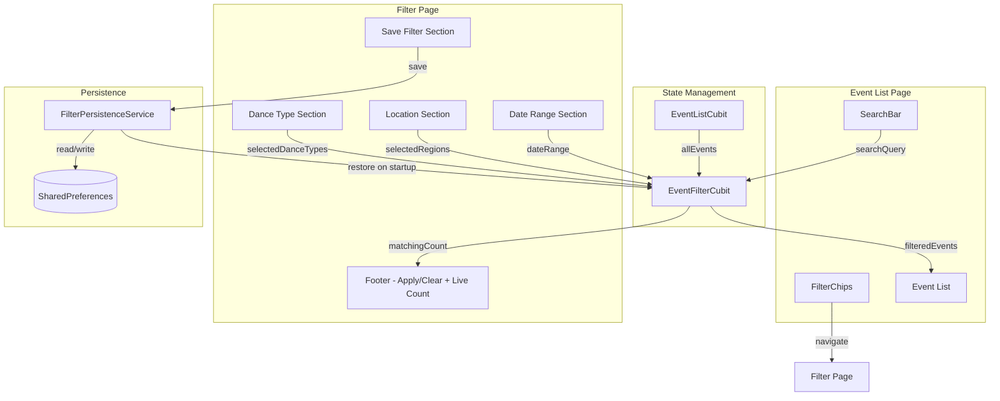
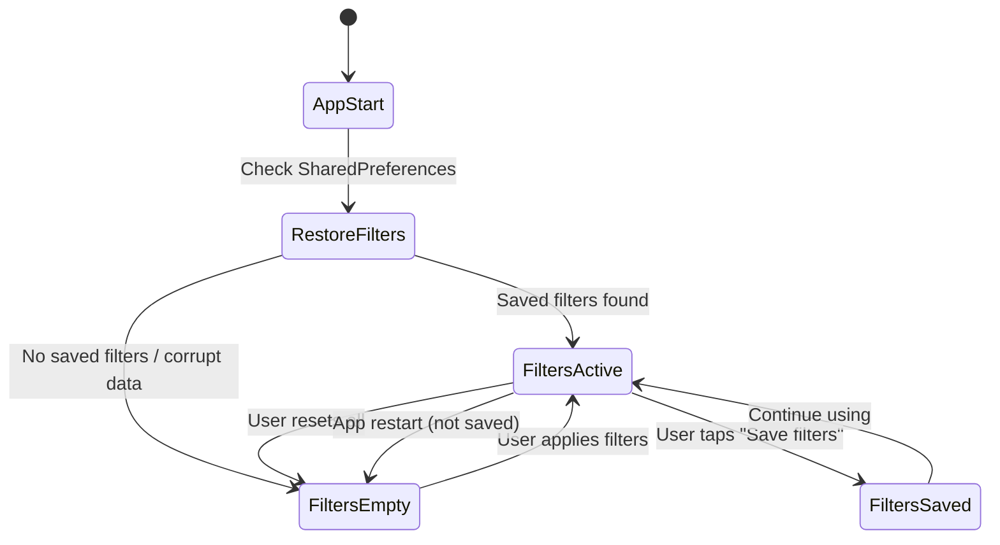

# Design Document: Event Search & Filter

## Overview

This feature adds local search and filtering to the Dancee App event list. Users can search events by title text, and filter by dance type, Czech region, and date range. All filtering runs in-memory on already-fetched event data — no additional API calls are made.

The feature introduces a new `EventFilterCubit` that holds a `FilterState` and applies filter logic to the event list provided by the existing `EventListCubit`. The existing `EventFiltersPage` (currently a static placeholder) will be upgraded to a fully interactive filter page. A `FilterPersistenceService` handles optional save/restore of filters via `SharedPreferences`.

Key design decisions:
- **Separate cubit**: `EventFilterCubit` is independent from `EventListCubit`. It receives the full event list and produces a filtered list. This keeps the existing event loading logic untouched.
- **Local-only filtering**: No backend changes needed. The `region` field already exists on Directus venues and is populated by Nominatim reverse geocoding.
- **In-memory by default**: Filters live in cubit state only. Persistence is opt-in via an explicit "Save filters" action.
- **Live preview**: The filter page shows a real-time count of matching events as the user adjusts selections, before applying.
- **Venue.region added to Flutter entity**: The `Venue` class gains a `region` field parsed from the Directus venue `region` property.

## Architecture



### Data Flow: All Events vs Filtered Events

The existing `EventListCubit` is the single source of truth for the **complete, unfiltered** event list fetched from the API. It always holds all events and is never modified by filtering.

`EventFilterCubit` subscribes to `EventListCubit` and receives the full event list whenever it changes (e.g., after initial load or refresh). It then applies the current `FilterState` to produce a **filtered view** stored in its own state. The UI (Event List Page) reads from `EventFilterCubit` for display.

When filters are reset or cleared, `EventFilterCubit` simply re-runs the filter logic with an empty `FilterState` against the full event list from `EventListCubit`, which restores the complete unfiltered view. No data is ever lost — `EventListCubit` always retains all events.

```
EventListCubit (all events, never filtered)
       │
       ▼
EventFilterCubit (applies FilterState → filtered view)
       │
       ▼
UI (displays filtered events)
```

The filter page manipulates a draft `FilterState` locally and only pushes it to `EventFilterCubit` when the user taps "Apply filters".

## Components and Interfaces

### EventFilterCubit

Location: `lib/features/events/logic/event_filter.dart`

Manages the active `FilterState` and produces filtered event lists.

```dart
class EventFilterCubit extends Cubit<EventFilterState> {
  final EventListCubit _eventListCubit;
  final FilterPersistenceService _persistenceService;

  // Methods
  void applyFilters(FilterState filters);
  void resetFilters();
  void updateSearchQuery(String query); // 300ms debounce before applying
  Future<void> saveFilters();
  Future<void> restoreFilters();
  List<Event> getFilteredEvents(List<Event> allEvents, FilterState filters);
  int getMatchingCount(List<Event> allEvents, FilterState filters);
  List<String> extractDanceTypes(List<Event> allEvents);
  List<String> extractRegions(List<Event> allEvents);
  int countEventsForDanceType(List<Event> allEvents, String danceType, FilterState filters); // cross-filter: applies all other active filters + this dance type
  int countEventsForRegion(List<Event> allEvents, String region, FilterState filters); // cross-filter: applies all other active filters + this region
}
```

### FilterState

Immutable data class (freezed) holding all filter criteria.

```dart
@freezed
class FilterState with _$FilterState {
  const factory FilterState({
    @Default('') String searchQuery,
    @Default({}) Set<String> selectedDanceTypes,
    @Default({}) Set<String> selectedRegions,
    DateTime? dateFrom,
    DateTime? dateTo,
  }) = _FilterState;
}
```

### EventFilterState (Cubit State)

```dart
@freezed
class EventFilterState with _$EventFilterState {
  const factory EventFilterState({
    required FilterState filters,
    required List<Event> filteredEvents,
    required List<Event> todayEvents,
    required List<Event> tomorrowEvents,
    required List<Event> upcomingEvents,
  }) = _EventFilterState;
}
```

### FilterPersistenceService

Location: `lib/features/events/data/filter_persistence_service.dart`

```dart
class FilterPersistenceService {
  static const _key = 'saved_event_filters';

  Future<FilterState?> loadFilters();
  Future<void> saveFilters(FilterState filters);
  Future<void> clearFilters();
}
```

Serializes `FilterState` to JSON string via `SharedPreferences`. On read failure or corrupt data, returns `null` (cubit falls back to default empty state).

### Updated Venue Entity

The existing `Venue` class gains a `region` field:

```dart
class Venue extends Equatable {
  final String name;
  final Address address;
  final String description;
  final double latitude;
  final double longitude;
  final String region; // NEW — from Directus venue.region
}
```

### Updated EventFiltersPage

The existing placeholder page (`event_filters_page.dart`) becomes a `StatefulWidget` that:
- Receives the current `FilterState` and full event list from `EventFilterCubit`
- Maintains a local draft `FilterState` for live preview
- Computes matching count in real-time as user toggles options
- On "Apply" — pushes draft state to `EventFilterCubit` and pops back
- On "Reset" — clears the local draft state
- Accepts an optional `scrollTo` parameter to auto-scroll to a specific section (date or location) when opened from a filter chip

### Updated Event List Page

- `SearchAndFiltersSection` wires the search bar to `EventFilterCubit.updateSearchQuery()`
- `FilterChipsRow` reads active filter state from `EventFilterCubit` to show badges and active styling
- `EventsByDateSection` reads filtered+grouped events from `EventFilterCubit` instead of `EventListCubit`
- Filter chips navigate to `EventFiltersPage` with optional `scrollTo` parameter

### Search Debounce

The `updateSearchQuery` method uses a 300ms debounce timer. Each keystroke resets the timer. Only after 300ms of inactivity does the cubit re-apply filters with the new search query. This prevents excessive re-filtering on rapid typing.

### Cross-Filter Counts

The per-option event counts (next to each dance type and region checkbox) use cross-filter logic: the count for a given option reflects how many events match all other active filters plus that specific option. For example, if the user has selected region "Praha" and date range "This Week", the count next to "Salsa" shows how many events in Praha this week include Salsa — not the total Salsa events across all regions and dates. This gives the user accurate expectations of what they'll see after toggling an option.

### Filter Scope

Filters apply only to the main Event List Page. The Favorites Page is not affected by filters — it always shows all favorited events regardless of active filter state.

The core filtering is a pure function for testability:

```dart
List<Event> applyFilters(List<Event> events, FilterState filters) {
  return events.where((event) {
    // Text search — case-insensitive title match
    if (filters.searchQuery.isNotEmpty) {
      if (!event.title.toLowerCase().contains(filters.searchQuery.toLowerCase())) {
        return false;
      }
    }
    // Dance type — event must contain at least one selected dance type
    if (filters.selectedDanceTypes.isNotEmpty) {
      if (!event.dances.any((d) => filters.selectedDanceTypes.contains(d))) {
        return false;
      }
    }
    // Region — event venue region must match one of selected regions
    if (filters.selectedRegions.isNotEmpty) {
      if (!filters.selectedRegions.contains(event.venue.region)) {
        return false;
      }
    }
    // Date range — event startTime must fall within range (inclusive)
    if (filters.dateFrom != null) {
      final fromStart = DateTime(filters.dateFrom!.year, filters.dateFrom!.month, filters.dateFrom!.day);
      if (event.startTime.isBefore(fromStart)) return false;
    }
    if (filters.dateTo != null) {
      final toEnd = DateTime(filters.dateTo!.year, filters.dateTo!.month, filters.dateTo!.day, 23, 59, 59);
      if (event.startTime.isAfter(toEnd)) return false;
    }
    return true;
  }).toList();
}
```

All filters combine with AND logic. Empty/unset filters are skipped (no restriction).


## Data Models

### FilterState

```dart
@freezed
class FilterState with _$FilterState {
  const factory FilterState({
    @Default('') String searchQuery,
    @Default({}) Set<String> selectedDanceTypes,
    @Default({}) Set<String> selectedRegions,
    DateTime? dateFrom,
    DateTime? dateTo,
  }) = _FilterState;

  factory FilterState.fromJson(Map<String, dynamic> json) => _$FilterStateFromJson(json);
}
```

JSON serialization is needed for `SharedPreferences` persistence. The `fromJson`/`toJson` is generated by `json_serializable` via freezed.

### Venue (Updated)

```dart
class Venue extends Equatable {
  final String name;
  final Address address;
  final String description;
  final double latitude;
  final double longitude;
  final String region;

  factory Venue.fromDirectus(Map<String, dynamic> json) {
    return Venue(
      name: json['name'] as String? ?? '',
      address: Address.fromDirectusVenue(json),
      description: '',
      latitude: (json['latitude'] as num?)?.toDouble() ?? 0.0,
      longitude: (json['longitude'] as num?)?.toDouble() ?? 0.0,
      region: json['region'] as String? ?? '',
    );
  }
}
```

The `region` field maps directly from the Directus venue `region` property, which is populated by Nominatim reverse geocoding (`address.state`). Example values: `"Hlavní město Praha"`, `"Jihomoravský kraj"`, `"Moravskoslezský kraj"`, `"Other"`.

### Quick Date Presets

Quick date presets are computed at runtime, not stored as data:

| Preset | From | To |
|---|---|---|
| Today | today 00:00 | today 23:59 |
| Tomorrow | tomorrow 00:00 | tomorrow 23:59 |
| This Week | today 00:00 | Sunday 23:59 |
| Weekend | Saturday 00:00 | Sunday 23:59 |

### FilterPersistenceService JSON Format

Stored in `SharedPreferences` under key `saved_event_filters`:

```json
{
  "searchQuery": "",
  "selectedDanceTypes": ["Salsa", "Bachata"],
  "selectedRegions": ["Hlavní město Praha"],
  "dateFrom": "2025-02-04T00:00:00.000",
  "dateTo": "2025-02-10T00:00:00.000"
}
```

On deserialization failure, the service returns `null` and the cubit uses the default empty `FilterState`.

### Dependency Injection Updates

```dart
// In service_locator.dart
getIt.registerLazySingleton<FilterPersistenceService>(
  () => FilterPersistenceService(),
);

getIt.registerLazySingleton<EventFilterCubit>(
  () => EventFilterCubit(
    getIt<EventListCubit>(),
    getIt<FilterPersistenceService>(),
  ),
);
```

### i18n Keys (New)

New translation keys added to all three language files under the existing `eventFilters` namespace:

- `eventFilters.noEventsMatch` — "No events match your filters"
- `eventFilters.showEvents` — "Show {count} events" (for the apply button with count)
- `eventFilters.activeFilterCount` — "{count} active" (for filter chip badge)
- `eventFilters.searchEvents` — reuse existing `searchEvents` key
- `eventFilters.noResults` — "No results"

### Mermaid: State Flow




## Correctness Properties

*A property is a characteristic or behavior that should hold true across all valid executions of a system — essentially, a formal statement about what the system should do. Properties serve as the bridge between human-readable specifications and machine-verifiable correctness guarantees.*

### Property 1: Combined AND filter correctness

*For any* list of events and *for any* `FilterState`, the result of `applyFilters(events, filters)` must contain exactly those events where:
- if `searchQuery` is non-empty, the event title contains the query (case-insensitive)
- if `selectedDanceTypes` is non-empty, the event's `dances` list contains at least one of the selected types
- if `selectedRegions` is non-empty, the event's `venue.region` is in the selected set
- if `dateFrom` is set, the event's `startTime` is on or after `dateFrom` (start of day)
- if `dateTo` is set, the event's `startTime` is on or before `dateTo` (end of day)

An event is included if and only if it passes all active criteria. Empty/unset criteria impose no restriction.

**Validates: Requirements 1.2, 1.3, 3.3, 3.4, 4.3, 4.4, 5.2, 5.3, 5.4, 5.5, 6.1, 9.1, 9.2**

### Property 2: Dance type extraction returns all unique dances

*For any* list of events, `extractDanceTypes(events)` must return a set equal to the union of all `event.dances` values across every event in the list, with no duplicates and no missing entries.

**Validates: Requirements 3.1**

### Property 3: Region extraction returns all unique regions

*For any* list of events, `extractRegions(events)` must return a set equal to the set of all unique non-empty `event.venue.region` values across every event in the list.

**Validates: Requirements 4.1**

### Property 4: Per-option cross-filter event count accuracy

*For any* list of events, *for any* active `FilterState`, and *for any* dance type `d` (or region `r`) present in the extracted options:
- `countEventsForDanceType(events, d, filters)` must equal the number of events that pass all other active filter criteria (regions, date range, search query) AND contain dance type `d` — regardless of which dance types are currently selected
- `countEventsForRegion(events, r, filters)` must equal the number of events that pass all other active filter criteria (dance types, date range, search query) AND have venue region `r` — regardless of which regions are currently selected

**Validates: Requirements 3.5, 4.5**

### Property 5: Active filter category count

*For any* `FilterState`, the active filter category count must equal the number of filter fields that are non-empty/non-null:
- +1 if `searchQuery.isNotEmpty`
- +1 if `selectedDanceTypes.isNotEmpty`
- +1 if `selectedRegions.isNotEmpty`
- +1 if `dateFrom != null` or `dateTo != null`

**Validates: Requirements 6.3, 8.1**

### Property 6: Quick date preset computation

*For any* date representing "now", each quick date preset must produce the correct `dateFrom` and `dateTo`:
- Today: from = today 00:00, to = today 23:59:59
- Tomorrow: from = tomorrow 00:00, to = tomorrow 23:59:59
- This Week: from = today 00:00, to = next Sunday 23:59:59
- Weekend: from = next Saturday 00:00 (or today if already Saturday), to = next Sunday 23:59:59

**Validates: Requirements 5.7**

### Property 7: FilterState serialization round trip

*For any* valid `FilterState`, serializing it to JSON and then deserializing the JSON back must produce a `FilterState` that is equal to the original.

**Validates: Requirements 7.2, 7.3**

### Property 8: Venue region parsing from Directus JSON

*For any* Directus venue JSON map containing a `region` string field, `Venue.fromDirectus(json).region` must equal the value of `json['region']`. When the `region` field is absent or null, the parsed `region` must default to an empty string.

**Validates: Requirements 4.7**

## Error Handling

| Scenario | Handling |
|---|---|
| FilterState JSON corrupt/unreadable in SharedPreferences | `FilterPersistenceService.loadFilters()` returns `null`; cubit uses default empty `FilterState` |
| SharedPreferences write failure on save | Catch exception, log error, show snackbar to user via cubit error state |
| Event list not yet loaded when filter is applied | `EventFilterCubit` emits empty filtered list; once `EventListCubit` emits loaded state, filters are re-applied automatically |
| Venue has no region field (empty string) | Event is included when no region filter is active; excluded when region filter is active (empty string won't match any selected region) |
| Date range where `dateFrom` > `dateTo` | Filter produces zero results (no event can satisfy both constraints). UI should prevent this by validating input. |
| Search query with special characters | Case-insensitive `String.contains()` handles all Unicode characters naturally |

## Testing Strategy

### Dual Testing Approach

This feature uses both unit tests and property-based tests for comprehensive coverage.

### Property-Based Testing

Library: `dart_check` (or `glados` — the Dart PBT library available in the project)

Each correctness property from the design is implemented as a single property-based test with minimum 100 iterations. Tests use random generators for:
- `Event` lists with random titles, dances, venues (with regions), and start times
- `FilterState` with random search queries, dance type subsets, region subsets, and date ranges

Tag format for each test:
```
// Feature: event-search-filter, Property 1: Combined AND filter correctness
```

Property tests to implement:
1. **Combined AND filter** — generate random events + random FilterState, verify filtered output matches all criteria (Property 1)
2. **Dance type extraction** — generate random events, verify extracted set equals union of all dances (Property 2)
3. **Region extraction** — generate random events, verify extracted set equals unique non-empty regions (Property 3)
4. **Per-option count** — generate random events + FilterState + option, verify count matches (Property 4)
5. **Active category count** — generate random FilterState, verify count formula (Property 5)
6. **Quick date presets** — generate random "now" dates, verify preset outputs (Property 6)
7. **Serialization round trip** — generate random FilterState, verify `fromJson(toJson(x)) == x` (Property 7)
8. **Venue region parsing** — generate random JSON maps with region field, verify parsing (Property 8)

### Unit Tests

Unit tests cover specific examples, edge cases, and integration points:

- Empty event list returns empty filtered list
- Search with whitespace-only query (treated as non-empty search)
- Filter with dance types not present in any event returns empty list
- Date range where from > to returns empty list
- Corrupt JSON in SharedPreferences returns null on load
- Clear filters after save removes from SharedPreferences
- EventFilterCubit re-applies filters when EventListCubit emits new loaded state
- Quick date presets on edge days (Sunday for "This Week", Saturday for "Weekend")
- Venue with missing/null region field defaults to empty string

### Test File Location

```
test/
  features/
    events/
      logic/
        event_filter_test.dart          # Unit + property tests for EventFilterCubit
      data/
        filter_persistence_service_test.dart  # Unit + property tests for persistence
        entities_test.dart              # Venue region parsing tests
```

