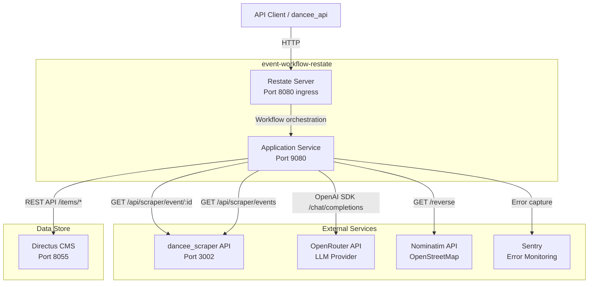
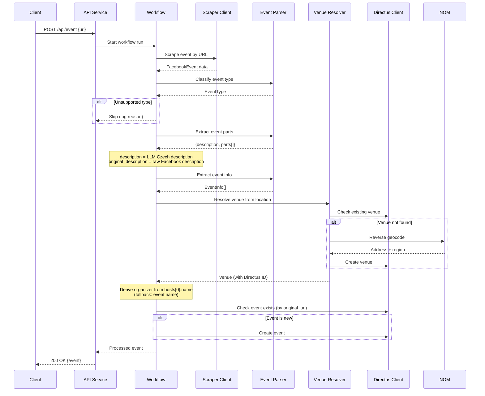
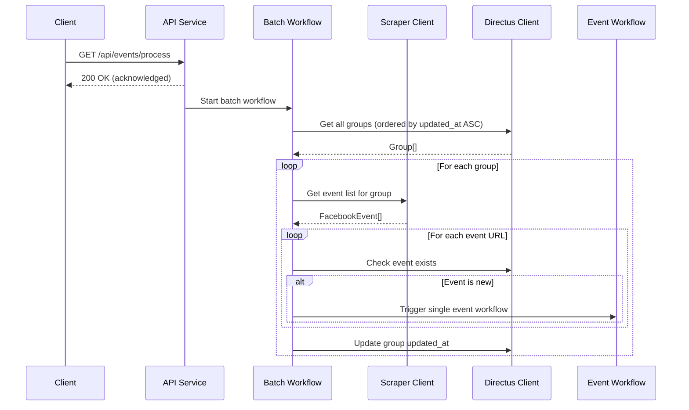
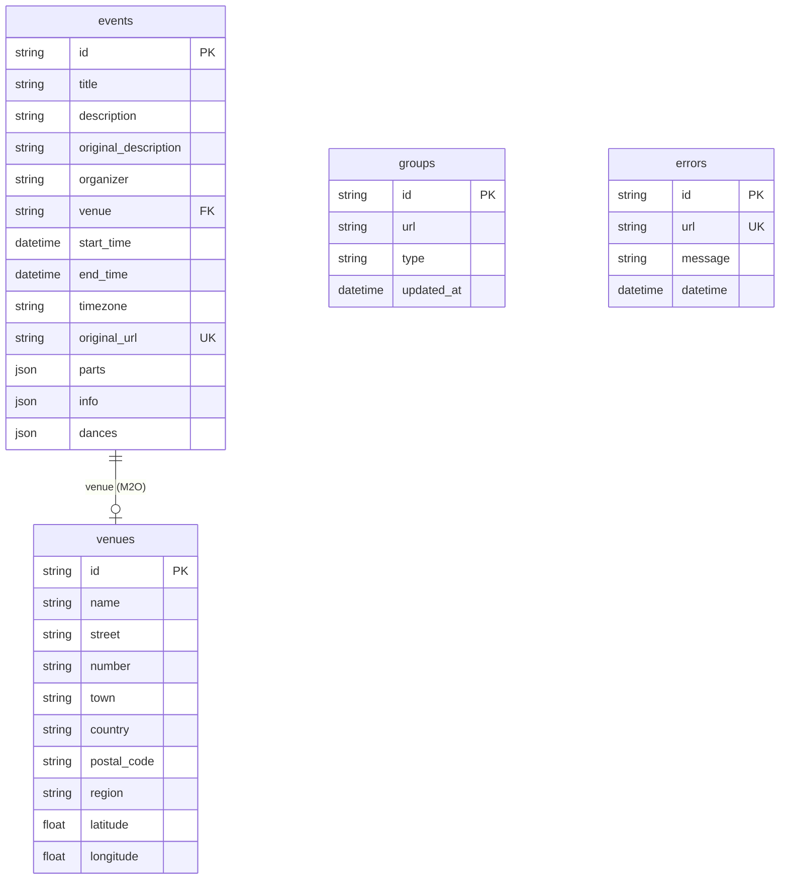

# Design Document: event-workflow-restate

## Overview

This service (`event-workflow-restate`) replaces the existing `serinus_service` (Dart/SurrealDB) with a TypeScript/Bun implementation using Restate for durable workflow orchestration, Directus CMS for data storage, OpenRouter for LLM integration, and Nominatim for reverse geocoding.

The service automates the pipeline: scrape Facebook events → classify via LLM → extract parts & info via LLM → resolve venues → store in Directus. It follows the project structure established by the `AiWorkflow` reference project.

### Key Technology Decisions

| Concern | Old (serinus_service) | New (event-workflow-restate) |
|---|---|---|
| Language/Runtime | Dart | TypeScript / Bun |
| Framework | Serinus | Restate SDK |
| Database | SurrealDB | Directus CMS (REST API) |
| LLM Provider | DanceeAiClient | OpenRouter (via OpenAI SDK) |
| Geocoding | Google Geocoding API | Nominatim (OpenStreetMap) |
| Error Monitoring | None | Sentry |
| Workflow | Sequential in-process | Durable Restate workflows |

### Rationale

- Restate provides automatic retries, K/V state tracking, and durable execution without custom retry logic.
- Directus CMS gives a built-in admin UI for managing events, venues, and groups without building a custom dashboard.
- Nominatim is free with no API key, replacing the paid Google Geocoding API.
- OpenRouter allows model switching without code changes. It exposes an OpenAI-compatible API, so the `openai` npm package is used as the client SDK with `baseURL` pointed to `https://openrouter.ai/api/v1`.
- Bun is used as the package manager per project requirements (runtime remains Node.js for Restate SDK compatibility).

## Architecture

### System Context Diagram



### Workflow Sequence - Single Event Processing



### Batch Processing Flow



## Components and Interfaces

### Project Structure

```
backend/dancee_workflow/
├── src/
│   ├── index.ts                        # Entry point, registers Restate services
│   ├── core/
│   │   ├── config.ts                   # Environment configuration (dotenv) + Sentry initialization
│   │   ├── schemas.ts                  # Zod schemas and TypeScript interfaces
│   │   └── prompts.ts                  # LLM prompt templates (Czech)
│   ├── clients/
│   │   ├── scraper-client.ts           # HTTP client for dancee_scraper API
│   │   ├── directus-client.ts          # Directus CMS REST API (events, venues, groups, errors)
│   │   └── nominatim-client.ts         # Nominatim reverse geocoding HTTP client
│   ├── services/
│   │   ├── api.ts                      # Restate service: HTTP API handlers
│   │   ├── workflow.ts                 # Restate workflow: single event processing
│   │   ├── batch.ts                    # Restate service: batch processing orchestration
│   │   ├── event-parser.ts             # LLM-based event classification and extraction (OpenAI SDK)
│   │   └── venue-resolver.ts           # Venue resolution logic (uses directus-client + nominatim-client)
├── scripts/
│   └── setup-directus.ts              # CLI script to create Directus collections
├── .env.example
├── .gitignore
├── docker-compose.yml
├── Dockerfile                          # Multi-stage build: Restate server + Node.js app via supervisord
├── supervisord.conf                    # Manages restate-server and app processes in single container
├── package.json
├── tsconfig.json
└── vitest.config.ts
```

### Component Interfaces

#### core/config.ts
```typescript
import * as Sentry from "@sentry/node";

export const config: {
  openRouterApiKey: string;
  openRouterModel: string;
  directusBaseUrl: string;
  directusToken: string;
  scraperBaseUrl: string;
  nominatimBaseUrl: string;
  sentryDsn: string;
  corsOrigins: string;
  appPort: number;
};

// Sentry initialization (called at startup)
export function initSentry(): void;

// Sentry error capture with context tags
export function captureError(error: Error, context: Record<string, string>): void;
```

#### clients/scraper-client.ts
```typescript
// Fetches raw event data from dancee_scraper API
export async function scrapeEvent(eventIdOrUrl: string): Promise<FacebookEvent>;
export async function scrapeEventList(pageId: string, eventType?: "upcoming" | "past"): Promise<FacebookEvent[]>;
```

#### services/event-parser.ts
```typescript
// LLM calls via OpenRouter using the OpenAI SDK (openai npm package)
// OpenRouter is OpenAI-compatible; the SDK is configured with:
//   baseURL: "https://openrouter.ai/api/v1"
//   apiKey: config.openRouterApiKey
import OpenAI from "openai";

const openai = new OpenAI({
  baseURL: "https://openrouter.ai/api/v1",
  apiKey: config.openRouterApiKey,
});

export async function classifyEventType(description: string): Promise<EventType>;
export async function extractEventParts(description: string): Promise<{ description: string; parts: EventPart[] }>;
export async function extractEventInfo(description: string): Promise<EventInfo[]>;
```

#### clients/directus-client.ts
```typescript
// All Directus CMS REST API operations (events, venues, groups, errors)

// Events
export async function createEvent(event: DirectusEvent): Promise<DirectusEvent>;
export async function findEventByOriginalUrl(originalUrl: string): Promise<DirectusEvent | null>;
export async function listEvents(): Promise<DirectusEvent[]>;

// Venues
export async function createVenue(venue: DirectusVenue): Promise<DirectusVenue>;
export async function findVenue(name: string, street: string, town: string): Promise<DirectusVenue | null>;
export async function findVenueByCoordinates(lat: number, lng: number): Promise<DirectusVenue | null>;

// Groups
export async function createGroup(group: DirectusGroup): Promise<DirectusGroup>;
export async function getGroupsOrderedByUpdatedAt(): Promise<DirectusGroup[]>;
export async function updateGroupTimestamp(groupId: string): Promise<void>;

// Errors
export async function createError(url: string, message: string): Promise<void>;
export async function findErrorByUrl(url: string): Promise<DirectusError | null>;
```

#### services/venue-resolver.ts
```typescript
// Resolves venue from Facebook location data, using Directus cache + Nominatim
export async function resolveVenue(location: FacebookLocation): Promise<DirectusVenue>;
```

#### clients/nominatim-client.ts
```typescript
// Nominatim reverse geocoding HTTP client (OpenStreetMap)
// Respects usage policy: max 1 request per second
export async function reverseGeocode(lat: number, lng: number): Promise<NominatimResponse>;
```

#### services/api.ts (Restate service)
```typescript
// Restate service handlers exposed via Restate ingress
// POST /api/event         → processEvent handler
// GET  /api/events/process → processBatch handler
// GET  /api/events/list    → listEvents handler
export const apiService: restate.ServiceDefinition;
```

#### services/workflow.ts (Restate workflow)
```typescript
// Durable workflow for single event processing
// Steps: scrape → classify → extract parts → extract info → resolve venue → derive organizer → store
//
// Field mapping:
//   description       = LLM-generated Czech description (from extractEventParts)
//   original_description = raw Facebook event description (from scraped data)
//   organizer          = hosts[0].name from scraped data (fallback: event name)
export const eventWorkflow: restate.WorkflowDefinition;
```

#### services/batch.ts (Restate service)
```typescript
// Orchestrates batch processing across all groups
export const batchService: restate.ServiceDefinition;
```


## Data Models

### TypeScript Interfaces and Zod Schemas (core/schemas.ts)

All data models are defined as Zod schemas for runtime validation and TypeScript types for compile-time safety.

#### FacebookEvent (from scraper response)
```typescript
const FacebookEventSchema = z.object({
  id: z.string(),
  name: z.string(),
  description: z.string().optional(),
  startTimestamp: z.number(),
  endTimestamp: z.number().nullable().optional(),
  location: z.object({
    name: z.string().optional(),
    address: z.string().optional(),
    city: z.string().optional(),
    country: z.string().optional(),
    latitude: z.number().optional(),
    longitude: z.number().optional(),
  }).optional(),
  url: z.string(),
  hosts: z.array(z.object({
    name: z.string(),
    id: z.string(),
    url: z.string(),
    type: z.string(),
  })).optional(),
  timezone: z.string().optional(),
});
```

#### EventType
```typescript
const EventTypeSchema = z.enum([
  "party", "workshop", "lesson", "course", "festival", "holiday", "other"
]);
type EventType = z.infer<typeof EventTypeSchema>;

const SUPPORTED_EVENT_TYPES: EventType[] = ["party", "workshop", "festival", "holiday"];
```

#### EventPart
```typescript
const EventPartSchema = z.object({
  name: z.string(),
  description: z.string(),
  type: z.enum(["party", "workshop", "openLesson"]),
  dances: z.array(z.string()),
  date_time_range: z.object({
    start: z.string(), // ISO 8601 UTC
    end: z.string(),   // ISO 8601 UTC
  }),
  lectors: z.array(z.string()),
  djs: z.array(z.string()),
});
```

#### EventInfo
```typescript
const EventInfoSchema = z.object({
  type: z.enum(["url", "price"]),
  key: z.string(),
  value: z.string(),
});
```

#### Directus Collection Schemas

```typescript
// Directus events collection
const DirectusEventSchema = z.object({
  id: z.string().optional(),           // Directus-assigned
  title: z.string(),
  description: z.string(),
  original_description: z.string(),
  organizer: z.string(),
  venue: z.string().optional(),         // Directus relation ID
  start_time: z.string(),              // ISO 8601
  end_time: z.string(),                // ISO 8601
  timezone: z.string(),
  original_url: z.string(),
  parts: z.array(EventPartSchema),     // JSON field
  info: z.array(EventInfoSchema),      // JSON field
  dances: z.array(z.string()),         // JSON field, computed from parts
});

// Directus venues collection
const DirectusVenueSchema = z.object({
  id: z.string().optional(),           // Directus-assigned
  name: z.string(),
  street: z.string(),
  number: z.string(),
  town: z.string(),
  country: z.string(),
  postal_code: z.string(),
  region: z.string(),                  // admin area level 1 from Nominatim
  latitude: z.number().nullable(),
  longitude: z.number().nullable(),
});

// Directus groups collection
const DirectusGroupSchema = z.object({
  id: z.string().optional(),           // Directus-assigned
  url: z.string(),
  type: z.string(),                    // e.g., "facebook"
  updated_at: z.string().optional(),   // ISO 8601
});

// Directus errors collection
const DirectusErrorSchema = z.object({
  id: z.string().optional(),           // Directus-assigned
  url: z.string(),
  message: z.string(),
  datetime: z.string(),                // ISO 8601
});
```

### Directus Collection Relationships



### Nominatim Reverse Geocoding Response (relevant fields)

```typescript
interface NominatimResponse {
  address: {
    road?: string;
    house_number?: string;
    city?: string;
    town?: string;
    village?: string;
    state?: string;          // → maps to venue.region
    country?: string;
    postcode?: string;
    country_code?: string;
  };
  display_name: string;
  lat: string;
  lon: string;
}
```

The `address.state` field from Nominatim maps to the venue `region` field. This is universal across countries (e.g., "Jihomoravský kraj" for CZ, "Bayern" for DE, "Île-de-France" for FR). When `state` is absent, region defaults to `"Other"`.

### Computed Dances Field

The `dances` field on events is computed at storage time by aggregating all unique dance names from all `EventPart` objects:

```typescript
function computeDances(parts: EventPart[]): string[] {
  const danceSet = new Set<string>();
  for (const part of parts) {
    for (const dance of part.dances) {
      danceSet.add(dance);
    }
  }
  return Array.from(danceSet);
}
```

### LLM Response Parsing

The event parser module must handle markdown code fences in LLM responses:

```typescript
function parseJsonResponse(raw: string): unknown {
  // Strip ```json ... ``` or ``` ... ``` wrappers
  const stripped = raw.replace(/^```(?:json)?\s*\n?/m, "").replace(/\n?```\s*$/m, "");
  return JSON.parse(stripped);
}
```

Retry logic: up to 2 additional attempts on invalid JSON for event parts extraction.

### Docker Compose Setup

Directus is managed externally (deployed separately on Fly.io). The docker-compose only runs the workflow service. Directus connection is configured via `.env` (`DIRECTUS_BASE_URL` and `DIRECTUS_ACCESS_TOKEN`).

```yaml
services:
  event-workflow:
    build: .
    ports:
      - "8080:8080"   # Restate ingress
      - "9070:9070"   # Restate dashboard
      - "9080:9080"   # Application service
    env_file:
      - .env
```

### Container Architecture

The Docker container runs both the Restate server and the application process using supervisord, following the AiWorkflow reference pattern:

- **Multi-stage Dockerfile**: Build stage compiles TypeScript, production stage copies the Restate server binary from the official `restatedev/restate:latest` image, installs Node.js and supervisord on a Debian base
- **supervisord.conf**: Manages two processes — `restate-server` (priority 10, starts first) and the Node.js application (priority 20, starts after Restate server with a short delay)
- **Exposed ports**: 8080 (Restate ingress), 9070 (Restate dashboard), 9080 (application service)

```
┌─────────────────────────────────┐
│         Docker Container        │
│                                 │
│  ┌──────────┐  ┌─────────────┐  │
│  │ Restate  │  │  Node.js    │  │
│  │ Server   │  │  App        │  │
│  │ :8080    │  │  :9080      │  │
│  │ :9070    │  │             │  │
│  └──────────┘  └─────────────┘  │
│         supervisord             │
└─────────────────────────────────┘
```

### Test Script

The `package.json` includes a test script for single-execution test runs:

```json
{
  "scripts": {
    "test": "vitest --run"
  }
}
```


## Correctness Properties

*A property is a characteristic or behavior that should hold true across all valid executions of a system — essentially, a formal statement about what the system should do. Properties serve as the bridge between human-readable specifications and machine-verifiable correctness guarantees.*

### Property 1: Scraper client error propagation

*For any* HTTP error status code (4xx or 5xx) and any error message string returned by the dancee_scraper API, the error thrown by the Scraper_Client shall contain both the status code and the error message.

**Validates: Requirements 1.2, 2.2**

### Property 2: End timestamp fallback

*For any* FacebookEvent object where `endTimestamp` is null, undefined, zero, or negative, the processed event's `end_time` shall equal the value derived from `startTimestamp`.

**Validates: Requirements 1.4**

### Property 3: Event type query parameter inclusion

*For any* call to `scrapeEventList` with an `eventType` parameter of "upcoming" or "past", the constructed request URL shall include `eventType` as a query parameter with the provided value. When `eventType` is omitted, the URL shall not contain the `eventType` parameter.

**Validates: Requirements 2.3**

### Property 4: Event type parsing always returns a valid type

*For any* string value returned by the LLM as the event type, parsing it shall always produce a valid `EventType` enum value. For any string that does not match a known type (party, workshop, lesson, course, festival, holiday), the result shall be "other".

**Validates: Requirements 3.2, 3.3**

### Property 5: Unsupported event types are skipped

*For any* EventType that is not in the supported set (party, workshop, festival, holiday), the Event_Processor shall skip further processing and return a skip result with a reason string.

**Validates: Requirements 3.4**

### Property 6: LLM response JSON parsing strips code fences

*For any* valid JSON string, wrapping it in markdown code fences (`` ```json ... ``` `` or `` ``` ... ``` ``) and then passing it through the `parseJsonResponse` function shall produce a value equal to parsing the original unwrapped JSON.

**Validates: Requirements 17.3**

### Property 7: EventPart and EventInfo schema validation

*For any* valid EventPart object, it shall contain all required fields: name, description, type (one of party/workshop/openLesson), dances (array), date_time_range (with start and end), lectors (array), and djs (array). *For any* valid EventInfo object, it shall contain type (url or price), key, and value.

**Validates: Requirements 4.2, 5.2**

### Property 8: Empty EventInfo values are filtered out

*For any* list of EventInfo-like objects where some have empty string or null values, the filtering function shall return only entries where `value` is a non-empty, non-null string. The length of the filtered list shall be less than or equal to the original, and every entry in the result shall have a truthy `value`.

**Validates: Requirements 5.3**

### Property 9: Venue resolution field mapping

*For any* Facebook location data that contains non-null `name`, `address`, `city`, and `countryCode` fields, the resolved venue shall use those values directly for `name`, `street`, `town`, and `country`. *For any* Nominatim response with a non-empty `address.state` field, the venue `region` shall equal that state value. *For any* Nominatim response without an `address.state` field, the venue `region` shall be "Other".

**Validates: Requirements 6.2, 6.3, 6.4, 6.5**

### Property 10: Venue deduplication

*For any* two venue resolution requests with the same (name, street, town) tuple or the same (latitude, longitude) coordinates, the Venue_Resolver shall return the same Directus venue ID without creating a duplicate record.

**Validates: Requirements 6.7, 6.8, 7.4, 8.2, 8.3**

### Property 11: Event deduplication by original URL

*For any* event with an `original_url` that already exists in Directus, attempting to store it again shall not create a duplicate record. The total count of events with that URL shall remain exactly 1.

**Validates: Requirements 7.2, 10.3**

### Property 12: Error deduplication by URL

*For any* error URL that already has an error record in Directus, calling `trackError` with the same URL shall not create a duplicate error record.

**Validates: Requirements 12.2**

### Property 13: Groups ordered by updated_at ascending

*For any* set of group records with distinct `updated_at` timestamps, `getGroupsOrderedByUpdatedAt` shall return them sorted in ascending order by `updated_at`.

**Validates: Requirements 11.3**

### Property 14: Missing URL field returns 400

*For any* request body that does not contain a `url` field (including empty objects, objects with other fields, null, and undefined), the API service shall respond with HTTP status 400.

**Validates: Requirements 13.4**

### Property 15: Computed dances field is the unique set from all parts

*For any* list of EventPart objects, the computed `dances` field shall contain exactly the unique set of all dance names across all parts, with no duplicates. When the parts list is empty or no part contains any dances, the result shall be an empty array.

**Validates: Requirements 20.1, 20.2, 20.3**

## Error Handling

### Error Categories

| Category | Handling Strategy | Example |
|---|---|---|
| Scraper HTTP errors | Propagate with status code + message, Restate retries | dancee_scraper returns 404 |
| LLM invalid JSON | Retry up to 2 additional times, then propagate | OpenRouter returns malformed response |
| LLM unrecognized type | Default to "other", skip processing | LLM returns "concert" |
| Nominatim failure | Set region to "Other", use available data | Nominatim rate limited or down |
| Directus API errors | Propagate, Restate retries | Directus returns 500 |
| Unsupported event type | Skip event, log reason, continue batch | Event classified as "lesson" |
| Single event failure in batch | Log via Directus error tracking, continue with next event | Any exception during single event processing |
| Missing Sentry DSN | Start without Sentry, log warning | Empty SENTRY_DSN in .env |

### Error Flow

1. Restate provides automatic retries for transient failures (network timeouts, 5xx errors).
2. For permanent failures (4xx, validation errors), use `restate.TerminalError` to stop retries.
3. In batch processing, individual event failures are caught, logged to Directus via the error tracking functions in `directus-client.ts`, and reported to Sentry. The batch continues with remaining events.
4. Sentry captures unhandled exceptions with context tags: workflow run ID, event URL, and workflow step name.

### Sentry Integration

Sentry initialization and error capture are part of `core/config.ts`:

```typescript
// core/config.ts (Sentry section)
import * as Sentry from "@sentry/node";

export function initSentry(): void {
  if (!config.sentryDsn) {
    console.warn("SENTRY_DSN not set, Sentry integration disabled");
    return;
  }
  Sentry.init({ dsn: config.sentryDsn });
}

export function captureError(error: Error, context: Record<string, string>): void {
  Sentry.withScope((scope) => {
    for (const [key, value] of Object.entries(context)) {
      scope.setTag(key, value);
    }
    Sentry.captureException(error);
  });
}
```

## Testing Strategy

### Dual Testing Approach

This project uses both unit tests and property-based tests for comprehensive coverage:

- **Unit tests** (vitest): Specific examples, integration points, edge cases, error conditions
- **Property-based tests** (fast-check via vitest): Universal properties across generated inputs

### Property-Based Testing Configuration

- Library: `fast-check` (already used in the AiWorkflow reference project)
- Framework: `vitest` with `--run` flag for single execution
- Minimum iterations: 100 per property test
- Each property test must reference its design document property with a tag comment:
  ```typescript
  // Feature: event-workflow-restate, Property 15: Computed dances field is the unique set from all parts
  ```

### Test Structure

Test directory mirrors the `src/` structure:

```
backend/dancee_workflow/
├── src/
│   └── __tests__/
│       ├── core/
│       │   ├── compute-dances.test.ts          # Property 15
│       │   ├── parse-json-response.test.ts     # Property 6
│       │   ├── event-type-parsing.test.ts      # Property 4
│       │   └── filter-event-info.test.ts       # Property 8
│       ├── clients/
│       │   ├── scraper-client.test.ts          # Properties 1, 3 + unit tests
│       │   ├── venue-dedup.test.ts             # Property 10 (with mock Directus)
│       │   ├── event-dedup.test.ts             # Property 11 (with mock Directus)
│       │   ├── error-dedup.test.ts             # Property 12 (with mock Directus)
│       │   └── group-ordering.test.ts          # Property 13
│       └── services/
│           ├── venue-field-mapping.test.ts     # Property 9
│           ├── end-timestamp-fallback.test.ts  # Property 2
│           ├── api-validation.test.ts          # Property 14
│           └── skip-unsupported.test.ts        # Property 5
```

### Unit Test Focus Areas

- API endpoint integration tests (POST /api/event, GET /api/events/process, GET /api/events/list)
- Directus client CRUD operations with mocked HTTP
- Workflow step orchestration order
- Sentry initialization with/without DSN
- Setup script collection creation and idempotency
- LLM retry behavior on invalid JSON (3 attempts max)

### Property Test to Design Property Mapping

| Test File | Design Property | Pattern |
|---|---|---|
| core/compute-dances.test.ts | Property 15 | Invariant (set uniqueness) |
| core/parse-json-response.test.ts | Property 6 | Round-trip |
| core/event-type-parsing.test.ts | Property 4 | Error condition / invariant |
| core/filter-event-info.test.ts | Property 8 | Metamorphic (length ≤ original) |
| clients/scraper-client.test.ts | Properties 1, 3 | Invariant |
| clients/venue-dedup.test.ts | Property 10 | Idempotence |
| clients/event-dedup.test.ts | Property 11 | Idempotence |
| clients/error-dedup.test.ts | Property 12 | Idempotence |
| clients/group-ordering.test.ts | Property 13 | Invariant (sorted) |
| services/venue-field-mapping.test.ts | Property 9 | Invariant |
| services/end-timestamp-fallback.test.ts | Property 2 | Invariant |
| services/api-validation.test.ts | Property 14 | Error condition |
| services/skip-unsupported.test.ts | Property 5 | Invariant |

