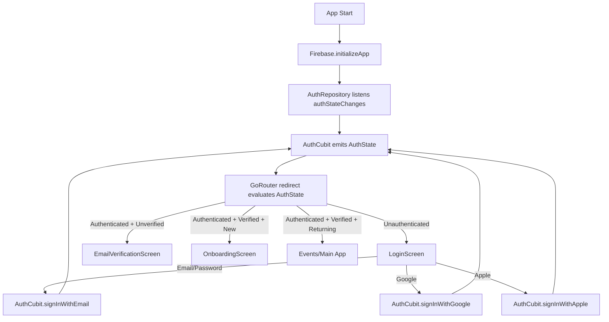
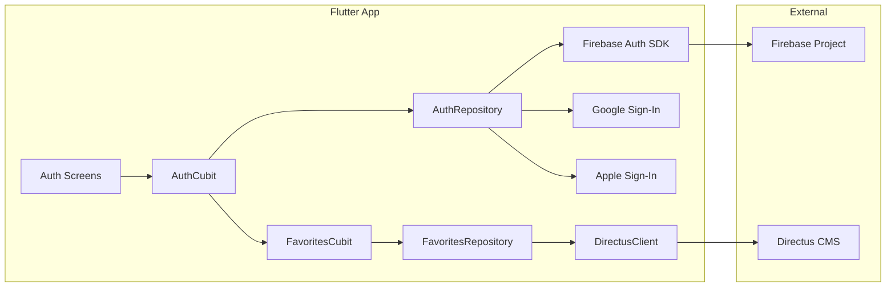
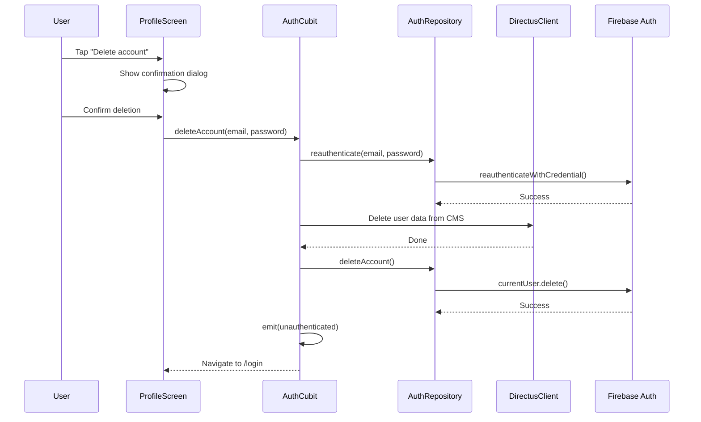

# Design Document: Firebase Authentication

## Overview

This design integrates Firebase Authentication into the Dancee App (dancee_app2), replacing the current hardcoded `defaultUserId` with real user identity. The implementation follows the existing Cubit/Bloc + Repository architecture, adding an `AuthRepository` (wrapping Firebase Auth SDK), an `AuthCubit` (managing auth state), and a `RouterGuard` (GoRouter redirect) to protect routes.

The scope covers:
- Firebase SDK initialization and configuration
- Email/password, Google, and Apple sign-in flows
- Email verification and password reset
- Auth state management with reactive stream-based updates
- Protected routing via GoRouter redirect
- Firebase UID → Directus user synchronization (replacing hardcoded user ID)
- Onboarding flow for first-time users
- Account deletion with re-authentication
- Internationalized error messages and form validation
- Setup documentation

All new UI strings use slang i18n (en, cs, es). The existing auth screen shells (LoginScreen, RegisterScreen, ForgotPasswordScreen, OnboardingScreen) are wired to the new AuthCubit. A new EmailVerificationScreen is added.

## Architecture

### High-Level Flow



### Component Interaction



### Integration Points with Existing Code

1. `main.dart` — Add `Firebase.initializeApp()` before `runApp()`, add `AuthCubit` to `MultiBlocProvider`, add `refreshListenable` to GoRouter
2. `service_locator.dart` — Register `AuthRepository` and `AuthCubit` as singletons
3. `config.dart` / `config.example.dart` — No Firebase keys needed here (FlutterFire CLI generates `firebase_options.dart`)
4. `clients.dart` — Modify `DirectusClient` to accept a dynamic auth token (Firebase ID token) instead of only the static access token
5. `FavoritesCubit` — Replace `AppConfig.defaultUserId` with Firebase UID from `AuthCubit`
6. GoRouter — Add `redirect` callback using `RouterGuard`

## Components and Interfaces

### AuthRepository

Location: `lib/data/repositories/auth_repository.dart`

Wraps all Firebase Auth SDK calls. Stateless — no caching, just delegates to Firebase.

```dart
class AuthRepository {
  AuthRepository({
    required FirebaseAuth firebaseAuth,
    required GoogleSignIn googleSignIn,
  });

  // Sign-in methods
  Future<UserCredential> signInWithEmail(String email, String password);
  Future<UserCredential> signInWithGoogle();
  Future<UserCredential> signInWithApple();

  // Registration
  Future<UserCredential> register({
    required String email,
    required String password,
    required String firstName,
    required String lastName,
  });

  // Email verification
  Future<void> sendEmailVerification();
  Future<bool> reloadAndCheckVerified();

  // Password reset
  Future<void> sendPasswordReset(String email);

  // Sign out
  Future<void> signOut();

  // Re-authentication (for account deletion)
  Future<void> reauthenticate({String? email, String? password});

  // Account deletion
  Future<void> deleteAccount();

  // Auth state stream
  Stream<User?> get authStateChanges;

  // Current user
  User? get currentUser;

  // Firebase ID token for Directus API calls
  Future<String?> getIdToken({bool forceRefresh = false});

  // Error mapping
  String mapFirebaseError(FirebaseAuthException e);
}
```

### AuthCubit

Location: `lib/logic/cubits/auth_cubit.dart`

Manages auth state, listens to `authStateChanges` stream, coordinates auth operations.

```dart
class AuthCubit extends Cubit<AuthState> {
  AuthCubit({required AuthRepository authRepository});

  // Delegating methods
  Future<void> signInWithEmail(String email, String password);
  Future<void> signInWithGoogle();
  Future<void> signInWithApple();
  Future<void> register({
    required String email,
    required String password,
    required String firstName,
    required String lastName,
  });
  Future<void> sendPasswordReset(String email);
  Future<void> sendEmailVerification();
  Future<void> reloadUser();
  Future<void> signOut();
  Future<void> deleteAccount({String? email, String? password});

  // Helpers
  bool get isNewUser; // checks metadata.creationTime within 60s
  String? get currentUid;
}
```

### RouterGuard

Location: `lib/core/router_guard.dart`

A function (not a class) used as GoRouter's `redirect` callback.

```dart
String? routerGuard(BuildContext context, GoRouterState state) {
  // Reads AuthCubit state
  // Returns redirect path or null (no redirect)
}
```

Redirect logic:
| Auth State | Target Route | Action |
|---|---|---|
| Unauthenticated | Any protected route | → `/login` |
| Authenticated + Unverified | Any route except `/verify-email` | → `/verify-email` |
| Authenticated + Verified | `/login`, `/register`, `/forgot-password` | → `/events` |
| Authenticated + Verified | `/verify-email` | → `/events` |
| Authenticated | `/onboarding` | Allow (onboarding is auth-gated) |

### DirectusClient Modifications

The existing `DirectusClient` uses a static access token. It needs to support dynamic Firebase ID tokens:

```dart
class DirectusClient {
  DirectusClient({
    required String baseUrl,
    required String accessToken,
    Future<String?> Function()? idTokenProvider, // NEW
  });
}
```

When `idTokenProvider` is set and returns a non-null token, use it as the Bearer token. Fall back to the static access token for unauthenticated/public requests.

### EmailVerificationScreen

Location: `lib/screens/auth/email_verification/email_verification_screen.dart`

New screen with:
- Message showing the user's email
- "Resend verification email" button
- "I've verified my email" button (reloads user, checks `emailVerified`)
- "Sign out" option
- All strings via slang i18n

### Form Validation

A shared `FormValidators` utility class:

Location: `lib/shared/utils/form_validators.dart`

```dart
class FormValidators {
  static String? email(String? value);        // null if valid, error key if not
  static String? notEmpty(String? value);      // null if valid, error key if empty
  static String? password(String? value);     // null if ≥8 chars
  static String? confirmPassword(String? value, String password); // null if match
  static int passwordStrength(String value);  // 0-4 score
}
```

Validators return translation keys (not raw strings) so the UI can call `t.{key}`.

### Error Message Mapping

Location: Inside `AuthRepository.mapFirebaseError()`

| Firebase Error Code | Translation Key |
|---|---|
| `invalid-credential` | `t.auth.errors.invalidCredential` |
| `user-disabled` | `t.auth.errors.userDisabled` |
| `email-already-in-use` | `t.auth.errors.emailAlreadyInUse` |
| `weak-password` | `t.auth.errors.weakPassword` |
| `too-many-requests` | `t.auth.errors.tooManyRequests` |
| `network-request-failed` | `t.auth.errors.networkError` |
| (default) | `t.auth.errors.generic` |

### Account Deletion Flow



## Data Models

### AuthState (freezed)

Location: `lib/logic/states/auth_state.dart`

```dart
@freezed
class AuthState with _$AuthState {
  const factory AuthState.unauthenticated() = _Unauthenticated;
  const factory AuthState.loading() = _Loading;
  const factory AuthState.authenticated({
    required String uid,
    required String? email,
    required String? displayName,
    required bool emailVerified,
    required bool isNewUser,
  }) = _Authenticated;
  const factory AuthState.error({required String message}) = _Error;
}
```

This follows the exact same freezed union pattern used by `FavoritesState`, `EventState`, etc.

### AuthUser (simplified view)

Not a separate model — the `AuthState.authenticated` variant carries the user fields directly, extracted from `FirebaseAuth.User`. This avoids an extra mapping layer since we only need 5 fields.

### Firebase-Directus Sync Model

No new Directus collection is needed initially. The sync strategy:
1. Use Firebase UID as the `user_id` in the existing `favorites` collection (replacing `default-user`)
2. The `DirectusClient` sends the Firebase ID token as Bearer auth
3. Directus access control can be configured later to validate Firebase tokens via a custom hook or extension

### Dependencies to Add (pubspec.yaml)

```yaml
dependencies:
  firebase_core: ^3.8.0
  firebase_auth: ^5.3.0
  google_sign_in: ^6.2.0
  sign_in_with_apple: ^6.1.0
```

### Config Changes

`lib/config.example.dart` — No Firebase-specific keys needed. FlutterFire CLI generates `lib/firebase_options.dart` which is committed (contains only project IDs, not secrets).

`lib/config.dart` — Keep existing Directus config. Firebase config comes from `firebase_options.dart`.

### Files to Create

| File | Purpose |
|---|---|
| `lib/data/repositories/auth_repository.dart` | Firebase Auth wrapper |
| `lib/logic/cubits/auth_cubit.dart` | Auth state management |
| `lib/logic/states/auth_state.dart` | Freezed auth state |
| `lib/core/router_guard.dart` | GoRouter redirect logic |
| `lib/screens/auth/email_verification/email_verification_screen.dart` | New screen |
| `lib/shared/utils/form_validators.dart` | Shared validation logic |
| `frontend/dancee_app2/docs/FIREBASE_AUTH_SETUP.md` | Setup documentation |

### Files to Modify

| File | Changes |
|---|---|
| `pubspec.yaml` | Add Firebase + social sign-in dependencies |
| `lib/main.dart` | Firebase init, AuthCubit provider, GoRouter redirect + refreshListenable |
| `lib/core/service_locator.dart` | Register AuthRepository, AuthCubit |
| `lib/core/clients.dart` | Add dynamic ID token support to DirectusClient |
| `lib/logic/cubits/favorites_cubit.dart` | Use Firebase UID instead of defaultUserId |
| `lib/screens/auth/login/sections/login_form_section.dart` | Wire to AuthCubit, add validation |
| `lib/screens/auth/register/sections/register_form_section.dart` | Wire to AuthCubit, add validation |
| `lib/screens/auth/forgot_password/sections/forgot_password_form_section.dart` | Wire to AuthCubit |
| `lib/screens/auth/onboarding/onboarding_screen.dart` | Persist preferences on completion |
| `lib/screens/profile/profile/profile_screen.dart` | Add sign out + delete account |
| i18n files (`strings.i18n.json`, `strings_cs.i18n.json`, `strings_es.i18n.json`) | Add auth error keys, verification screen strings, deletion strings |


## Correctness Properties

*A property is a characteristic or behavior that should hold true across all valid executions of a system — essentially, a formal statement about what the system should do. Properties serve as the bridge between human-readable specifications and machine-verifiable correctness guarantees.*

### Property 1: Error code mapping always returns a non-empty string

*For any* Firebase Auth error code string (known or unknown), the `mapFirebaseError` function shall return a non-null, non-empty translation key string. Known error codes (`invalid-credential`, `user-disabled`, `email-already-in-use`, `weak-password`, `too-many-requests`, `network-request-failed`) shall each map to a distinct, specific translation key. All other error codes shall map to the generic error translation key.

**Validates: Requirements 2.10, 14.1, 14.2, 14.3, 14.4, 14.5, 14.6, 14.7**

### Property 2: Auth stream events map to correct AuthState

*For any* sequence of `User?` events emitted by the `authStateChanges` stream, the `AuthCubit` shall emit an `authenticated` state (containing uid, email, displayName, emailVerified) when the event is a non-null `User`, and an `unauthenticated` state when the event is `null`.

**Validates: Requirements 3.2, 3.3, 3.4**

### Property 3: Auth operations emit loading state first

*For any* auth operation (signInWithEmail, signInWithGoogle, signInWithApple, register, sendPasswordReset, sendEmailVerification, signOut, deleteAccount), the `AuthCubit` shall emit a `loading` state before emitting the final result state (authenticated, unauthenticated, or error).

**Validates: Requirements 3.6**

### Property 4: Failed auth operations emit error state with message

*For any* auth operation that throws an exception, the `AuthCubit` shall emit an `error` state containing a non-empty error message string (the mapped user-friendly message from the `AuthRepository`).

**Validates: Requirements 3.7**

### Property 5: Email format validation

*For any* string, the email validator shall return `null` (valid) if and only if the string matches a valid email format (contains exactly one `@`, has a non-empty local part, and has a domain with at least one dot). For all other strings (empty, whitespace-only, missing `@`, missing domain), the validator shall return a non-null error translation key.

**Validates: Requirements 4.6, 5.7, 9.4, 16.1, 16.4, 16.8**

### Property 6: Password minimum length validation

*For any* string, the password validator shall return `null` (valid) if and only if the string length is ≥ 8 characters. For all strings shorter than 8 characters, the validator shall return a non-null error translation key.

**Validates: Requirements 5.8, 16.5**

### Property 7: Confirm password equality validation

*For any* two strings `password` and `confirmPassword`, the confirm password validator shall return `null` (valid) if and only if the two strings are exactly equal. For all non-equal pairs, the validator shall return a non-null error translation key.

**Validates: Requirements 5.9, 16.6**

### Property 8: Router guard redirect correctness

*For any* combination of route path and `AuthState`, the router guard shall return the correct redirect:
- For any protected route (`/events`, `/courses`, `/saved`, `/profile` and sub-routes) with an `unauthenticated` state → redirect to `/login`
- For any auth screen (`/login`, `/register`, `/forgot-password`) with an `authenticated` + `emailVerified=true` state → redirect to `/events`
- For any route (except `/verify-email`) with an `authenticated` + `emailVerified=false` state → redirect to `/verify-email`
- For `/verify-email` with `authenticated` + `emailVerified=true` → redirect to `/events`

**Validates: Requirements 10.1, 10.2, 10.3**

### Property 9: New user detection by creation time

*For any* `creationTime` timestamp and `currentTime` timestamp, the `isNewUser` function shall return `true` if and only if the absolute difference between the two timestamps is ≤ 60 seconds. For all differences > 60 seconds, it shall return `false`.

**Validates: Requirements 13.2**

### Property 10: Password strength output range

*For any* string, the `passwordStrength` function shall return an integer in the range [0, 4]. The score shall increase monotonically with the number of satisfied criteria (length ≥ 8, mixed case, contains digit, contains special character).

**Validates: Requirements 16.7**

## Error Handling

### Firebase Auth Errors

All `FirebaseAuthException` errors are caught in `AuthRepository` and mapped to user-friendly translation keys via `mapFirebaseError()`. The `AuthCubit` catches these mapped messages and emits `AuthState.error(message: ...)`.

Error flow:
1. Firebase SDK throws `FirebaseAuthException` with a `code` field
2. `AuthRepository` catches it, calls `mapFirebaseError(e)` → returns translation key
3. `AuthCubit` catches the mapped string, emits `AuthState.error(message: translationKey)`
4. UI reads the error state, displays `t.{translationKey}` via slang

### Social Sign-In Cancellation

Google and Apple sign-in can be cancelled by the user. These are not errors:
- Google: `google_sign_in` returns `null` from `signIn()` → `AuthRepository` returns early, no state change
- Apple: `sign_in_with_apple` throws `SignInWithAppleAuthorizationException` with code `canceled` → `AuthRepository` catches and returns early

### Network Errors

Firebase SDK's `network-request-failed` error code is mapped to a network error translation key. The `DirectusClient` already handles Dio network errors separately.

### Token Refresh Errors

If `getIdToken(forceRefresh: true)` fails, the `DirectusClient` falls back to the static access token. This ensures public data (events, courses) remains accessible even if token refresh fails.

### Account Deletion Errors

The deletion flow has multiple failure points:
1. Re-authentication failure → Cancel deletion, show error, keep user signed in
2. CMS data cleanup failure → Cancel deletion, show error, keep user signed in (no partial deletion)
3. Firebase account deletion failure → Show error, keep user signed in (CMS data may already be deleted — acceptable since the user can retry)

### Firebase Initialization Failure

If `Firebase.initializeApp()` throws, the app catches the error in `main()` and runs a minimal `MaterialApp` showing an error screen with the exception message. No auth features are available.

## Testing Strategy

### Property-Based Testing

Use the `dart_check` package (or `glados` if `dart_check` is unavailable) for property-based testing. Each property test runs a minimum of 100 iterations with random inputs.

Each property test must be tagged with a comment referencing the design property:
```dart
// Feature: firebase-auth, Property 1: Error code mapping always returns a non-empty string
```

Property tests to implement:

| Property | Test Description | Generator |
|---|---|---|
| 1 | `mapFirebaseError` returns non-empty string for any error code | Random strings (including known codes) |
| 2 | AuthCubit emits correct state for stream events | Random `User?` sequences (null / mock User) |
| 3 | AuthCubit emits loading before result | Random auth operations with mock repository |
| 4 | AuthCubit emits error on failure | Random auth operations with throwing mock repository |
| 5 | Email validator correctness | Random strings, random valid emails |
| 6 | Password length validator | Random strings of varying length |
| 7 | Confirm password validator | Random string pairs (equal and unequal) |
| 8 | Router guard redirect matrix | Random route paths × random AuthState variants |
| 9 | New user detection | Random timestamp pairs |
| 10 | Password strength range [0,4] | Random strings |

### Unit Tests

Unit tests cover specific examples, edge cases, and integration points:

- `AuthRepository`: Mock `FirebaseAuth`, verify each method delegates correctly, verify error mapping for each known code
- `AuthCubit`: Mock `AuthRepository`, verify state transitions for login, register, sign out, delete account flows
- `RouterGuard`: Test specific route/state combinations including edge cases (`/onboarding` access, `/verify-email` with verified user)
- `FormValidators`: Edge cases — empty string, whitespace-only, boundary length (7 vs 8 chars), unicode characters in email
- `DirectusClient`: Verify Authorization header uses Firebase ID token when available, falls back to static token
- `FavoritesCubit`: Verify it uses Firebase UID from AuthCubit, not hardcoded default
- `EmailVerificationScreen`: Widget test — verify resend button calls cubit, verify check button reloads user
- Account deletion: Verify CMS cleanup happens before Firebase deletion, verify rollback on failure

### Test File Locations

Following the project convention, tests go in `lib/` sibling `test/` directory mirroring source structure:

```
test/
├── data/repositories/
│   └── auth_repository_test.dart
├── logic/cubits/
│   ├── auth_cubit_test.dart
│   └── favorites_cubit_auth_test.dart
├── core/
│   ├── router_guard_test.dart
│   └── clients_test.dart
├── shared/utils/
│   └── form_validators_test.dart
└── properties/
    ├── error_mapping_property_test.dart
    ├── auth_state_property_test.dart
    ├── email_validator_property_test.dart
    ├── password_validator_property_test.dart
    ├── router_guard_property_test.dart
    ├── new_user_detection_property_test.dart
    └── password_strength_property_test.dart
```
