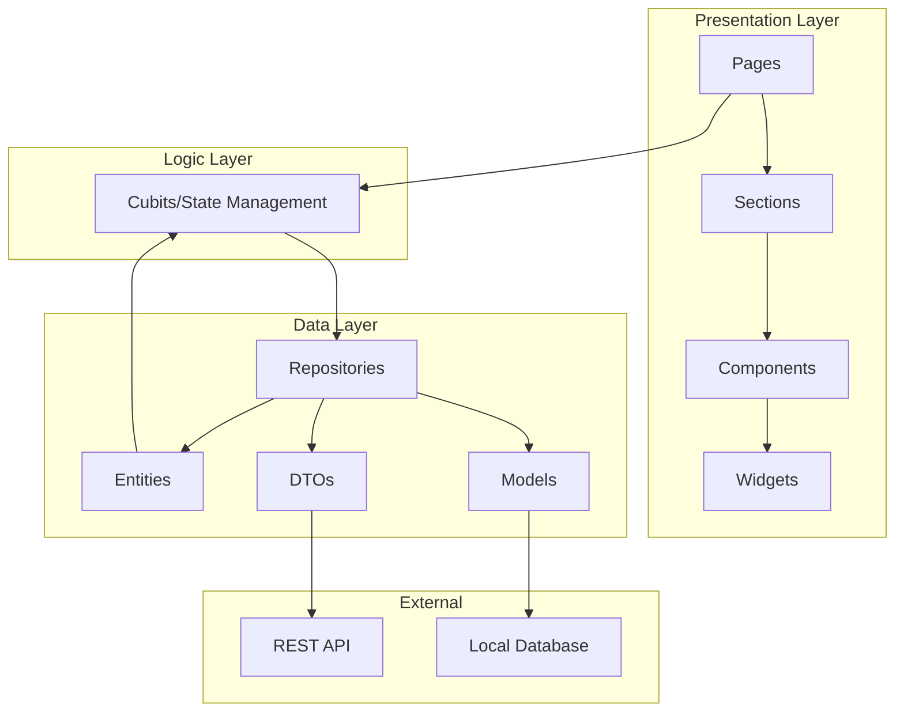
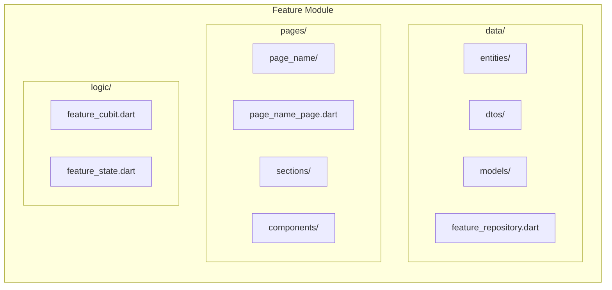
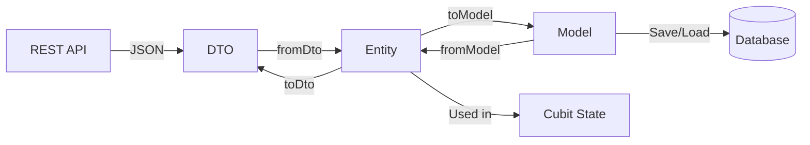
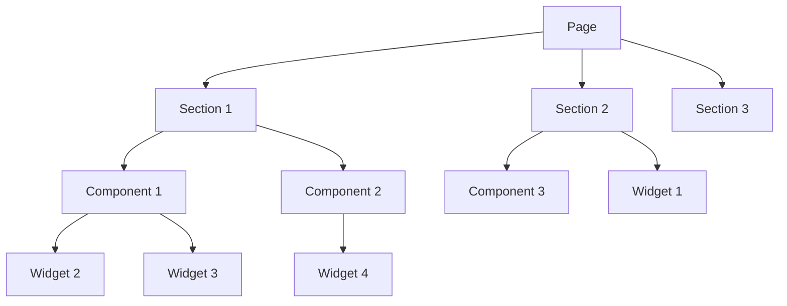
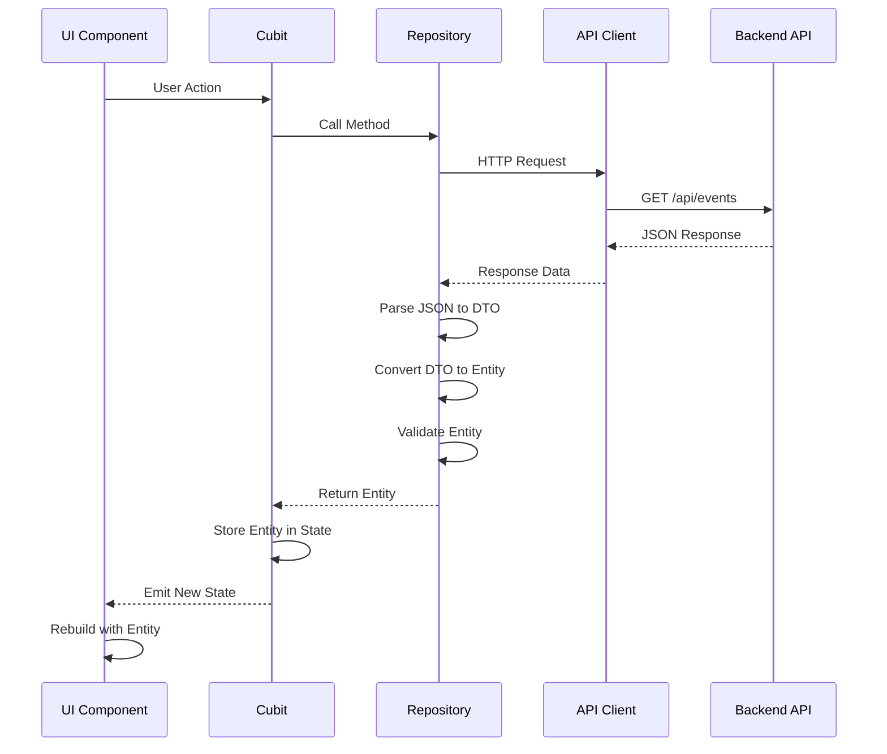
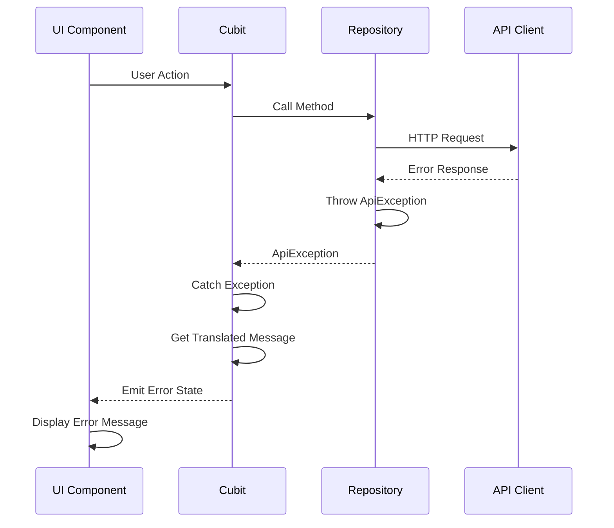
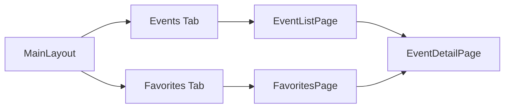

# Design Document: Flutter Architecture Refactoring

## Overview

This design document outlines the comprehensive refactoring of the Dancee App Flutter application from a basic flat structure to a clean architecture pattern with feature-based organization. The refactoring will transform the existing codebase while maintaining all functionality and establishing a scalable foundation for future development.

### Current State

The application currently uses a flat directory structure:
- `lib/screens/` - All UI screens
- `lib/models/` - All data models
- `lib/cubits/` - All state management
- `lib/widgets/` - All reusable widgets
- `lib/repositories/` - Data access layer

### Target State

The refactored application will use feature-based organization:
- `lib/features/` - Feature modules (events, app, auth, settings)
- `lib/design/` - Shared design system
- `lib/core/` - Shared utilities and configuration
- Each feature contains its own data, pages, and logic

### Goals

1. Establish clean architecture with clear separation of concerns
2. Organize code by features for better maintainability
3. Implement proper data layer with DTOs, Entities, and Models
4. Integrate type-safe routing with go_router
5. Create reusable design system
6. Maintain all existing functionality during migration


## Architecture

### High-Level Architecture Diagram



### Feature Module Architecture

Each feature module follows clean architecture principles:




### Directory Structure Transformation

#### Before (Current Structure)

```
lib/
├── core/
│   ├── clients/
│   │   └── api_client.dart
│   ├── config/
│   │   └── api_config.dart
│   └── exceptions/
│       └── api_exception.dart
├── cubits/
│   ├── event_list/
│   │   ├── event_list_cubit.dart
│   │   └── event_list_state.dart
│   └── favorites/
│       ├── favorites_cubit.dart
│       └── favorites_state.dart
├── di/
│   └── service_locator.dart
├── i18n/
│   ├── strings.i18n.json
│   ├── strings_cs.i18n.json
│   ├── strings_es.i18n.json
│   └── translations.g.dart
├── models/
│   ├── address.dart
│   ├── event.dart
│   ├── event_info.dart
│   ├── event_part.dart
│   └── venue.dart
├── repositories/
│   └── event_repository.dart
├── screens/
│   ├── event_list_screen.dart
│   └── favorites_screen.dart
├── widgets/
│   └── event_card.dart
├── app_config.dart (gitignored)
├── app_config.example.dart
└── main.dart
```


#### After (Target Structure)

```
lib/
├── core/
│   ├── service_locator.dart    # Dependency injection (moved from lib/di/)
│   ├── clients.dart             # API clients (single file if only one client)
│   ├── config.dart              # Public configuration (timeouts, feature flags, etc.)
│   ├── exceptions.dart          # Custom exceptions (single file if simple)
│   └── routing.dart             # App router configuration
├── design/
│   ├── widgets.dart             # Shared widgets (or folder if multiple files)
│   ├── components.dart          # Shared components (or folder if multiple files)
│   ├── theme.dart               # App theme configuration
│   ├── colors.dart              # Color constants
│   └── typography.dart          # Typography definitions
├── features/
│   ├── app/
│   │   ├── layouts.dart         # Main layout (single file if only one layout)
│   │   └── pages/
│   │       ├── initial_page.dart
│   │       ├── not_found_page.dart
│   │       └── error_page.dart
│   ├── auth/
│   │   ├── data/
│   │   │   ├── entities.dart    # All auth entities in one file
│   │   │   ├── dtos.dart        # All auth DTOs in one file
│   │   │   └── auth_repository.dart
│   │   ├── pages/
│   │   │   ├── login/           # Complex page with sections/components
│   │   │   │   ├── login_page.dart
│   │   │   │   ├── sections.dart     # All sections in one file
│   │   │   │   └── components.dart   # All components in one file
│   │   │   └── register/        # Complex page with sections/components
│   │   │       ├── register_page.dart
│   │   │       ├── sections.dart
│   │   │       └── components.dart
│   │   └── logic/
│   │       └── auth.dart        # Cubit + State in one file
│   ├── events/
│   │   ├── data/
│   │   │   ├── entities.dart    # EventEntity, VenueEntity, AddressEntity, etc.
│   │   │   ├── dtos.dart        # EventDto, VenueDto, AddressDto, etc.
│   │   │   └── event_repository.dart
│   │   ├── pages/
│   │   │   ├── event_list/      # Complex page with sections/components
│   │   │   │   ├── event_list_page.dart
│   │   │   │   ├── sections.dart     # All sections in one file
│   │   │   │   └── components.dart   # All components in one file
│   │   │   ├── event_detail/    # Complex page with sections/components
│   │   │   │   ├── event_detail_page.dart
│   │   │   │   ├── sections.dart
│   │   │   │   └── components.dart
│   │   │   ├── event_filters_page.dart  # Simple page - direct file
│   │   │   └── favorites_page.dart      # Simple page - direct file
│   │   └── logic/
│   │       ├── event_list.dart  # EventListCubit + EventListState
│   │       └── favorites.dart   # FavoritesCubit + FavoritesState
│   └── settings/
│       ├── data/
│       │   ├── entities.dart    # All settings entities
│       │   ├── dtos.dart        # All settings DTOs
│       │   └── settings_repository.dart
│       ├── pages/
│       │   └── settings_page.dart  # Simple page - direct file
│       └── logic/
│           └── settings.dart    # SettingsCubit + SettingsState
├── i18n/
│   ├── strings.i18n.json
│   ├── strings_cs.i18n.json
│   ├── strings_es.i18n.json
│   └── translations.g.dart
├── config.dart (gitignored - ONLY sensitive data)
├── config.example.dart (template for config.dart)
└── main.dart
```

**Directory Structure Rules:**

1. **Single File = No Folder Rule**
   - If a directory would contain only ONE file → No directory, use a single file with the directory name
   - Example: `core/clients/api_client.dart` → `core/clients.dart`
   - Example: `logic/auth_cubit.dart` + `auth_state.dart` → `logic/auth.dart` (both in one file)

2. **When to Create a Folder**
   - When a file grows beyond ~500 lines
   - When a page has sections AND components (needs multiple files)
   - When there are multiple related files that need organization

3. **Pages Structure**
   - **Simple page** (no sections/components, < 500 lines) → `page_name.dart` directly in `pages/`
   - **Complex page** (has sections/components OR > 500 lines) → `page_name/` folder with:
     - `page_name_page.dart`
     - `sections.dart` (all sections in one file)
     - `components.dart` (all components in one file)

4. **Data Layer**
   - Multiple small related classes → combine into one file
   - `entities/event_entity.dart`, `entities/venue_entity.dart` → `entities.dart` (all entities)
   - `dtos/event_dto.dart`, `dtos/venue_dto.dart` → `dtos.dart` (all DTOs)

5. **Logic Layer**
   - Cubit + State → combine into one file
   - `event_list/event_list_cubit.dart` + `event_list_state.dart` → `event_list.dart`

6. **Core and Design**
   - Apply same rules: single file unless multiple files needed
   - `core/clients/api_client.dart` → `core/clients.dart`
   - `design/theme/app_theme.dart` → `design/theme.dart`


## Components and Interfaces

### Data Layer Components

#### Entity, DTO, and Model Separation



**Entity**: Domain model used throughout the application
- Used in Cubit state
- Used in UI components
- Contains business logic
- Immutable with Equatable

**DTO**: Data Transfer Object for API communication
- Matches API response structure
- Contains fromJson/toJson methods
- Converts to Entity via toEntity() or Entity.fromDto()

**Model**: Database persistence model
- Matches database schema
- Contains database-specific fields (e.g., localId)
- Converts to Entity via toEntity() or Entity.fromModel()

#### Event Entity Design

```dart
// lib/features/events/data/entities/event_entity.dart
import 'package:equatable/equatable.dart';
import 'venue_entity.dart';
import 'event_info_entity.dart';
import 'event_part_entity.dart';
import '../dtos/event_dto.dart';

class EventEntity extends Equatable {
  final String id;
  final String title;
  final String description;
  final String organizer;
  final VenueEntity venue;
  final DateTime startTime;
  final DateTime endTime;
  final Duration duration;
  final List<String> dances;
  final List<EventInfoEntity> info;
  final List<EventPartEntity> parts;
  final bool isFavorite;
  final bool isPast;
  final String? badge;

  const EventEntity({
    required this.id,
    required this.title,
    required this.description,
    required this.organizer,
    required this.venue,
    required this.startTime,
    required this.endTime,
    required this.duration,
    required this.dances,
    this.info = const [],
    this.parts = const [],
    this.isFavorite = false,
    this.isPast = false,
    this.badge,
  });

  // Factory constructor from DTO
  factory EventEntity.fromDto(EventDto dto) {
    return EventEntity(
      id: dto.id,
      title: dto.title,
      description: dto.description,
      organizer: dto.organizer,
      venue: VenueEntity.fromDto(dto.venue),
      startTime: dto.startTime,
      endTime: dto.endTime,
      duration: dto.duration,
      dances: dto.dances,
      info: dto.info.map((i) => EventInfoEntity.fromDto(i)).toList(),
      parts: dto.parts.map((p) => EventPartEntity.fromDto(p)).toList(),
      isFavorite: dto.isFavorite,
      isPast: dto.isPast,
      badge: dto.badge,
    );
  }

  EventEntity copyWith({
    String? id,
    String? title,
    String? description,
    String? organizer,
    VenueEntity? venue,
    DateTime? startTime,
    DateTime? endTime,
    Duration? duration,
    List<String>? dances,
    List<EventInfoEntity>? info,
    List<EventPartEntity>? parts,
    bool? isFavorite,
    bool? isPast,
    String? badge,
  }) {
    return EventEntity(
      id: id ?? this.id,
      title: title ?? this.title,
      description: description ?? this.description,
      organizer: organizer ?? this.organizer,
      venue: venue ?? this.venue,
      startTime: startTime ?? this.startTime,
      endTime: endTime ?? this.endTime,
      duration: duration ?? this.duration,
      dances: dances ?? this.dances,
      info: info ?? this.info,
      parts: parts ?? this.parts,
      isFavorite: isFavorite ?? this.isFavorite,
      isPast: isPast ?? this.isPast,
      badge: badge ?? this.badge,
    );
  }

  @override
  List<Object?> get props => [
        id,
        title,
        description,
        organizer,
        venue,
        startTime,
        endTime,
        duration,
        dances,
        info,
        parts,
        isFavorite,
        isPast,
        badge,
      ];
}
```


#### Event DTO Design

```dart
// lib/features/events/data/dtos/event_dto.dart
import 'venue_dto.dart';
import 'event_info_dto.dart';
import 'event_part_dto.dart';

class EventDto {
  final String id;
  final String title;
  final String description;
  final String organizer;
  final VenueDto venue;
  final DateTime startTime;
  final DateTime endTime;
  final Duration duration;
  final List<String> dances;
  final List<EventInfoDto> info;
  final List<EventPartDto> parts;
  final bool isFavorite;
  final bool isPast;
  final String? badge;

  const EventDto({
    required this.id,
    required this.title,
    required this.description,
    required this.organizer,
    required this.venue,
    required this.startTime,
    required this.endTime,
    required this.duration,
    required this.dances,
    this.info = const [],
    this.parts = const [],
    this.isFavorite = false,
    this.isPast = false,
    this.badge,
  });

  // JSON serialization for API communication
  Map<String, dynamic> toJson() {
    return {
      'id': id,
      'title': title,
      'description': description,
      'organizer': organizer,
      'venue': venue.toJson(),
      'startTime': startTime.toIso8601String(),
      'endTime': endTime.toIso8601String(),
      'duration': duration.inSeconds,
      'dances': dances,
      'info': info.map((i) => i.toJson()).toList(),
      'parts': parts.map((p) => p.toJson()).toList(),
      'isFavorite': isFavorite,
      'isPast': isPast,
      'badge': badge,
    };
  }

  factory EventDto.fromJson(Map<String, dynamic> json) {
    return EventDto(
      id: json['id'] as String,
      title: json['title'] as String,
      description: json['description'] as String,
      organizer: json['organizer'] as String,
      venue: VenueDto.fromJson(json['venue'] as Map<String, dynamic>),
      startTime: DateTime.parse(json['startTime'] as String),
      endTime: DateTime.parse(json['endTime'] as String),
      duration: Duration(seconds: json['duration'] as int),
      dances: (json['dances'] as List<dynamic>).cast<String>(),
      info: (json['info'] as List<dynamic>)
          .map((i) => EventInfoDto.fromJson(i as Map<String, dynamic>))
          .toList(),
      parts: (json['parts'] as List<dynamic>)
          .map((p) => EventPartDto.fromJson(p as Map<String, dynamic>))
          .toList(),
      isFavorite: json['isFavorite'] as bool? ?? false,
      isPast: json['isPast'] as bool? ?? false,
      badge: json['badge'] as String?,
    );
  }
}
```


#### Repository Pattern Implementation

```dart
// lib/features/events/data/event_repository.dart
import '../../../core/clients.dart';
import '../../../core/config.dart';
import '../../../core/exceptions.dart';
import 'entities.dart';
import 'dtos.dart';

/// Repository for managing event data.
///
/// Responsibilities:
/// - Fetch data from API
/// - Convert DTOs to Entities
/// - Validate data
/// - Throw custom exceptions on errors
/// - ALWAYS return Entities (never DTOs)
class EventRepository {
  final ApiClient _apiClient;

  EventRepository(this._apiClient);

  /// Returns all events from the backend API.
  /// Converts DTOs to Entities before returning.
  Future<List<EventEntity>> getAllEvents() async {
    try {
      final response = await _apiClient.get(
        '/api/events/list',
        queryParameters: {'userId': AppConfig.userId},
      );
      
      if (response is! List) {
        throw ApiException(message: 'Invalid response format');
      }
      
      // Convert DTOs to Entities
      return response
          .map((json) => EventDto.fromJson(json as Map<String, dynamic>))
          .map((dto) => EventEntity.fromDto(dto))
          .toList();
    } on ApiException {
      rethrow;
    } on FormatException catch (e) {
      throw ApiException(
        message: 'Failed to parse events response',
        originalError: e,
      );
    } catch (e) {
      throw ApiException(
        message: 'Failed to load events',
        originalError: e,
      );
    }
  }

  /// Returns only favorite events from the backend API.
  /// Converts DTOs to Entities before returning.
  Future<List<EventEntity>> getFavoriteEvents() async {
    try {
      final response = await _apiClient.get(
        '/api/events/favorites',
        queryParameters: {'userId': AppConfig.userId},
      );
      
      if (response is! List) {
        throw ApiException(message: 'Invalid response format');
      }
      
      // Convert DTOs to Entities
      return response
          .map((json) => EventDto.fromJson(json as Map<String, dynamic>))
          .map((dto) => EventEntity.fromDto(dto))
          .toList();
    } on ApiException {
      rethrow;
    } on FormatException catch (e) {
      throw ApiException(
        message: 'Failed to parse favorite events response',
        originalError: e,
      );
    } catch (e) {
      throw ApiException(
        message: 'Failed to load favorite events',
        originalError: e,
      );
    }
  }

  /// Toggles the favorite status of an event.
  Future<void> toggleFavorite(String eventId, bool currentIsFavorite) async {
    if (currentIsFavorite) {
      await _removeFavorite(eventId);
    } else {
      await _addFavorite(eventId);
    }
  }

  Future<void> _addFavorite(String eventId) async {
    try {
      await _apiClient.post(
        '/api/events/favorites',
        data: {
          'userId': AppConfig.userId,
          'eventId': eventId,
        },
      );
    } on ApiException {
      rethrow;
    } catch (e) {
      throw ApiException(
        message: 'Failed to add favorite',
        originalError: e,
      );
    }
  }

  Future<void> _removeFavorite(String eventId) async {
    try {
      await _apiClient.delete(
        '/api/events/favorites/$eventId',
        queryParameters: {'userId': AppConfig.userId},
      );
    } on ApiException {
      rethrow;
    } catch (e) {
      throw ApiException(
        message: 'Failed to remove favorite',
        originalError: e,
      );
    }
  }
}
```


### State Management Components

#### Cubit with Freezed State

```dart
// lib/features/events/logic/event_list.dart
import 'package:flutter_bloc/flutter_bloc.dart';
import 'package:freezed_annotation/freezed_annotation.dart';
import '../../../i18n/translations.g.dart';
import '../../../core/exceptions.dart';
import '../../../core/service_locator.dart';
import '../data/event_repository.dart';
import '../data/entities.dart';
import 'favorites.dart';

part 'event_list.freezed.dart';

// State definition
@freezed
class EventListState with _$EventListState {
  const factory EventListState.initial() = EventListInitial;
  
  const factory EventListState.loading() = EventListLoading;
  
  const factory EventListState.loaded({
    required List<EventEntity> allEvents,
    required List<EventEntity> todayEvents,
    required List<EventEntity> tomorrowEvents,
    required List<EventEntity> upcomingEvents,
  }) = EventListLoaded;
  
  const factory EventListState.error(String message) = EventListError;
}

// Cubit implementation
class EventListCubit extends Cubit<EventListState> {
  final EventRepository _repository;

  EventListCubit(this._repository) : super(const EventListState.initial());

  Future<void> loadEvents() async {
    emit(const EventListState.loading());
    try {
      final events = await _repository.getAllEvents();
      
      // Group events by date
      final now = DateTime.now();
      final today = DateTime(now.year, now.month, now.day);
      final tomorrow = today.add(const Duration(days: 1));
      
      final todayEvents = events.where((e) {
        final eventDate = DateTime(
          e.startTime.year,
          e.startTime.month,
          e.startTime.day,
        );
        return eventDate.isAtSameMomentAs(today) && !e.isPast;
      }).toList();
      
      final tomorrowEvents = events.where((e) {
        final eventDate = DateTime(
          e.startTime.year,
          e.startTime.month,
          e.startTime.day,
        );
        return eventDate.isAtSameMomentAs(tomorrow) && !e.isPast;
      }).toList();
      
      final upcomingEvents = events.where((e) {
        final eventDate = DateTime(
          e.startTime.year,
          e.startTime.month,
          e.startTime.day,
        );
        return eventDate.isAfter(tomorrow) && !e.isPast;
      }).toList();
      
      emit(EventListState.loaded(
        allEvents: events,
        todayEvents: todayEvents,
        tomorrowEvents: tomorrowEvents,
        upcomingEvents: upcomingEvents,
      ));
    } on ApiException {
      emit(EventListState.error(t.errors.loadEventsError));
    } catch (e) {
      emit(EventListState.error(t.errors.genericError));
    }
  }

  Future<void> searchEvents(String query) async {
    if (query.isEmpty) {
      await loadEvents();
      return;
    }
    
    final currentState = state;
    if (currentState is! EventListLoaded) return;
    
    final lowerQuery = query.toLowerCase();
    final filteredEvents = currentState.allEvents.where((event) {
      return event.title.toLowerCase().contains(lowerQuery) ||
             event.venue.name.toLowerCase().contains(lowerQuery) ||
             event.description.toLowerCase().contains(lowerQuery);
    }).toList();
    
    // Group filtered results by date
    final now = DateTime.now();
    final today = DateTime(now.year, now.month, now.day);
    final tomorrow = today.add(const Duration(days: 1));
    
    final todayEvents = filteredEvents.where((e) {
      final eventDate = DateTime(
        e.startTime.year,
        e.startTime.month,
        e.startTime.day,
      );
      return eventDate.isAtSameMomentAs(today) && !e.isPast;
    }).toList();
    
    final tomorrowEvents = filteredEvents.where((e) {
      final eventDate = DateTime(
        e.startTime.year,
        e.startTime.month,
        e.startTime.day,
      );
      return eventDate.isAtSameMomentAs(tomorrow) && !e.isPast;
    }).toList();
    
    final upcomingEvents = filteredEvents.where((e) {
      final eventDate = DateTime(
        e.startTime.year,
        e.startTime.month,
        e.startTime.day,
      );
      return eventDate.isAfter(tomorrow) && !e.isPast;
    }).toList();
    
    emit(EventListState.loaded(
      allEvents: filteredEvents,
      todayEvents: todayEvents,
      tomorrowEvents: tomorrowEvents,
      upcomingEvents: upcomingEvents,
    ));
  }

  Future<void> toggleFavorite(String eventId) async {
    final currentState = state;
    if (currentState is! EventListLoaded) return;
    
    try {
      final event = currentState.allEvents.firstWhere(
        (e) => e.id == eventId,
        orElse: () => throw ApiException(message: 'Event not found'),
      );
      
      await _repository.toggleFavorite(eventId, event.isFavorite);
      
      // Update state locally
      final updatedAllEvents = currentState.allEvents.map((event) {
        if (event.id == eventId) {
          return event.copyWith(isFavorite: !event.isFavorite);
        }
        return event;
      }).toList();
      
      final updatedTodayEvents = currentState.todayEvents.map((event) {
        if (event.id == eventId) {
          return event.copyWith(isFavorite: !event.isFavorite);
        }
        return event;
      }).toList();
      
      final updatedTomorrowEvents = currentState.tomorrowEvents.map((event) {
        if (event.id == eventId) {
          return event.copyWith(isFavorite: !event.isFavorite);
        }
        return event;
      }).toList();
      
      final updatedUpcomingEvents = currentState.upcomingEvents.map((event) {
        if (event.id == eventId) {
          return event.copyWith(isFavorite: !event.isFavorite);
        }
        return event;
      }).toList();
      
      emit(EventListState.loaded(
        allEvents: updatedAllEvents,
        todayEvents: updatedTodayEvents,
        tomorrowEvents: updatedTomorrowEvents,
        upcomingEvents: updatedUpcomingEvents,
      ));
      
      // Notify FavoritesCubit
      getIt<FavoritesCubit>().loadFavorites();
    } on ApiException {
      emit(EventListState.error(t.errors.toggleFavoriteError));
    } catch (e) {
      emit(EventListState.error(t.errors.genericError));
    }
  }
}
```


### Routing Architecture

#### Go Router Configuration

```dart
// lib/core/routing.dart
import 'package:go_router/go_router.dart';
import 'package:flutter/material.dart';
import '../features/app/pages/initial_page.dart';
import '../features/app/pages/not_found_page.dart';
import '../features/events/pages/event_list/event_list_page.dart';
import '../features/events/pages/event_detail/event_detail_page.dart';
import '../features/events/pages/event_filters_page.dart';
import '../features/events/pages/favorites_page.dart';
import '../features/auth/pages/login/login_page.dart';
import '../features/auth/pages/register/register_page.dart';
import '../features/settings/pages/settings_page.dart';

final goRouter = GoRouter(
  initialLocation: '/',
  routes: $appRoutes,
  errorBuilder: (context, state) => const NotFoundPage(),
  redirect: (context, state) {
    // Authentication guard logic
    final isAuthenticated = false; // TODO: Get from auth state
    
    // Protected routes
    final protectedRoutes = ['/settings'];
    final isProtectedRoute = protectedRoutes.any(
      (route) => state.matchedLocation.startsWith(route),
    );
    
    if (!isAuthenticated && isProtectedRoute) {
      return '/login';
    }
    
    return null; // No redirect
  },
);
```

#### Route Definitions in Page Files

```dart
// lib/features/events/pages/event_list/event_list_page.dart
import 'package:flutter/material.dart';
import 'package:go_router/go_router.dart';

part 'event_list_page.g.dart';

@TypedGoRoute<EventListRoute>(path: '/events')
class EventListRoute extends GoRouteData {
  const EventListRoute();

  @override
  Widget build(BuildContext context, GoRouterState state) {
    return const EventListPage();
  }
}

class EventListPage extends StatelessWidget {
  const EventListPage({super.key});
  
  @override
  Widget build(BuildContext context) {
    // Page implementation
    return Scaffold(
      // ...
    );
  }
}
```

```dart
// lib/features/events/pages/event_detail/event_detail_page.dart
import 'package:flutter/material.dart';
import 'package:go_router/go_router.dart';

part 'event_detail_page.g.dart';

@TypedGoRoute<EventDetailRoute>(path: '/events/:id')
class EventDetailRoute extends GoRouteData {
  final String id;

  const EventDetailRoute({required this.id});

  @override
  Widget build(BuildContext context, GoRouterState state) {
    return EventDetailPage(eventId: id);
  }
}

class EventDetailPage extends StatelessWidget {
  final String eventId;
  
  const EventDetailPage({super.key, required this.eventId});
  
  @override
  Widget build(BuildContext context) {
    // Page implementation
    return Scaffold(
      // ...
    );
  }
}
```

#### Shell Routes for Main Layout

```dart
// lib/features/app/layouts/main_layout.dart
import 'package:flutter/material.dart';
import 'package:go_router/go_router.dart';

part 'main_layout.g.dart';

@TypedShellRoute<MainLayoutRoute>(
  routes: <TypedRoute<RouteData>>[
    TypedGoRoute<EventListRoute>(path: '/events'),
    TypedGoRoute<FavoritesRoute>(path: '/favorites'),
  ],
)
class MainLayoutRoute extends ShellRouteData {
  const MainLayoutRoute();

  @override
  Widget builder(BuildContext context, GoRouterState state, Widget navigator) {
    return MainLayout(child: navigator);
  }
}

class MainLayout extends StatefulWidget {
  final Widget child;
  
  const MainLayout({super.key, required this.child});

  @override
  State<MainLayout> createState() => _MainLayoutState();
}

class _MainLayoutState extends State<MainLayout> {
  int _selectedIndex = 0;

  @override
  Widget build(BuildContext context) {
    return Scaffold(
      body: widget.child,
      bottomNavigationBar: BottomNavigationBar(
        currentIndex: _selectedIndex,
        onTap: (index) {
          setState(() {
            _selectedIndex = index;
          });
          
          switch (index) {
            case 0:
              context.go('/events');
              break;
            case 1:
              context.go('/favorites');
              break;
          }
        },
        items: const [
          BottomNavigationBarItem(
            icon: Icon(Icons.event),
            label: 'Events',
          ),
          BottomNavigationBarItem(
            icon: Icon(Icons.favorite),
            label: 'Favorites',
          ),
        ],
      ),
    );
  }
}
```


### UI Component Hierarchy

#### Component Organization Pattern



**Rules:**
- Every UI element is its own class (no private build methods)
- Pages contain Sections
- Sections contain Components and Widgets
- Components contain Widgets
- Widgets are simple, reusable elements

#### Event List Page Structure

```dart
// lib/features/events/pages/event_list/event_list_page.dart
class EventListPage extends StatelessWidget {
  const EventListPage({super.key});
  
  @override
  Widget build(BuildContext context) {
    return Scaffold(
      backgroundColor: Colors.grey[50],
      body: SafeArea(
        child: BlocBuilder<EventListCubit, EventListState>(
          builder: (context, state) {
            return state.when(
              initial: () => const SizedBox.shrink(),
              loading: () => const LoadingSection(),
              loaded: (allEvents, todayEvents, tomorrowEvents, upcomingEvents) {
                return CustomScrollView(
                  slivers: [
                    const EventListHeaderSection(),
                    const SliverToBoxAdapter(
                      child: SearchAndFiltersSection(),
                    ),
                    SliverPadding(
                      padding: const EdgeInsets.fromLTRB(20, 16, 20, 96),
                      sliver: EventsByDateSection(
                        todayEvents: todayEvents,
                        tomorrowEvents: tomorrowEvents,
                        upcomingEvents: upcomingEvents,
                      ),
                    ),
                  ],
                );
              },
              error: (message) => ErrorSection(message: message),
            );
          },
        ),
      ),
    );
  }
}
```

```dart
// lib/features/events/pages/event_list/sections/event_list_header_section.dart
class EventListHeaderSection extends StatelessWidget {
  const EventListHeaderSection({super.key});
  
  @override
  Widget build(BuildContext context) {
    return SliverAppBar(
      expandedHeight: 100.0,
      collapsedHeight: 70,
      floating: false,
      pinned: true,
      backgroundColor: const Color(0xFF6366F1),
      flexibleSpace: LayoutBuilder(
        builder: (context, constraints) {
          // Animation logic
          return const HeaderContent();
        },
      ),
    );
  }
}
```

```dart
// lib/features/events/pages/event_list/sections/search_and_filters_section.dart
class SearchAndFiltersSection extends StatelessWidget {
  const SearchAndFiltersSection({super.key});
  
  @override
  Widget build(BuildContext context) {
    return Container(
      decoration: const BoxDecoration(
        gradient: LinearGradient(
          colors: [Color(0xFF6366F1), Color(0xFF8B5CF6), Color(0xFFEC4899)],
          begin: Alignment.centerLeft,
          end: Alignment.centerRight,
        ),
      ),
      padding: const EdgeInsets.fromLTRB(20, 0, 20, 24),
      child: const Column(
        children: [
          SearchBar(),
          SizedBox(height: 16),
          FilterChipsRow(),
        ],
      ),
    );
  }
}
```

```dart
// lib/features/events/pages/event_list/components/event_card.dart
class EventCard extends StatelessWidget {
  final EventEntity event;
  final VoidCallback onTap;
  final VoidCallback onFavoriteToggle;
  
  const EventCard({
    super.key,
    required this.event,
    required this.onTap,
    required this.onFavoriteToggle,
  });
  
  @override
  Widget build(BuildContext context) {
    return GestureDetector(
      onTap: onTap,
      child: Container(
        margin: const EdgeInsets.only(bottom: 16),
        decoration: BoxDecoration(
          color: Colors.white,
          borderRadius: BorderRadius.circular(16),
          boxShadow: [
            BoxShadow(
              color: Colors.black.withOpacity(0.05),
              blurRadius: 10,
              offset: const Offset(0, 2),
            ),
          ],
        ),
        child: Column(
          children: [
            EventCardHeader(
              title: event.title,
              badge: event.badge,
              isFavorite: event.isFavorite,
              onFavoriteToggle: onFavoriteToggle,
            ),
            EventCardBody(
              venue: event.venue,
              startTime: event.startTime,
              dances: event.dances,
            ),
          ],
        ),
      ),
    );
  }
}
```


## Data Models

### Entity Models

All entities follow these principles:
- Immutable classes using `const` constructors
- Extend `Equatable` for value equality
- Include `copyWith` method for updates
- Factory constructor `fromDto` for DTO conversion
- No JSON serialization (that's in DTOs)

#### Core Entity Structure

```dart
// Base pattern for all entities
class XEntity extends Equatable {
  final Type field1;
  final Type field2;
  
  const XEntity({
    required this.field1,
    required this.field2,
  });
  
  factory XEntity.fromDto(XDto dto) {
    return XEntity(
      field1: dto.field1,
      field2: dto.field2,
    );
  }
  
  XEntity copyWith({
    Type? field1,
    Type? field2,
  }) {
    return XEntity(
      field1: field1 ?? this.field1,
      field2: field2 ?? this.field2,
    );
  }
  
  @override
  List<Object?> get props => [field1, field2];
}
```

### DTO Models

All DTOs follow these principles:
- Immutable classes using `const` constructors
- Include `toJson` and `fromJson` methods
- Match API response structure exactly
- No business logic

#### Core DTO Structure

```dart
// Base pattern for all DTOs
class XDto {
  final Type field1;
  final Type field2;
  
  const XDto({
    required this.field1,
    required this.field2,
  });
  
  Map<String, dynamic> toJson() {
    return {
      'field1': field1,
      'field2': field2,
    };
  }
  
  factory XDto.fromJson(Map<String, dynamic> json) {
    return XDto(
      field1: json['field1'] as Type,
      field2: json['field2'] as Type,
    );
  }
}
```

### Data Flow Diagram




## Correctness Properties

*A property is a characteristic or behavior that should hold true across all valid executions of a system—essentially, a formal statement about what the system should do. Properties serve as the bridge between human-readable specifications and machine-verifiable correctness guarantees.*

### Property Reflection

After analyzing all acceptance criteria, I identified the following testable properties. I then performed a reflection to eliminate redundancy:

**Redundancy Analysis:**
- Properties 2.8, 6.4, and 7.3 all test "repositories return Entity objects" - these can be combined into one comprehensive property
- Properties 2.9 and 7.4 both test "DTO to Entity conversion" - these can be combined
- Properties 6.6 and 6.7 test specific conversion methods - these are examples, not properties
- Property 2.10 and 11.6 both test "existing functionality maintained" - these are examples for specific features

**Final Properties (after removing redundancy):**

### Property 1: Repository Return Type Consistency

*For any* repository method that fetches data, the return type should be Entity or List<Entity>, never DTO or Model.

**Validates: Requirements 2.8, 6.4, 7.3**

### Property 2: DTO to Entity Conversion Completeness

*For any* DTO received from the API, converting it to an Entity and back to DTO should preserve all data fields.

**Validates: Requirements 2.9, 6.5, 7.4**

### Property 3: Entity Value Equality

*For any* two entities with identical field values, they should be equal according to Equatable comparison.

**Validates: Requirements 6.8**

### Property 4: Repository Error Handling

*For any* error condition encountered by a repository (network error, parse error, validation error), the repository should throw a custom ApiException with a descriptive message.

**Validates: Requirements 7.5**

### Property 5: Repository Data Validation

*For any* invalid data received from the API (missing required fields, invalid formats), the repository should reject it and throw an exception before returning.

**Validates: Requirements 7.6**

### Property 6: Authentication Redirect

*For any* protected route, when accessed by an unauthenticated user, the router should redirect to the login page.

**Validates: Requirements 10.8**

### Property 7: Cubit Exception Handling

*For any* exception thrown by a repository, the cubit should catch it and emit an error state with a translated user-friendly message.

**Validates: Requirements 11.4, 11.5**

### Property 8: Cubit State Data Type

*For any* cubit state that stores data, the stored data should be Entity objects, never DTO or Model objects.

**Validates: Requirements 11.7**


## Error Handling

### Exception Hierarchy

```dart
// lib/core/exceptions/api_exception.dart
class ApiException implements Exception {
  final String message;
  final dynamic originalError;
  final int? statusCode;

  ApiException({
    required this.message,
    this.originalError,
    this.statusCode,
  });

  @override
  String toString() => 'ApiException: $message';
}

class NetworkException extends ApiException {
  NetworkException({String? message})
      : super(message: message ?? 'Network error occurred');
}

class ValidationException extends ApiException {
  ValidationException({required String message})
      : super(message: message);
}

class NotFoundException extends ApiException {
  NotFoundException({required String message})
      : super(message: message, statusCode: 404);
}
```

### Error Handling Flow



### Error Handling in Repository

```dart
Future<List<EventEntity>> getAllEvents() async {
  try {
    final response = await _apiClient.get('/api/events/list');
    
    // Validate response format
    if (response is! List) {
      throw ValidationException(
        message: 'Invalid response format: expected List, got ${response.runtimeType}',
      );
    }
    
    // Parse and convert
    return response
        .map((json) => EventDto.fromJson(json as Map<String, dynamic>))
        .map((dto) => EventEntity.fromDto(dto))
        .toList();
        
  } on ApiException {
    // Re-throw API exceptions
    rethrow;
  } on FormatException catch (e) {
    // Handle parsing errors
    throw ValidationException(
      message: 'Failed to parse events response: ${e.message}',
    );
  } catch (e) {
    // Handle unexpected errors
    throw ApiException(
      message: 'Failed to load events',
      originalError: e,
    );
  }
}
```

### Error Handling in Cubit

```dart
Future<void> loadEvents() async {
  emit(const EventListState.loading());
  
  try {
    final events = await _repository.getAllEvents();
    emit(EventListState.loaded(events: events));
    
  } on NetworkException {
    emit(EventListState.error(t.errors.networkError));
    
  } on ValidationException {
    emit(EventListState.error(t.errors.dataValidationError));
    
  } on NotFoundException {
    emit(EventListState.error(t.errors.notFoundError));
    
  } on ApiException catch (e) {
    // Generic API error
    emit(EventListState.error(t.errors.apiError));
    
  } catch (e) {
    // Unexpected error
    emit(EventListState.error(t.errors.genericError));
  }
}
```

### Error Pages

```dart
// lib/features/app/pages/error_page.dart
class ErrorPage extends StatelessWidget {
  final String message;
  final VoidCallback? onRetry;
  
  const ErrorPage({
    super.key,
    required this.message,
    this.onRetry,
  });
  
  @override
  Widget build(BuildContext context) {
    return Scaffold(
      body: Center(
        child: Column(
          mainAxisAlignment: MainAxisAlignment.center,
          children: [
            Icon(
              Icons.error_outline,
              size: 64,
              color: Colors.red,
            ),
            const SizedBox(height: 24),
            Text(
              message,
              style: Theme.of(context).textTheme.titleLarge,
              textAlign: TextAlign.center,
            ),
            if (onRetry != null) ...[
              const SizedBox(height: 24),
              ElevatedButton(
                onPressed: onRetry,
                child: Text(t.retry),
              ),
            ],
          ],
        ),
      ),
    );
  }
}

// lib/features/app/pages/not_found_page.dart
class NotFoundPage extends StatelessWidget {
  const NotFoundPage({super.key});
  
  @override
  Widget build(BuildContext context) {
    return Scaffold(
      body: Center(
        child: Column(
          mainAxisAlignment: MainAxisAlignment.center,
          children: [
            Icon(
              Icons.search_off,
              size: 64,
              color: Colors.grey,
            ),
            const SizedBox(height: 24),
            Text(
              t.errors.pageNotFound,
              style: Theme.of(context).textTheme.titleLarge,
            ),
            const SizedBox(height: 24),
            ElevatedButton(
              onPressed: () => context.go('/events'),
              child: Text(t.goHome),
            ),
          ],
        ),
      ),
    );
  }
}
```


## Testing Strategy

### Dual Testing Approach

This refactoring requires both unit tests and property-based tests for comprehensive coverage:

**Unit Tests:**
- Specific examples and edge cases
- Integration points between components
- Error conditions
- UI component rendering

**Property-Based Tests:**
- Universal properties across all inputs
- Data conversion correctness
- Repository behavior consistency
- State management invariants

### Property-Based Testing Configuration

**Library Selection:** `test` package with custom property test helpers (or `fast_check` if available for Dart)

**Configuration:**
- Minimum 100 iterations per property test
- Each test references its design document property
- Tag format: `@Tags(['Feature: flutter-architecture-refactor, Property X: {property_text}'])`

### Test Structure

```
test/
├── features/
│   ├── events/
│   │   ├── data/
│   │   │   ├── event_repository_test.dart
│   │   │   ├── entities/
│   │   │   │   └── event_entity_test.dart
│   │   │   └── dtos/
│   │   │       └── event_dto_test.dart
│   │   ├── logic/
│   │   │   ├── event_list/
│   │   │   │   └── event_list_cubit_test.dart
│   │   │   └── favorites/
│   │   │       └── favorites_cubit_test.dart
│   │   └── pages/
│   │       └── event_list/
│   │           └── event_list_page_test.dart
│   ├── auth/
│   │   └── ...
│   └── settings/
│       └── ...
└── helpers/
    ├── property_test_helpers.dart
    └── mock_factories.dart
```

### Property Test Examples

#### Property 1: Repository Return Type Consistency

```dart
// test/features/events/data/event_repository_property_test.dart
import 'package:test/test.dart';

/// Feature: flutter-architecture-refactor
/// Property 1: Repository Return Type Consistency
void main() {
  group('Property 1: Repository Return Type Consistency', () {
    test('getAllEvents returns List<EventEntity>', () async {
      // Arrange
      final mockClient = MockApiClient();
      final repository = EventRepository(mockClient);
      
      // Mock API response with valid data
      when(() => mockClient.get(any(), queryParameters: any(named: 'queryParameters')))
          .thenAnswer((_) async => [
            {
              'id': '1',
              'title': 'Test Event',
              // ... other fields
            }
          ]);
      
      // Act
      final result = await repository.getAllEvents();
      
      // Assert
      expect(result, isA<List<EventEntity>>());
      expect(result.every((item) => item is EventEntity), isTrue);
    });
    
    test('getFavoriteEvents returns List<EventEntity>', () async {
      // Similar test for getFavoriteEvents
    });
  });
}
```

#### Property 2: DTO to Entity Conversion Completeness

```dart
/// Feature: flutter-architecture-refactor
/// Property 2: DTO to Entity Conversion Completeness
void main() {
  group('Property 2: DTO to Entity Conversion', () {
    test('round-trip conversion preserves data', () {
      // Run 100 iterations with different data
      for (var i = 0; i < 100; i++) {
        // Arrange - Generate random DTO
        final originalDto = generateRandomEventDto(seed: i);
        
        // Act - Convert DTO -> Entity -> DTO
        final entity = EventEntity.fromDto(originalDto);
        final convertedDto = EventDto.fromEntity(entity);
        
        // Assert - Data should be preserved
        expect(convertedDto.id, equals(originalDto.id));
        expect(convertedDto.title, equals(originalDto.title));
        expect(convertedDto.description, equals(originalDto.description));
        // ... check all fields
      }
    });
  });
}
```

#### Property 7: Cubit Exception Handling

```dart
/// Feature: flutter-architecture-refactor
/// Property 7: Cubit Exception Handling
void main() {
  group('Property 7: Cubit Exception Handling', () {
    test('cubit catches repository exceptions and emits error state', () async {
      // Test with different exception types
      final exceptionTypes = [
        ApiException(message: 'API error'),
        NetworkException(),
        ValidationException(message: 'Validation error'),
        NotFoundException(message: 'Not found'),
      ];
      
      for (final exception in exceptionTypes) {
        // Arrange
        final mockRepository = MockEventRepository();
        final cubit = EventListCubit(mockRepository);
        
        when(() => mockRepository.getAllEvents())
            .thenThrow(exception);
        
        // Act
        await cubit.loadEvents();
        
        // Assert
        expect(cubit.state, isA<EventListError>());
        final errorState = cubit.state as EventListError;
        expect(errorState.message, isNotEmpty);
        expect(errorState.message, isNot(contains('Exception')));
        expect(errorState.message, isNot(contains('Error:')));
      }
    });
  });
}
```

### Unit Test Examples

#### Repository Unit Tests

```dart
// test/features/events/data/event_repository_test.dart
void main() {
  group('EventRepository', () {
    late MockApiClient mockClient;
    late EventRepository repository;
    
    setUp(() {
      mockClient = MockApiClient();
      repository = EventRepository(mockClient);
    });
    
    group('getAllEvents', () {
      test('returns events when API call succeeds', () async {
        // Arrange
        final mockResponse = [
          {
            'id': '1',
            'title': 'Test Event',
            'description': 'Test Description',
            // ... other fields
          }
        ];
        
        when(() => mockClient.get(any(), queryParameters: any(named: 'queryParameters')))
            .thenAnswer((_) async => mockResponse);
        
        // Act
        final result = await repository.getAllEvents();
        
        // Assert
        expect(result, hasLength(1));
        expect(result.first.id, equals('1'));
        expect(result.first.title, equals('Test Event'));
      });
      
      test('throws ApiException when response is not a list', () async {
        // Arrange
        when(() => mockClient.get(any(), queryParameters: any(named: 'queryParameters')))
            .thenAnswer((_) async => {'error': 'Invalid format'});
        
        // Act & Assert
        expect(
          () => repository.getAllEvents(),
          throwsA(isA<ApiException>()),
        );
      });
      
      test('throws ApiException when JSON parsing fails', () async {
        // Arrange
        when(() => mockClient.get(any(), queryParameters: any(named: 'queryParameters')))
            .thenAnswer((_) async => [
              {'id': 1} // Invalid: id should be String
            ]);
        
        // Act & Assert
        expect(
          () => repository.getAllEvents(),
          throwsA(isA<ApiException>()),
        );
      });
    });
    
    group('toggleFavorite', () {
      test('calls addFavorite when currentIsFavorite is false', () async {
        // Arrange
        when(() => mockClient.post(any(), data: any(named: 'data')))
            .thenAnswer((_) async => {});
        
        // Act
        await repository.toggleFavorite('event-1', false);
        
        // Assert
        verify(() => mockClient.post(
          '/api/events/favorites',
          data: {'userId': any(named: 'userId'), 'eventId': 'event-1'},
        )).called(1);
      });
      
      test('calls removeFavorite when currentIsFavorite is true', () async {
        // Arrange
        when(() => mockClient.delete(any(), queryParameters: any(named: 'queryParameters')))
            .thenAnswer((_) async => {});
        
        // Act
        await repository.toggleFavorite('event-1', true);
        
        // Assert
        verify(() => mockClient.delete(
          '/api/events/favorites/event-1',
          queryParameters: any(named: 'queryParameters'),
        )).called(1);
      });
    });
  });
}
```


#### Cubit Unit Tests

```dart
// test/features/events/logic/event_list/event_list_cubit_test.dart
void main() {
  group('EventListCubit', () {
    late MockEventRepository mockRepository;
    late EventListCubit cubit;
    
    setUp(() {
      mockRepository = MockEventRepository();
      cubit = EventListCubit(mockRepository);
    });
    
    tearDown(() {
      cubit.close();
    });
    
    group('loadEvents', () {
      test('emits [loading, loaded] when successful', () async {
        // Arrange
        final mockEvents = [
          createMockEventEntity(id: '1', startTime: DateTime.now()),
          createMockEventEntity(id: '2', startTime: DateTime.now().add(Duration(days: 1))),
        ];
        
        when(() => mockRepository.getAllEvents())
            .thenAnswer((_) async => mockEvents);
        
        // Assert
        expectLater(
          cubit.stream,
          emitsInOrder([
            isA<EventListLoading>(),
            isA<EventListLoaded>(),
          ]),
        );
        
        // Act
        await cubit.loadEvents();
      });
      
      test('emits [loading, error] when repository throws exception', () async {
        // Arrange
        when(() => mockRepository.getAllEvents())
            .thenThrow(ApiException(message: 'Network error'));
        
        // Assert
        expectLater(
          cubit.stream,
          emitsInOrder([
            isA<EventListLoading>(),
            isA<EventListError>(),
          ]),
        );
        
        // Act
        await cubit.loadEvents();
      });
      
      test('groups events by date correctly', () async {
        // Arrange
        final now = DateTime.now();
        final today = DateTime(now.year, now.month, now.day);
        final tomorrow = today.add(Duration(days: 1));
        final nextWeek = today.add(Duration(days: 7));
        
        final mockEvents = [
          createMockEventEntity(id: '1', startTime: today.add(Duration(hours: 10))),
          createMockEventEntity(id: '2', startTime: tomorrow.add(Duration(hours: 10))),
          createMockEventEntity(id: '3', startTime: nextWeek.add(Duration(hours: 10))),
        ];
        
        when(() => mockRepository.getAllEvents())
            .thenAnswer((_) async => mockEvents);
        
        // Act
        await cubit.loadEvents();
        
        // Assert
        final state = cubit.state as EventListLoaded;
        expect(state.todayEvents, hasLength(1));
        expect(state.tomorrowEvents, hasLength(1));
        expect(state.upcomingEvents, hasLength(1));
      });
    });
    
    group('searchEvents', () {
      test('filters events by title', () async {
        // Arrange
        final mockEvents = [
          createMockEventEntity(id: '1', title: 'Salsa Night'),
          createMockEventEntity(id: '2', title: 'Bachata Workshop'),
          createMockEventEntity(id: '3', title: 'Salsa Festival'),
        ];
        
        when(() => mockRepository.getAllEvents())
            .thenAnswer((_) async => mockEvents);
        
        await cubit.loadEvents();
        
        // Act
        await cubit.searchEvents('Salsa');
        
        // Assert
        final state = cubit.state as EventListLoaded;
        expect(state.allEvents, hasLength(2));
        expect(state.allEvents.every((e) => e.title.contains('Salsa')), isTrue);
      });
      
      test('reloads all events when query is empty', () async {
        // Arrange
        final mockEvents = [
          createMockEventEntity(id: '1', title: 'Event 1'),
          createMockEventEntity(id: '2', title: 'Event 2'),
        ];
        
        when(() => mockRepository.getAllEvents())
            .thenAnswer((_) async => mockEvents);
        
        await cubit.loadEvents();
        await cubit.searchEvents('Event 1');
        
        // Act
        await cubit.searchEvents('');
        
        // Assert
        final state = cubit.state as EventListLoaded;
        expect(state.allEvents, hasLength(2));
      });
    });
    
    group('toggleFavorite', () {
      test('updates event favorite status locally', () async {
        // Arrange
        final mockEvents = [
          createMockEventEntity(id: '1', isFavorite: false),
          createMockEventEntity(id: '2', isFavorite: false),
        ];
        
        when(() => mockRepository.getAllEvents())
            .thenAnswer((_) async => mockEvents);
        when(() => mockRepository.toggleFavorite(any(), any()))
            .thenAnswer((_) async => {});
        
        await cubit.loadEvents();
        
        // Act
        await cubit.toggleFavorite('1');
        
        // Assert
        final state = cubit.state as EventListLoaded;
        final updatedEvent = state.allEvents.firstWhere((e) => e.id == '1');
        expect(updatedEvent.isFavorite, isTrue);
      });
    });
  });
}
```

### Test Coverage Goals

- **Repository Layer:** 90%+ coverage
  - All public methods
  - Error handling paths
  - Data validation

- **Cubit Layer:** 90%+ coverage
  - All state transitions
  - Error handling
  - Business logic

- **Entity/DTO Layer:** 100% coverage
  - Conversion methods
  - Equality comparison
  - copyWith methods

- **UI Components:** 70%+ coverage
  - Widget rendering
  - User interactions
  - State-based rendering

### Running Tests

```bash
# Run all tests
flutter test

# Run tests with coverage
flutter test --coverage

# Run specific test file
flutter test test/features/events/data/event_repository_test.dart

# Run property tests only
flutter test --tags property

# Run tests for specific feature
flutter test test/features/events/
```


## Implementation Guidance

### Migration Strategy

The refactoring will be performed incrementally to maintain functionality:

#### Phase 1: Setup and Infrastructure (Week 1)

1. **Create new directory structure**
   - Create `lib/features/` directory
   - Create `lib/design/` directory
   - Create `lib/core/routing/` directory

2. **Add dependencies**
   ```yaml
   dependencies:
     go_router: ^13.0.0
     freezed_annotation: ^2.4.1
     
   dev_dependencies:
     go_router_builder: ^2.4.0
     freezed: ^2.4.6
     build_runner: ^2.4.7
   ```

3. **Configure build_runner**
   ```yaml
   # build.yaml
   targets:
     $default:
       builders:
         go_router_builder:
           options:
             routes_file_name: app_routes.dart
   ```

#### Phase 2: Events Feature Migration (Week 2-3)

1. **Create data layer**
   - Create entity classes in `lib/features/events/data/entities/`
   - Create DTO classes in `lib/features/events/data/dtos/`
   - Migrate EventRepository to `lib/features/events/data/`
   - Update repository to use DTOs and return Entities

2. **Create logic layer**
   - Move cubits to `lib/features/events/logic/`
   - Update cubit imports
   - Convert state classes to use freezed
   - Update cubits to use Entities

3. **Create presentation layer**
   - Create page directories in `lib/features/events/pages/`
   - Extract sections from existing screens
   - Extract components from sections
   - Move EventCard to feature components
   - Add route definitions with @TypedGoRoute

4. **Update dependency injection**
   - Update service_locator.dart with new paths
   - Ensure all dependencies resolve correctly

5. **Run tests**
   - Update test imports
   - Verify all tests pass
   - Add new tests for entities and DTOs

#### Phase 3: App Feature Creation (Week 3)

1. **Create layouts**
   - Move MainNavigationScreen to `lib/features/app/layouts/main_layout.dart`
   - Extract bottom navigation into components
   - Add shell route definition

2. **Create error pages**
   - Create NotFoundPage
   - Create ErrorPage
   - Add route definitions

3. **Create initial page**
   - Create InitialPage as app entry point
   - Add routing logic

4. **Configure router**
   - Create `lib/core/routing/app_router.dart`
   - Configure GoRouter with all routes
   - Add redirect logic for auth guards
   - Update main.dart to use MaterialApp.router

#### Phase 4: Auth Feature Scaffolding (Week 4)

1. **Create feature structure**
   - Create `lib/features/auth/` directories
   - Create placeholder repository
   - Create placeholder cubits

2. **Create login page**
   - Create page structure based on .design/auth-login.html
   - Extract sections
   - Extract components
   - Add route definition

3. **Create register page**
   - Create page structure based on .design/auth-register.html
   - Extract sections
   - Extract components
   - Add route definition

#### Phase 5: Settings Feature Scaffolding (Week 4)

1. **Create feature structure**
   - Create `lib/features/settings/` directories
   - Create placeholder repository
   - Create placeholder cubits

2. **Create settings page**
   - Create page structure based on .design/settings.html
   - Extract sections
   - Extract components
   - Add route definition

#### Phase 6: Design System Organization (Week 5)

1. **Extract shared components**
   - Identify truly shared widgets
   - Move to `lib/design/widgets/`
   - Update imports across codebase

2. **Create theme structure**
   - Extract colors to `lib/design/colors/app_colors.dart`
   - Extract typography to `lib/design/typography/app_typography.dart`
   - Create `lib/design/theme/app_theme.dart`

3. **Update app to use theme**
   - Apply theme in MaterialApp
   - Update components to use theme values

#### Phase 7: Cleanup and Documentation (Week 5)

1. **Remove legacy directories**
   - Delete `lib/screens/`
   - Delete `lib/models/`
   - Delete `lib/cubits/`
   - Delete `lib/widgets/`

2. **Update documentation**
   - Update README.md
   - Document feature structure
   - Document data layer patterns
   - Document routing setup
   - Provide examples

3. **Final testing**
   - Run full test suite
   - Test on all platforms (web, Android, iOS)
   - Verify all functionality works

### Code Generation Commands

```bash
# Generate routes and freezed classes
task build-runner

# Watch mode during development
task build-runner-watch

# Force regeneration (delete conflicting outputs)
task build-runner-force

# Clean generated files
task build-runner-clean
```

### File Naming Checklist

- [ ] All files use snake_case
- [ ] Files prefixed with feature name (e.g., `event_repository.dart`)
- [ ] Pages suffixed with `_page.dart`
- [ ] Sections suffixed with `_section.dart`
- [ ] Cubits suffixed with `_cubit.dart`
- [ ] States suffixed with `_state.dart`
- [ ] Entities suffixed with `_entity.dart`
- [ ] DTOs suffixed with `_dto.dart`

### Import Organization

```dart
// 1. Dart imports
import 'dart:async';

// 2. Flutter imports
import 'package:flutter/material.dart';

// 3. Package imports
import 'package:flutter_bloc/flutter_bloc.dart';
import 'package:go_router/go_router.dart';

// 4. Relative imports (grouped by layer)
// Core
import '../../../core/exceptions/api_exception.dart';
import '../../../core/clients/api_client.dart';

// Data
import '../../data/entities/event_entity.dart';
import '../../data/event_repository.dart';

// Logic
import '../../logic/event_list/event_list_cubit.dart';

// UI
import '../components/event_card.dart';

// Translations
import '../../../i18n/translations.g.dart';
```


### Common Pitfalls and Solutions

#### Pitfall 1: Circular Dependencies

**Problem:** Feature modules importing from each other

**Solution:**
- Keep features independent
- Share common code through `lib/core/` or `lib/design/`
- Use dependency injection for cross-feature communication
- Use event bus or state management for loose coupling

#### Pitfall 2: Mixing DTOs and Entities

**Problem:** Using DTOs in UI or Entities in API calls

**Solution:**
- Repository always converts DTO → Entity
- Cubit always stores Entity in state
- UI always receives Entity
- API calls always use DTO

#### Pitfall 3: Private Build Methods

**Problem:** Creating private `_buildXxx()` methods for UI

**Solution:**
- Extract every UI element into its own class
- Use composition over private methods
- Follow Page → Section → Component → Widget hierarchy

#### Pitfall 4: Hardcoded Strings

**Problem:** Forgetting to use translations

**Solution:**
- Always import `translations.g.dart`
- Use `t.keyName` for all user-facing text
- Add translations to all language files (en, cs, es)
- Run `task slang` after adding translations

#### Pitfall 5: Route Generation Issues

**Problem:** Routes not generating or not found

**Solution:**
- Add `part 'page_name.g.dart';` directive
- Ensure @TypedGoRoute annotation is correct
- Run `task build-runner` to generate routes
- Check for syntax errors in route definitions

#### Pitfall 6: State Not Updating

**Problem:** UI not rebuilding when state changes

**Solution:**
- Ensure state classes use freezed for immutability
- Use `copyWith` for state updates
- Emit new state instances (not mutated state)
- Use BlocBuilder or BlocConsumer correctly

### Dependency Injection Updates

```dart
// lib/core/service_locator.dart (moved from lib/di/)
import 'package:get_it/get_it.dart';
import 'package:dio/dio.dart';

// Core
import 'clients.dart';
import '../config.dart';
import 'config.dart';

// Features - Events
import '../features/events/data/event_repository.dart';
import '../features/events/logic/event_list.dart';
import '../features/events/logic/favorites.dart';

// Features - Auth
import '../features/auth/data/auth_repository.dart';
import '../features/auth/logic/auth.dart';

// Features - Settings
import '../features/settings/data/settings_repository.dart';
import '../features/settings/logic/settings.dart';

final getIt = GetIt.instance;

Future<void> setupDependencies() async {
  // Core - API Client
  getIt.registerLazySingleton<Dio>(() => Dio(BaseOptions(
    baseUrl: AppConfig.apiBaseUrl,
    connectTimeout: Duration(milliseconds: AppConfig.connectTimeout),
    receiveTimeout: Duration(milliseconds: AppConfig.receiveTimeout),
  )));
  
  getIt.registerLazySingleton<ApiClient>(
    () => ApiClient(getIt<Dio>()),
  );
  
  // Events Feature
  getIt.registerLazySingleton<EventRepository>(
    () => EventRepository(getIt<ApiClient>()),
  );
  
  getIt.registerFactory<EventListCubit>(
    () => EventListCubit(getIt<EventRepository>()),
  );
  
  getIt.registerFactory<FavoritesCubit>(
    () => FavoritesCubit(getIt<EventRepository>()),
  );
  
  // Auth Feature
  getIt.registerLazySingleton<AuthRepository>(
    () => AuthRepository(getIt<ApiClient>()),
  );
  
  getIt.registerFactory<AuthCubit>(
    () => AuthCubit(getIt<AuthRepository>()),
  );
  
  // Settings Feature
  getIt.registerLazySingleton<SettingsRepository>(
    () => SettingsRepository(getIt<ApiClient>()),
  );
  
  getIt.registerFactory<SettingsCubit>(
    () => SettingsCubit(getIt<SettingsRepository>()),
  );
}
```

### Main.dart Updates

```dart
// lib/main.dart
import 'package:flutter/material.dart';
import 'package:flutter_localizations/flutter_localizations.dart';
import 'core/routing.dart';
import 'core/service_locator.dart';
import 'i18n/translations.g.dart';

void main() async {
  WidgetsFlutterBinding.ensureInitialized();
  
  // Initialize translations
  LocaleSettings.useDeviceLocale();
  
  // Setup dependency injection
  await setupDependencies();
  
  runApp(TranslationProvider(child: const MyApp()));
}

class MyApp extends StatelessWidget {
  const MyApp({super.key});

  @override
  Widget build(BuildContext context) {
    return MaterialApp.router(
      title: 'Dancee',
      routerConfig: goRouter,
      locale: TranslationProvider.of(context).flutterLocale,
      supportedLocales: AppLocaleUtils.supportedLocales,
      localizationsDelegates: const [
        GlobalMaterialLocalizations.delegate,
        GlobalWidgetsLocalizations.delegate,
        GlobalCupertinoLocalizations.delegate,
      ],
      theme: ThemeData(
        colorScheme: ColorScheme.fromSeed(seedColor: const Color(0xFF6366F1)),
        useMaterial3: true,
      ),
    );
  }
}
```

### Configuration Management

The refactoring uses a clear separation between sensitive and public configuration:

**Sensitive Configuration (gitignored):**

```dart
// lib/config.dart (gitignored - NOT committed)
class Config {
  static const String apiBaseUrl = 'https://api.dancee.app';
  static const String apiKey = 'your-api-key-here';
  static const String sentryDsn = 'your-sentry-dsn';
}

// lib/config.example.dart (committed as template)
class Config {
  static const String apiBaseUrl = 'YOUR_API_BASE_URL_HERE';
  static const String apiKey = 'YOUR_API_KEY_HERE';
  static const String sentryDsn = 'YOUR_SENTRY_DSN_HERE';
}
```

**Public Configuration:**

```dart
// lib/core/config.dart (public - committed)
import '../config.dart';

class AppConfig {
  // Import sensitive values from Config
  static const String apiBaseUrl = Config.apiBaseUrl;
  static const String apiKey = Config.apiKey;
  static const String sentryDsn = Config.sentryDsn;
  
  // Public non-sensitive values
  static const String userId = 'user123';
  static const int connectTimeout = 10000;
  static const int receiveTimeout = 10000;
  static const int sendTimeout = 10000;
  static const bool enableLogging = true;
}
```

**Setup for new developers:**
```bash
cp lib/config.example.dart lib/config.dart
# Edit lib/config.dart with actual values
```


## Feature-Specific Designs

### Events Feature

#### Event List Page Design

Based on the current implementation and design requirements:

**Page Structure:**
```
EventListPage
├── EventListHeaderSection (SliverAppBar with animation)
├── SearchAndFiltersSection
│   ├── SearchBar (component)
│   └── FilterChipsRow (component)
│       └── FilterChip (widget) x N
└── EventsByDateSection
    ├── TodayEventsSection
    │   ├── SectionHeader (component)
    │   └── EventCard (component) x N
    ├── TomorrowEventsSection
    │   ├── SectionHeader (component)
    │   └── EventCard (component) x N
    └── UpcomingEventsSection
        ├── SectionHeader (component)
        └── EventCard (component) x N
```

**Key Components:**

1. **EventCard** - Feature-specific component (used across multiple event pages)
   - Location: `lib/features/events/pages/event_list/components/event_card.dart`
   - Displays event information
   - Handles favorite toggle
   - Handles tap navigation

2. **SectionHeader** - Feature-specific component
   - Location: `lib/features/events/pages/event_list/components/section_header.dart`
   - Displays section title, subtitle, count, and icon
   - Reusable across date sections

3. **FilterChip** - Feature-specific widget
   - Location: `lib/features/events/pages/event_list/components/filter_chip.dart`
   - Displays filter option with optional icon and notification badge

#### Event Detail Page Design

Based on `.design/event-detail.html`:

**Page Structure:**
```
EventDetailPage
├── EventDetailHeaderSection
│   ├── BackButton (widget)
│   ├── EventTitle (component)
│   └── FavoriteButton (widget)
├── EventImageSection
│   └── EventImage (component)
├── EventInfoSection
│   ├── DateTimeInfo (component)
│   ├── VenueInfo (component)
│   └── OrganizerInfo (component)
├── EventDescriptionSection
│   └── DescriptionText (component)
├── DanceStylesSection
│   └── DanceChip (widget) x N
└── EventPartsSection
    └── EventPartCard (component) x N
```

#### Event Filters Page Design

Based on `.design/event-filters.html`:

**Page Structure:**
```
EventFiltersPage
├── FiltersHeaderSection
│   ├── CloseButton (widget)
│   ├── Title (component)
│   └── ResetButton (widget)
├── DateFilterSection
│   └── DateRangePicker (component)
├── LocationFilterSection
│   └── LocationSelector (component)
├── DanceStyleFilterSection
│   └── DanceStyleCheckbox (widget) x N
├── PriceFilterSection
│   └── PriceRangeSlider (component)
└── ApplyFiltersSection
    └── ApplyButton (widget)
```

#### Favorites Page Design

**Page Structure:**
```
FavoritesPage
├── FavoritesHeaderSection
├── FavoritesListSection
│   └── EventCard (component) x N
└── EmptyFavoritesSection (when no favorites)
    ├── EmptyStateIcon (widget)
    ├── EmptyStateText (component)
    └── BrowseEventsButton (widget)
```

### App Feature

#### Main Layout Design

**Layout Structure:**
```
MainLayout
├── child (Navigator outlet)
└── BottomNavigationBar
    ├── EventsNavItem (widget)
    └── FavoritesNavItem (widget)
```

**Navigation Flow:**


#### Error Pages

1. **NotFoundPage** - Displayed for undefined routes
2. **ErrorPage** - Generic error display with retry option

### Auth Feature

#### Login Page Design

Based on `.design/auth-login.html`:

**Page Structure:**
```
LoginPage
├── LoginHeaderSection
│   ├── Logo (component)
│   └── Title (component)
├── LoginFormSection
│   ├── EmailField (widget)
│   ├── PasswordField (widget)
│   ├── RememberMeCheckbox (widget)
│   └── ForgotPasswordLink (widget)
├── LoginButtonSection
│   └── LoginButton (widget)
└── RegisterLinkSection
    └── RegisterLink (widget)
```

#### Register Page Design

Based on `.design/auth-register.html`:

**Page Structure:**
```
RegisterPage
├── RegisterHeaderSection
│   ├── Logo (component)
│   └── Title (component)
├── RegisterFormSection
│   ├── NameField (widget)
│   ├── EmailField (widget)
│   ├── PasswordField (widget)
│   ├── ConfirmPasswordField (widget)
│   └── TermsCheckbox (widget)
├── RegisterButtonSection
│   └── RegisterButton (widget)
└── LoginLinkSection
    └── LoginLink (widget)
```

### Settings Feature

#### Settings Page Design

Based on `.design/settings.html`:

**Page Structure:**
```
SettingsPage
├── SettingsHeaderSection
│   └── Title (component)
├── ProfileSection
│   ├── ProfileAvatar (component)
│   ├── ProfileName (component)
│   └── EditProfileButton (widget)
├── PreferencesSection
│   ├── LanguageSelector (component)
│   ├── NotificationToggle (widget)
│   └── ThemeSelector (component)
├── AccountSection
│   ├── ChangePasswordButton (widget)
│   ├── PrivacySettingsButton (widget)
│   └── DeleteAccountButton (widget)
└── AppInfoSection
    ├── VersionInfo (component)
    └── AboutButton (widget)
```


## Design System Structure

### Color System

```dart
// lib/design/colors/app_colors.dart
import 'package:flutter/material.dart';

class AppColors {
  // Primary colors
  static const Color primary = Color(0xFF6366F1);
  static const Color primaryLight = Color(0xFF8B5CF6);
  static const Color primaryDark = Color(0xFF4F46E5);
  
  // Accent colors
  static const Color accent = Color(0xFFEC4899);
  static const Color accentLight = Color(0xFFF472B6);
  
  // Neutral colors
  static const Color background = Color(0xFFF9FAFB);
  static const Color surface = Color(0xFFFFFFFF);
  static const Color textPrimary = Color(0xFF0F172A);
  static const Color textSecondary = Color(0xFF64748B);
  static const Color textTertiary = Color(0xFF94A3B8);
  
  // Semantic colors
  static const Color success = Color(0xFF10B981);
  static const Color warning = Color(0xFFF59E0B);
  static const Color error = Color(0xFFEF4444);
  static const Color info = Color(0xFF3B82F6);
  
  // Gradients
  static const LinearGradient primaryGradient = LinearGradient(
    colors: [primary, primaryLight, accent],
    begin: Alignment.centerLeft,
    end: Alignment.centerRight,
  );
}
```

### Typography System

```dart
// lib/design/typography/app_typography.dart
import 'package:flutter/material.dart';
import 'package:google_fonts/google_fonts.dart';

class AppTypography {
  // Display styles
  static TextStyle displayLarge = GoogleFonts.inter(
    fontSize: 32,
    fontWeight: FontWeight.bold,
    height: 1.2,
  );
  
  static TextStyle displayMedium = GoogleFonts.inter(
    fontSize: 24,
    fontWeight: FontWeight.bold,
    height: 1.3,
  );
  
  static TextStyle displaySmall = GoogleFonts.inter(
    fontSize: 20,
    fontWeight: FontWeight.bold,
    height: 1.4,
  );
  
  // Body styles
  static TextStyle bodyLarge = GoogleFonts.inter(
    fontSize: 16,
    fontWeight: FontWeight.normal,
    height: 1.5,
  );
  
  static TextStyle bodyMedium = GoogleFonts.inter(
    fontSize: 14,
    fontWeight: FontWeight.normal,
    height: 1.5,
  );
  
  static TextStyle bodySmall = GoogleFonts.inter(
    fontSize: 12,
    fontWeight: FontWeight.normal,
    height: 1.5,
  );
  
  // Label styles
  static TextStyle labelLarge = GoogleFonts.inter(
    fontSize: 14,
    fontWeight: FontWeight.w600,
    height: 1.4,
  );
  
  static TextStyle labelMedium = GoogleFonts.inter(
    fontSize: 12,
    fontWeight: FontWeight.w600,
    height: 1.4,
  );
  
  static TextStyle labelSmall = GoogleFonts.inter(
    fontSize: 10,
    fontWeight: FontWeight.w600,
    height: 1.4,
  );
}
```

### Theme Configuration

```dart
// lib/design/theme/app_theme.dart
import 'package:flutter/material.dart';
import '../colors/app_colors.dart';
import '../typography/app_typography.dart';

class AppTheme {
  static ThemeData lightTheme = ThemeData(
    useMaterial3: true,
    colorScheme: ColorScheme.light(
      primary: AppColors.primary,
      secondary: AppColors.accent,
      surface: AppColors.surface,
      background: AppColors.background,
      error: AppColors.error,
    ),
    textTheme: TextTheme(
      displayLarge: AppTypography.displayLarge,
      displayMedium: AppTypography.displayMedium,
      displaySmall: AppTypography.displaySmall,
      bodyLarge: AppTypography.bodyLarge,
      bodyMedium: AppTypography.bodyMedium,
      bodySmall: AppTypography.bodySmall,
      labelLarge: AppTypography.labelLarge,
      labelMedium: AppTypography.labelMedium,
      labelSmall: AppTypography.labelSmall,
    ),
    scaffoldBackgroundColor: AppColors.background,
    appBarTheme: AppBarTheme(
      backgroundColor: AppColors.primary,
      foregroundColor: Colors.white,
      elevation: 0,
    ),
    cardTheme: CardTheme(
      color: AppColors.surface,
      elevation: 2,
      shape: RoundedRectangleBorder(
        borderRadius: BorderRadius.circular(16),
      ),
    ),
    elevatedButtonTheme: ElevatedButtonThemeData(
      style: ElevatedButton.styleFrom(
        backgroundColor: AppColors.primary,
        foregroundColor: Colors.white,
        padding: const EdgeInsets.symmetric(horizontal: 24, vertical: 12),
        shape: RoundedRectangleBorder(
          borderRadius: BorderRadius.circular(12),
        ),
      ),
    ),
    inputDecorationTheme: InputDecorationTheme(
      filled: true,
      fillColor: AppColors.surface,
      border: OutlineInputBorder(
        borderRadius: BorderRadius.circular(12),
        borderSide: BorderSide.none,
      ),
      contentPadding: const EdgeInsets.symmetric(horizontal: 16, vertical: 12),
    ),
  );
}
```

### Shared Widgets

Widgets that are truly shared across multiple features should be placed in `lib/design/widgets/`:

**Examples:**
- `loading_indicator.dart` - Standard loading spinner
- `error_message.dart` - Standard error display
- `empty_state.dart` - Standard empty state display
- `custom_button.dart` - Styled button variants
- `custom_text_field.dart` - Styled text input

**Note:** EventCard is NOT a shared widget—it's feature-specific to events and should remain in `lib/features/events/pages/event_list/components/`.


## Migration Checklist

### Pre-Migration

- [ ] Review requirements document
- [ ] Review design document
- [ ] Backup current codebase
- [ ] Create feature branch
- [ ] Run existing tests to establish baseline

### Phase 1: Setup

- [ ] Add go_router dependencies
- [ ] Add freezed dependencies
- [ ] Configure build_runner
- [ ] Create `lib/features/` directory
- [ ] Create `lib/design/` directory
- [ ] Create `lib/core/routing/` directory

### Phase 2: Events Feature

**Data Layer:**
- [ ] Create `lib/features/events/data/entities/` directory
- [ ] Create EventEntity with fromDto constructor
- [ ] Create VenueEntity, AddressEntity, EventInfoEntity, EventPartEntity
- [ ] Create `lib/features/events/data/dtos/` directory
- [ ] Create EventDto with toJson/fromJson
- [ ] Create VenueDto, AddressDto, EventInfoDto, EventPartDto
- [ ] Move EventRepository to `lib/features/events/data/`
- [ ] Update repository to convert DTOs to Entities
- [ ] Add data validation in repository
- [ ] Write repository tests

**Logic Layer:**
- [ ] Create `lib/features/events/logic/event_list/` directory
- [ ] Move event_list_cubit.dart
- [ ] Convert EventListState to use freezed
- [ ] Update cubit to use Entities
- [ ] Create `lib/features/events/logic/favorites/` directory
- [ ] Move favorites_cubit.dart
- [ ] Convert FavoritesState to use freezed
- [ ] Update cubit to use Entities
- [ ] Write cubit tests

**Presentation Layer:**
- [ ] Create `lib/features/events/pages/event_list/` directory
- [ ] Move event_list_screen.dart to event_list_page.dart
- [ ] Add @TypedGoRoute annotation
- [ ] Extract EventListHeaderSection
- [ ] Extract SearchAndFiltersSection
- [ ] Extract EventsByDateSection
- [ ] Create `sections/` directory with all sections
- [ ] Create `components/` directory
- [ ] Move EventCard to components
- [ ] Extract SectionHeader component
- [ ] Extract FilterChip component
- [ ] Create event_detail_page.dart with route
- [ ] Create event_filters_page.dart with route
- [ ] Move favorites_screen.dart to favorites_page.dart
- [ ] Add @TypedGoRoute to favorites page
- [ ] Extract favorites sections and components

**Verification:**
- [ ] Run `task build-runner`
- [ ] Update imports in all files
- [ ] Run tests
- [ ] Test event list functionality
- [ ] Test favorites functionality
- [ ] Test search functionality

### Phase 3: App Feature

- [ ] Create `lib/features/app/` directory structure
- [ ] Move MainNavigationScreen to main_layout.dart
- [ ] Add @TypedShellRoute annotation
- [ ] Extract bottom navigation components
- [ ] Create initial_page.dart with route
- [ ] Create not_found_page.dart
- [ ] Create error_page.dart
- [ ] Create `lib/core/routing/app_router.dart`
- [ ] Configure GoRouter with all routes
- [ ] Add redirect logic for auth guards
- [ ] Update main.dart to use MaterialApp.router
- [ ] Test navigation between pages
- [ ] Test 404 handling

### Phase 4: Auth Feature

- [ ] Create `lib/features/auth/` directory structure
- [ ] Create auth_repository.dart (placeholder)
- [ ] Create auth_cubit.dart (placeholder)
- [ ] Create AuthState with freezed (placeholder)
- [ ] Create login_page.dart with route
- [ ] Extract login sections based on design
- [ ] Extract login components
- [ ] Create register_page.dart with route
- [ ] Extract register sections based on design
- [ ] Extract register components
- [ ] Test navigation to auth pages

### Phase 5: Settings Feature

- [ ] Create `lib/features/settings/` directory structure
- [ ] Create settings_repository.dart (placeholder)
- [ ] Create settings_cubit.dart (placeholder)
- [ ] Create SettingsState with freezed (placeholder)
- [ ] Create settings_page.dart with route
- [ ] Extract settings sections based on design
- [ ] Extract settings components
- [ ] Test navigation to settings page
- [ ] Test auth guard on settings page

### Phase 6: Design System

- [ ] Create `lib/design/colors/app_colors.dart`
- [ ] Extract all color constants
- [ ] Create `lib/design/typography/app_typography.dart`
- [ ] Extract all text styles
- [ ] Create `lib/design/theme/app_theme.dart`
- [ ] Configure theme with colors and typography
- [ ] Update main.dart to use AppTheme
- [ ] Identify truly shared widgets
- [ ] Move shared widgets to `lib/design/widgets/`
- [ ] Update imports across codebase
- [ ] Test theme application

### Phase 7: Cleanup

- [ ] Delete `lib/screens/` directory
- [ ] Delete `lib/models/` directory
- [ ] Delete `lib/cubits/` directory
- [ ] Delete `lib/widgets/` directory
- [ ] Update service_locator.dart with final paths
- [ ] Run full test suite
- [ ] Test on web platform
- [ ] Test on Android platform
- [ ] Test on iOS platform
- [ ] Update README.md
- [ ] Document feature structure
- [ ] Document data layer patterns
- [ ] Document routing setup
- [ ] Provide examples for new features
- [ ] Create pull request
- [ ] Code review
- [ ] Merge to main

### Post-Migration

- [ ] Monitor for issues
- [ ] Gather team feedback
- [ ] Update documentation based on feedback
- [ ] Plan next features using new architecture


## Summary

This design document provides a comprehensive blueprint for refactoring the Dancee App Flutter application from a flat directory structure to a clean architecture with feature-based organization. The refactoring will:

1. **Establish Clean Architecture** - Clear separation between data, logic, and presentation layers
2. **Feature-Based Organization** - Self-contained feature modules for better maintainability
3. **Proper Data Layer** - Explicit separation of DTOs, Entities, and Models with clear conversion patterns
4. **Type-Safe Routing** - go_router with code generation for compile-time safety
5. **Immutable State** - freezed for state classes ensuring predictable state management
6. **Design System** - Centralized colors, typography, and shared components
7. **Comprehensive Testing** - Both unit tests and property-based tests for correctness

The migration will be performed incrementally over 5 weeks, maintaining functionality throughout the process. Each phase builds on the previous one, allowing for continuous testing and validation.

Key architectural decisions:
- Repository always returns Entities (never DTOs)
- Cubit always stores Entities in state (never DTOs)
- Every UI element is its own class (no private build methods)
- Page → Section → Component → Widget hierarchy
- Feature modules are independent and self-contained
- Shared code lives in `lib/core/` or `lib/design/`

The result will be a scalable, maintainable codebase that follows Flutter best practices and clean architecture principles, ready for future feature development.

