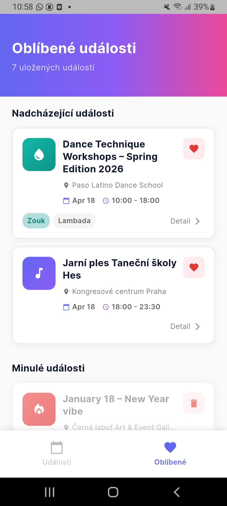
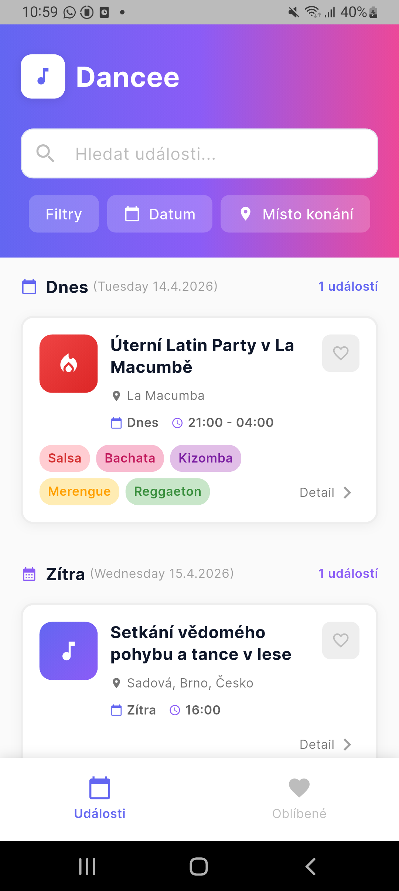
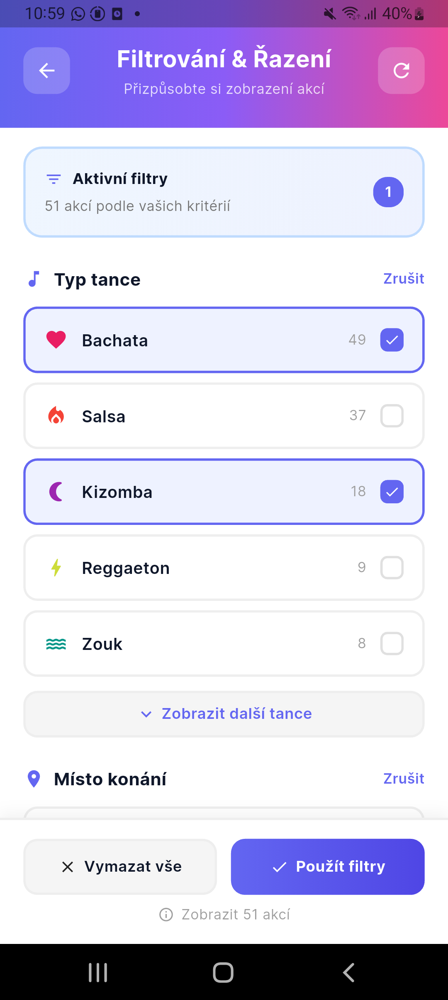
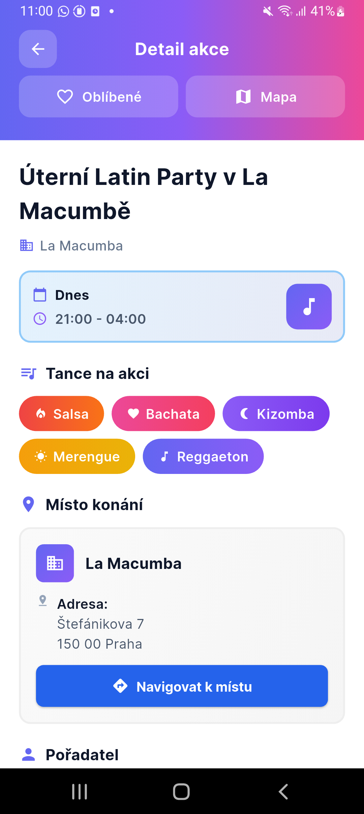
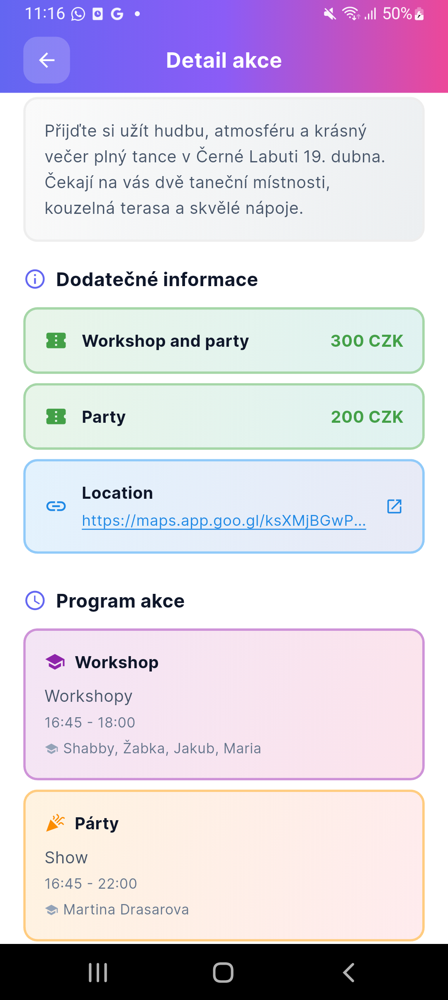
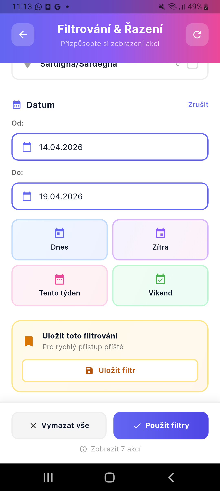

# Dancee

Dance event discovery app for finding and exploring dance events. Built with Flutter (Android, iOS, Web) and a microservices backend.

## Screenshots

| | | |
|---|---|---|
|  |  |  |
|  |  |  |

## Architecture

```
frontend/dancee_app/     Flutter app (Android, iOS, Web)
backend/dancee_api/      API Gateway — Express, OpenAPI docs, Swagger UI
backend/dancee_workflow/  Event processing — Restate, OpenAI, scraping, geocoding
backend/dancee_cms/      Directus headless CMS (PostgreSQL, S3)
```

## Tech Stack

- Flutter / Dart (BLoC, GoRouter, slang i18n)
- TypeScript / Express (API Gateway)
- TypeScript / Restate (durable workflows, OpenAI, Nominatim)
- Directus CMS (Supabase PostgreSQL + S3)
- Fly.io (backend deployment)

## Getting Started

### Frontend

```bash
cd frontend/dancee_app
cp lib/config.example.dart lib/config.dart  # fill in values
task get-deps
task run-web
```

### Backend

```bash
# API Gateway
cd backend/dancee_api
cp .env.example .env
task install
task dev

# Workflow service
cd backend/dancee_workflow
cp .env.example .env
task install
task dev

# CMS
cd backend/dancee_cms
cp .env.example .env
./start-directus.sh
```

## Languages

The app supports English, Czech, and Spanish.
